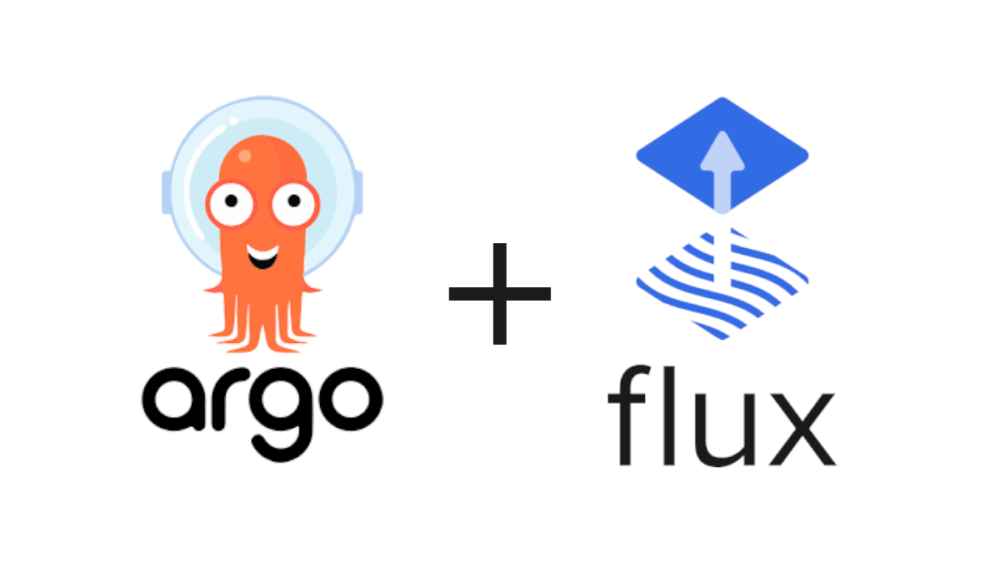

# GitOps Engine

Two of the biggest GitOps projects are joining forces. [Argo CD](https://github.com/argoproj/argo-cd) and [Flux CD](https://github.com/fluxcd/flux) have been out there for years, making the lives of operators and organisations easier. Now the teams are building the best possible GitOps solution together. The first step on this journey is the GitOps Engine.

Argo and Flux already have similar sets of functionality, soon they will start sharing code using the GitOps Engine. The GitOps Engine will be responsible for the following functionality:

- Access to Git repositories
- Kubernetes resource cache
- Manifest Generation
- Resources reconciliation
- Sync Planning

Over time, this might be useful to other projects too.

## Proposals, specifications and ideas

Proposals and ideas are in markdown docs in the [`specs/`](specs/) directory.
To create a new proposal, simply copy the spec [`template`](specs/template.md),
name the file corresponding to the title of your proposal, and place it in the
`specs/` directory.

A good starting point to understand the structure is the [GitOps Engine Design spec](specs/design.md).

We tried to answer frequently asked question in a [separate FAQ document](docs/faq.md).

## Governance

This project is licensed under the [Apache 2 license](LICENSE).

The GitOps Engine follows the [CNCF Code of Conduct](https://github.com/cncf/foundation/blob/master/code-of-conduct.md).

## Get involved

If you are as excited about GitOps and one common engine for it as much as we are, please get in touch. If you want to write code that's great, if you want to share feedback, ideas and use-cases, that's great too.

Find us on the [#gitops channel][gitops-slack] on Kubernetes Slack (get an [invite here][kube-slack]).

### Meetings

The developer team meets regularly, every 1st and 3rd Tuesday of the month, [16:00 UTC](http://time.unitarium.com/utc/16). Instructions, agenda and minutes can be found in [the meeting doc](https://docs.google.com/document/d/17AEZgv6yVuD4HS7_oNPiMKmS7Q6vjkhk6jH0YCELpRk/edit#). The meetings will be recorded and added to this [Youtube playlist](https://www.youtube.com/playlist?list=PLbx4FZ4kOKnvSQP394o5UdF9wL7FaQd-R).

We look forward to seeing you at our meetings and hearing about your feedback and ideas there!

### Contributing to the effort

At this stage we are interested in feedback, use-cases and help on the GitOps Engine.

If you want to immediately kick the tires, you can try out using builds of either [Argo CD][argo-poc] or [Flux CD][flux-poc] powered by the GitOps Engine.

[argo-poc]: https://github.com/argoproj/argo-cd/tree/gitops-engine-poc#what-is-gitops-engine-poc-branch
[flux-poc]: https://github.com/fluxcd/flux/tree/gitops-engine-poc#what-is-gitops-engine-poc-branch
[kube-slack]: https://slack.k8s.io/
[gitops-slack]: https://kubernetes.slack.com/messages/gitops
