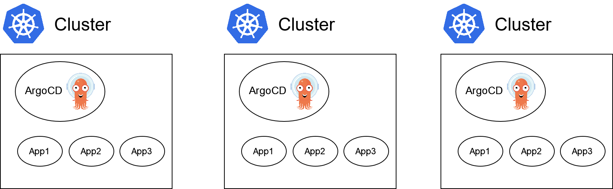
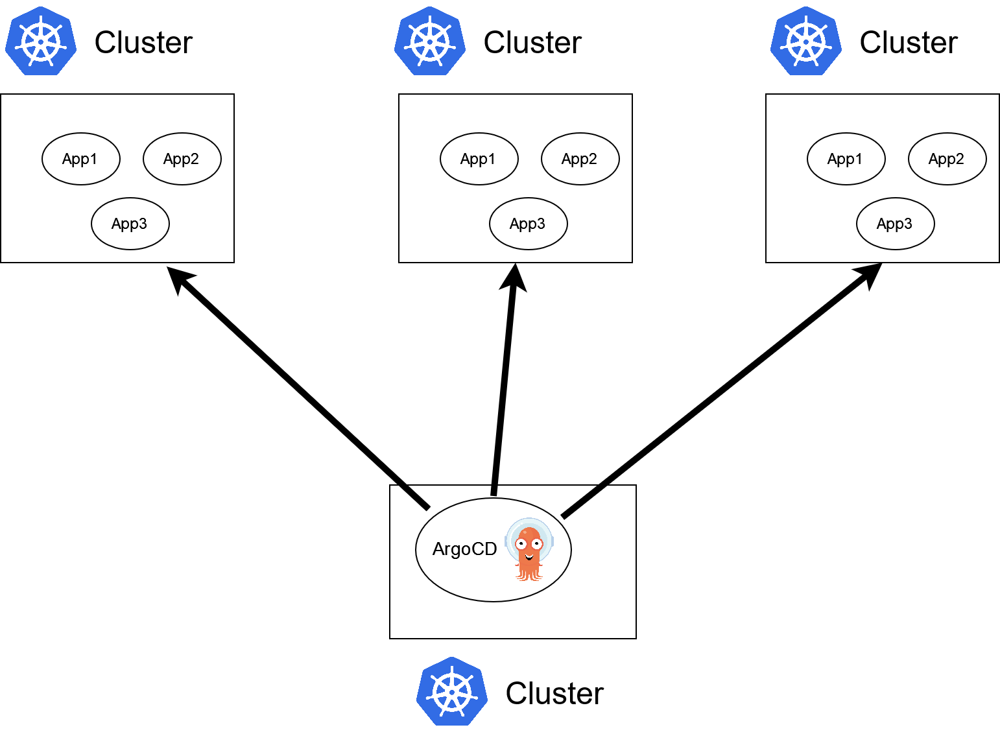
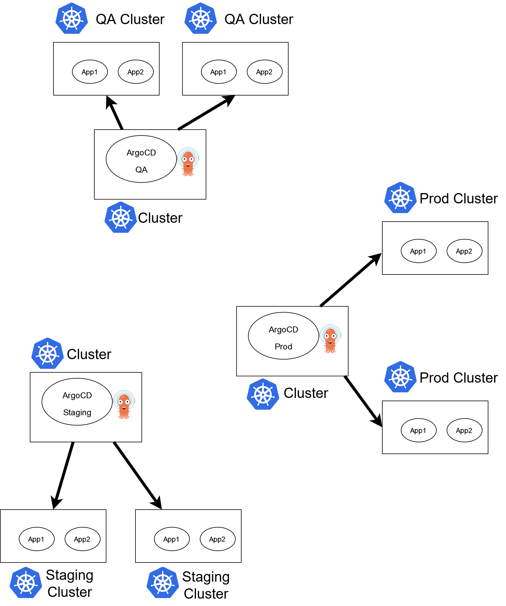
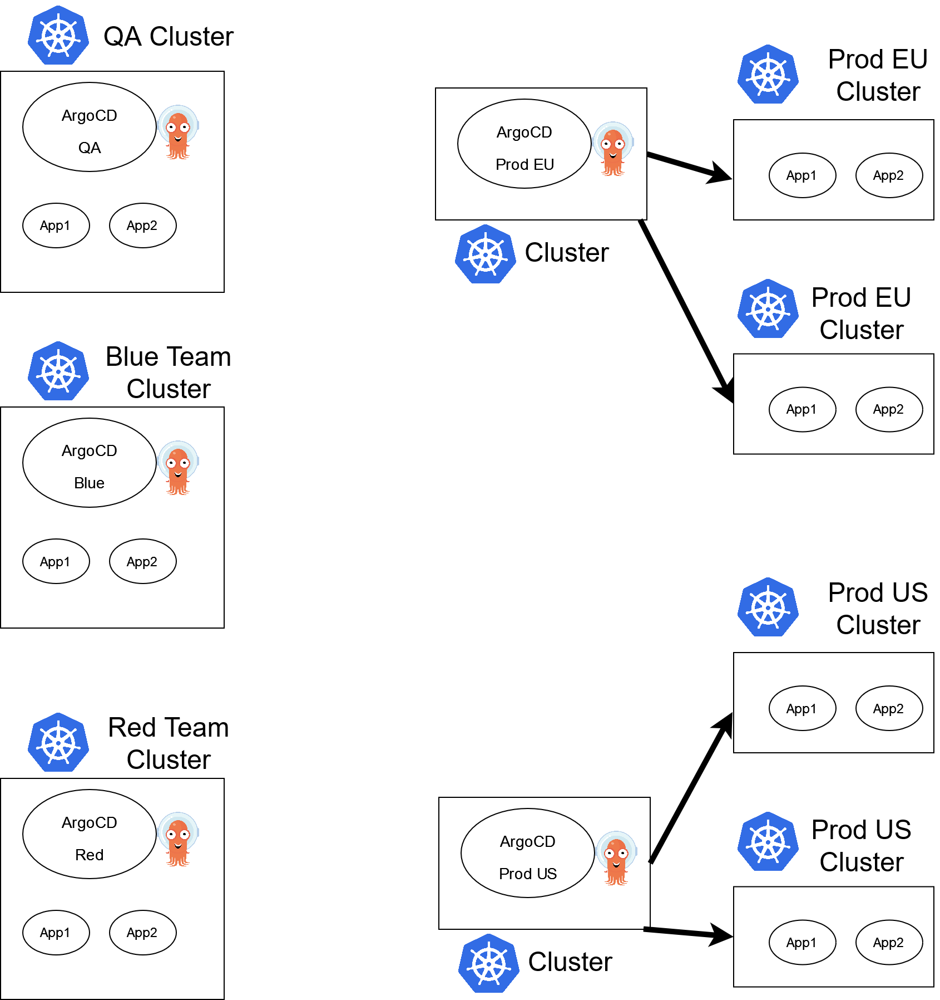

# Argo CD target clusters

By default an Argo CD instance can deploy applications to the [same cluster](internal/) it is installed on. However, Argo CD has the capability to connect and deploy to [external clusters](external).

This means that there are several topologies for handling multiple clusters with Argo CD

1. Using one Argo CD instance per cluster
1. Using a centralized Argo CD instance that handles all cluster
1. A mixture of both strategies. For example you can have different groups of children clusters managed by multiple parent Argo CD instances

Let's see those options in turn:

## Installing Argo CD on each deployment cluster

This is arguably the simplest way to install Argo CD. Each deployment cluster gets its own instance and each Argo CD installation controls the same cluster it is installed on.

This approach has several advantages when it comes to maintenance and upgrades but also suffers from several issues when you have too many clusters. 

Advantages

 * Straightforward installation
 * Target clusters do not need network connectivity which each other and can even work fully isolated from each other
 * Clusters operate independently without reliance on an external instance of Argo CD
 * Security surface is limited to each individual cluster, (compromising one does not compromise the rest)
 * [Upgrades](../../operations/upgrading/) can happen in a gradual way by moving Argo CD instances to a new version one-by-one or in waves
 * Different plugins and configurations/policies can be set on each deployment cluster
 * Easy to split environments (QA/Staging/Production)

Disadvantages

 * Difficult to manage in a uniform way
 * Can lead to many instances being out-of-date, introducing a new class of security problems
 * Poor visibility across organizations
 * Difficult to implement policy across many instances
 * More resources used for each cluster in order to run Argo CD itself
 * Multiple dashboards, users, SSO setups and possible RBAC setups are confusing for end users. 

## Using a central Argo CD installation

At the other end of the spectrum we can have a centralized Argo CD installation which controls and manages all deployment clusters. The cluster that hosts Argo CD can be dedicated to Argo CD only or it can also be used for deploying applications as well.

Advantages

* Easy to maintain and upgrade
* Centralized control (including SSO and RBAC)
* Better visibility across organization
* Single dashboard for all clusters

Disadvantages

* Single point of failure
* Target cluster API’s must be accessible to the central instance
* Single attack surface
* RBAC and SSO might not match organizational requirements
* Impossible to upgrade different clusters in waves
* No separation between QA/Staging/Prod installations
* Argo CD performance may degrade with many applications and clusters as they scale
* In theory requires less resources per each deployment cluster (as it only runs apps and not ArgoCD itself)

While a single Argo CD instance might be tempting (especially for big organizations) it is important to understand the tradeoffs regarding security and performance if you go down that route. Also note the networking requirements.

## Hybrid approaches

An alternative approach (and most often the recommended one) is a hybrid architecture that either combines Argo CD instances that control other clusters or mixes internal and external clusters in the different Argo CD installations.

!!! information
    It is important to remember that Argo CD can only manage other [external clusters](external). It is **NOT** possible to manage other Argo CD instances or have a parent-child relationship between different Argo CD installations.

A hybrid approach combines the best of both worlds by allowing you to mitigate the risks of each one according to your own requirements.

Example 1 - Different Argo CD instances per environment

In this example there are 3 management Argo CD instances. This allows the Production instance to have different constraints than the non-production instances while also making upgrades of Argo CD itself more granular (Production instance can be updated at the end after QA and staging).

Example 2 - Mix of Argo CD instances per region and environment

In this example there are different Argo CD instances per region that manage other clusters, while each team gets also its own Argo CD instance. This allows developer teams to have their own config for their ArgoCD instance and also there is no fear of affecting other teams during upgrades.

## Which strategy to choose

There is no right or wrong Argo CD topology. Each organization has different needs. It is also possible to start with one topology and change to another as the organization needs are changing.

As a starting point we suggest we have at least 2 ArgoCD categories (which might be individual instances or multiple installations)

* Argo CD instance(s) for production systems
* Argo CD instance(s) for NON production systems

This would help you during [upgrades](../../operations/upgrading/) as you can test a new version of Argo CD itself without affecting production.

