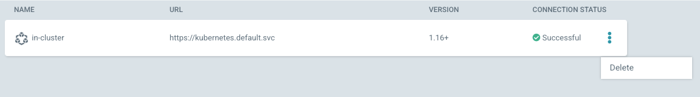

# Managing Clusters

## Using the `argocd` CLI

### Listing all clusters

To list all clusters, run `argocd cluster list`. You should see a list of output with details about the clusters.

```bash
$ argocd cluster list
SERVER                          NAME        VERSION  STATUS      MESSAGE
https://kubernetes.default.svc  in-cluster  1.16+    Successful  
```

### Get details about a cluster

To get more detailed information about a specific cluster, you can use `argocd cluster get <server>`, where `server` is the server URL of the cluster.

```bash
$ argocd cluster get https://kubernetes.default.svc
config:
  tlsClientConfig:
    insecure: false
connectionState:
  attemptedAt: "2021-03-19T16:42:09Z"
  message: ""
  status: Successful
info:
  applicationsCount: 6
  cacheInfo:
    apisCount: 54
    lastCacheSyncTime: "2021-03-19T16:39:36Z"
    resourcesCount: 504
  connectionState:
    attemptedAt: "2021-03-19T16:42:09Z"
    message: ""
    status: Successful
  serverVersion: 1.16+
name: in-cluster
server: https://kubernetes.default.svc
serverVersion: 1.16+
```

### Add a cluster

To add a cluster using the CLI:

1. Ensure you have a valid context in your kubeconfig for the cluster. Running `argocd cluster add` will list all available contexts.
2. Add the cluster with `argocd cluster add <context name>`.

Adding a cluster with `argocd cluster add` installs a ServiceAccount named `argocd-manager` into the `kube-system` namespace of that context and binds the service account to an admin-level ClusterRole. Argo CD uses this service account token to perform its management tasks (i.e. deploy/monitoring).

!!! Tip
    To register the `in-cluster` cluster as a cluster with its own secret, run
    `argocd cluster add <cluster name> --in-cluster`

### Removing a cluster

To remove a cluster using the CLI:

1. Identify the server URL for the cluster. Running `argocd cluster list` will show a list of all clusters with their name and server.
2. Remove the cluster with `argocd cluster rm <server>`

!!! Note
    Removing a cluster will not remove the Applications associated with that cluster

## Using the web UI

### Get details about a cluster

To view details about a cluster in the web UI, first go to `/settings/clusters/` in your Argo CD instance in your browser, then click on the row for a cluster. You can also click on the "edit" button in the top right corner to edit the cluster name or allowed namespaces.

### Removing a cluster

To remove a cluster using the web UI, first go to `/settings/clusters` in your Argo CD instance in your browser
Then, find the cluster and click on the three dots on the right hand side of the cluster row, then click "delete".



## Using the kubernetes API

Clusters are stored as kubernetes secrets, so it is possible (but not typically recommended) to manipulate them using the kubernetes API. 

### Listing all clusters

To view all cluster secrets, you can run `kubectl get secret -l argocd.argoproj.io/secret-type="cluster"` in the namespace for your Argo CD instance. The secrets should be in the format `cluster-<server url>-<hash>`, and have keys for `config`, `name`, `server`, and (optionally) `shard`.

```bash
$ kubectl get secret -l argocd.argoproj.io/secret-type="cluster" -n argocd
NAME                                        TYPE     DATA   AGE
cluster-kubernetes.default.svc-3396314289   Opaque   3      3s
```

```bash
$ kubectl get secret -n argocd cluster-kubernetes.default.svc-3396314289 -o yaml
apiVersion: v1
data:
  config: ****
  name: ZG9ja2VyLWRlc2t0b3A=
  server: aHR0cHM6Ly9rdWJlcm5ldGVzLmRlZmF1bHQuc3Zj
kind: Secret
metadata:
  annotations:
    managed-by: argocd.argoproj.io
  creationTimestamp: "2021-03-19T16:59:50Z"
  labels:
    argocd.argoproj.io/secret-type: cluster
  name: cluster-kubernetes.default.svc-3396314289
  namespace: argocd
  resourceVersion: "8980461"
  selfLink: /api/v1/namespaces/argocd/secrets/cluster-kubernetes.default.svc-3396314289
  uid: 19b453ce-93e7-41f0-b59d-0c4e3b51f3a0
```

### Removing a cluster

To remove a cluster, identify the name of the cluster secret and run `kubectl delete secret <cluster secret name>`.
