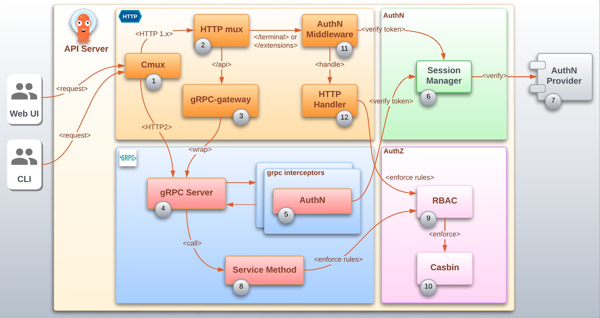

# Authentication and Authorization

This document describes how authentication (authn) and authorization
(authz) are implemented in Argo CD. There is a clear distinction in
the code base of when and how these two security concepts are
enforced.

## Logical layers

The diagram bellow suggests 4 different logical layers (represented by
4 boxes: HTTP, gRPC, AuthN and AuthZ) inside Argo CD API server that
collaborate to provide authentication and authorization. 

- **HTTP**: The HTTP layer groups the *logical elements* that
  collaborate to handle HTTP requests. Every incoming request reaches
  the same HTTP server at the same port (8080). This server will
  analyze the request headers and dispatch to the proper internal
  server: gRPC or standard HTTP.

- **gRPC**: The [gRPC][4] layer groups the logical elements responsible for
  the gRPC implementation.

- **AuthN**: The AuthN represents the layer responsible for
  authentication.

- **AuthZ**: The AuthZ represents the layer responsible for
  authorization.

## Logical elements

The logical elements (identified by numbers) can represent an object,
a function or a component in the code base. Note that this particular
distinction is not represented in the diagram.

Incoming requests can reach Argo CD API server from the web UI as well
as from the `argocd` CLI. The responsibility of the represented
elements are described below with their respective numbers:

1. **Cmux**: Uses the [cmux][1] library to provide a connection
   multiplexer capability making it possible to use the same port to
   handle standard HTTP as well as gRPC requests. It is responsible
   for inspecting incoming requests and dispatch to appropriate
   internal servers. If the request version is `http1.x` it will
   delegate to the *http mux*. If the request version is `http2` and
   has the header `content-type: application/grpc`, it will delegate
   to the *gRPC Server*.

1. **HTTP mux**: A [standard HTTP multiplexer][8] that will handle non
   gRPC requests. It is responsible for serving a unified [REST
   API][3] to the web UI exposing all gRPC and non-gRPC services.

1. **gRPC-gateway**: Uses the [grpc-gateway][2] library to translate
   internal gRPC services and expose them as a [REST API][3]. The
   great majority of API services in Argo CD are implemented in gRPC.
   The grpc-gateway makes it possible to access gRPC services from the
   web UI.

1. **Server**: The internal gRPC Server responsible for handling gRPC
   requests.

1. **AuthN**: Is responsible for invoking the authentication logic. It
   is registered as a gRPC interceptor which will automatically
   trigger for every gRPC request.

1. **Session Manager**: Is the object responsible for managing Argo CD
   API server session. It provides the functionality to verify the
   validity of the authentication token provided in the request.
   Depending on how Argo CD is configured it may or may not delegate
   to an external AuthN provider to verify the token.

1. **AuthN Provider**: Describes the component that can be plugged in
   Argo CD API server to provide the authentication functionality such
   as the login and the token verification process.

1. **Service Method**: represents the method implementing the business
   logic (core functionality) requested. An example of business logic
   is: `List Applications`. Service methods are also responsible for
   invoking the [RBAC][7] enforcement function to validate if the
   authenticated user has permission to execute this method.

1. **RBAC**: Is a collection of functions to provide the capability to
   verify if the user has permission to execute a specific action in
   Argo CD. It does so by validating the incoming request action
   against predefined [RBAC][7] rules that can be configured in Argo CD
   API server as well as in Argo CD `Project` CRD.

1. **Casbin**: Uses the [Casbin][5] library to enforce [RBAC][7] rules.

1. **AuthN Middleware**: Is an [HTTP Middleware][6] configured to
   invoke the logic to verify the token for HTTP services that are not
   implemented as gRPC and requires authentication.

1. **HTTP Handler**: represents the http handlers responsible for
   invoking the business logic (core functionality) requested. An
   example of business logic is: `List Applications`. Http handlers
   are also responsible for invoking the [RBAC][7] enforcement function to
   validate if the authenticated user has permission to execute this
   business logic.

[1]: https://github.com/soheilhy/cmux
[2]: https://github.com/grpc-ecosystem/grpc-gateway
[3]: https://en.wikipedia.org/wiki/Representational_state_transfer
[4]: https://grpc.io/
[5]: https://casbin.org/
[6]: https://github.com/golang/go/wiki/LearnServerProgramming#middleware
[7]: https://en.wikipedia.org/wiki/Role-based_access_control
[8]: https://pkg.go.dev/net/http#ServeMux
