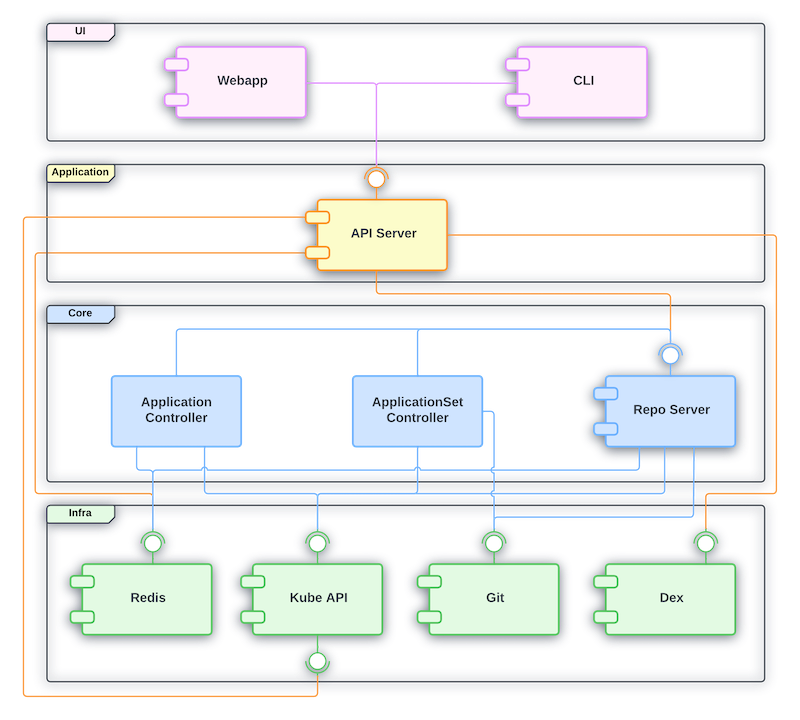

# Component Architecture

Argo CD is designed with a component based architecture. The goal is
to separate the responsibility in different deployable units in order
to have the following benefits:

- **Modularity**: Provides great level of flexibility. Components
  interact with each other via an interface. This means that as long
  as the interface contract is respected, a given component can be
  replaced without requiring the rest of the system to adapt. It is
  also possible to run the system without certain components if a
  specific group of functionality isn't desired.
- **Single responsibility**: Helps to determine where the different
  types of functionality should be implemented which drives for
  better system cohesiveness.
- **Reusability**: Clearly defined interfaces helps in functionality
  discoverability which benefits reusability of services.

The default Argo CD installation is composed by different components
and different Kubernetes controllers. The controllers aren't
categorized as components as they have proprietary interfaces (CRDs)
and therefore, miss the modular nature. There are more resources
created while installing Argo CD (ConfigMaps, Services, etc), but for
simplicity we are covering just the ones directly related with the
componentized architecture.

## Dependencies

The diagram below has represented all dependencies between the
different components used by the default Argo CD installation:

There are 4 logical layers represented in the diagram:

- **UI**: This is the presentation layer. Users interact with Argo CD
  mainly by components from this layer.
- **Application**: The capabilities required to support the components
  from the UI layer.
- **Core**: The main Argo CD gitops functionality is implemented by
  components and Kubernetes controllers from the Core layer.
- **Infra**: Represent the tools that Argo CD depends on as part of
  its infrastructure.

The logical layers also help making the diagram easier to follow as
dependencies are represented in a top-down relationship. This means
that components from the top layers will be allowed to depend on any
component from any of the bottom layers. However components from the
bottom layers will never depend on any ones from upper layers.

## Responsibility

Below you can refer to a brief description of Argo CD components and
its main responsibilities.

### Webapp

Argo CD ships with a powerful web interface that allows managing
applications deployed in a given Kubernetes cluster.

### CLI

Argo CD provides a CLI that can be used by users to interact with Argo
CD API. The CLI can also be used for automation and scripting.

### API Server

Defines the proprietary API exposed by Argo CD that powers the Webapp
and the CLI functionalities.

### Application Controller

The Application Controller is responsible for reconciling the
Application resource in Kubernetes synchronizing the desired
application state (provided in Git) with the live state (in
Kubernetes). The Application Controller is also responsible for
reconciling the Project resource.

### ApplicationSet Controller

The ApplicationSet Controller is responsible for reconciling the
ApplicationSet resource.

### Repo Server

Repo Server plays an important role in Argo CD architecture as it is
responsible for interacting with the Git repository to generate the
desired state for all Kubernetes resources that belongs to a given
application.

### Redis

Redis is used by Argo CD to provide a cache layer reducing requests
sent to the Kube API as well as to the Git provider. It also supports
a few UI operations.

### Kube API

Argo CD controllers will connect to the Kubernetes API in order to run
the reconciliation loop.

### Git

As a gitops tool Argo CD requires that the desired state of the
Kubernetes resources to be provided in a Git repository.

We use "git" here to stand in for an actual git repo, a Helm repo,
or an OCI artifact repo. Argo CD supports all those options.

### Dex

Argo CD relies on Dex to provide authentication with external OIDC
providers. However other tools can be used instead of Dex. Check the
[user management
documentation](../../operator-manual/user-management/index.md) for
more details.

