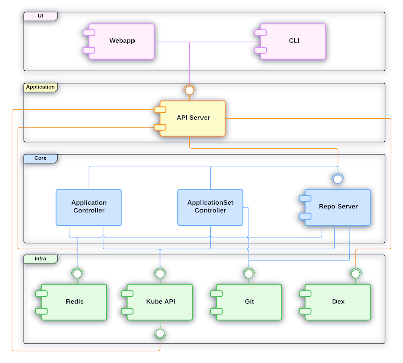

# Component Architecture

Argo CD is designed with a component based architecture. The goal is
to separate the responsibility in different deployable units in order
to have the following benefits:

- **Modularity**: Provides great level of flexibility. Components
  interact with each other via an interface. This means that as long
  as the interface contract is respected, a given component can be
  replaced without requiring the rest of the system to adapt. It is
  also possible to run the system without certain components if a
  specific group of functionality isn't desired.
- **Single responsibility**: Helps to determine where the different types
  of functionality should be implementation which drives for better
  system cohesiveness.
- **Reusability**: Clearly defined interfaces helps in functionality
  discoverability which benefits reusability of services.

The default Argo CD installation is composed by different components
and different Kubernetes controllers. The controllers aren't
categorized as components as they have a proprietary interfaces (CRDs)
and therefore, miss the modular nature. There are more resources
created while installing Argo CD (ConfigMaps, Services, etc), but for
simplicity we are covering just the ones directly related with the
componentized architecture.

## Dependencies

The diagram below have represented all dependencies between the
different components used by the default Argo CD installation:

There are 4 logical layers represented in the diagram:

- **UI**: This is the presentation layer. Users interact with Argo CD mainly
  by components from this layer.
- **Application**: The capabilities required to support the
  components from the UI layer.
- **Core**: The main Argo CD gitops functionality is implemented by
  components and Kubernetes controllers from the Core layer.
- **Infra**: Represent the tools that Argo CD depends on as part of
  its infrastructure.

## Responsibility
