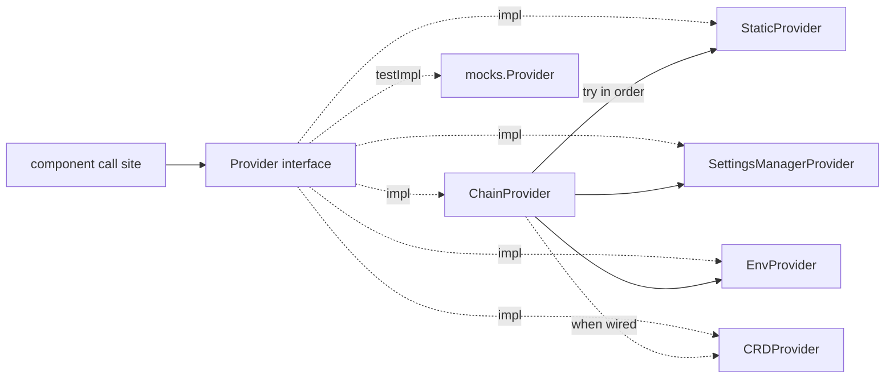

# Config bus

The **config bus** (`util/configbus`) exists to migrate Argo CD’s **durable
product settings** from ConfigMaps (`argocd-cm`, `argocd-cmd-params-cm`, and
related sources) to a **singleton configuration CRD**. The bus’s
`configbus.Provider` is the stable API that component code calls during that
migration: call sites read typed getters instead of reaching into flags, env
vars, or ConfigMaps directly. Backing sources change behind the Provider; the
call sites do not.

> [!NOTE]
> This page is for **contributors** changing how Argo CD reads configuration.
> It describes the bus as of the application-controller cutover with the
> composable provider chain. Production processes compose leaf providers with
> `ChainProvider`. Until the CRD source is wired, `CRDProvider` is omitted from
> the chain (or included as a no-op that always returns `ErrNotConfigured`).

## Why it exists

The end state is one declarative config object per install. Getting there
requires a single typed read path first—otherwise every binary keeps its own
ConfigMap / flag / env parsing, and a CRD cutover would mean rewriting call
sites again.

Without a shared bus:

- Precedence between flag, env, and ConfigMap differed by binary.
- Call sites often mixed ConfigMap reads, constructor fields, and ad hoc parsing.
- Resolve failures were easy to log-and-ignore, leaving zero/default values in
  effect.

The Provider gives one place to add settings, one place to swap ConfigMap-backed
resolution for CRD-backed resolution later, and a clear error path when a
required value cannot be resolved.

## Provider design

`Provider` is a **flat, alphabetical interface**. There are no sub-interfaces;
each component layer inserts its methods into this one block in alphabetical
order so PRs stay skimmable.

### Methodology

| Rule | Meaning |
| --- | --- |
| Method = smallest migrateable unit | When a method’s backing CRD field is set, every nested value under that field is considered migrated. |
| Alphabetical method names | Receivers are added in alphabetical position as each component is wired. |
| Every getter returns `(T, error)` | Even process-local values use this shape, because CRD-backed reads can fail via a Kubernetes client or informer. |
| `ErrNotConfigured` sentinel | A leaf signals “I do not own / do not have this field”; `ChainProvider` skips to the next link. |

### Implementations



| Implementation | Constructor | Behavior |
| --- | --- | --- |
| `StaticProvider` | `&StaticProvider{Fields: StaticFields{...}}` | In-memory nilable fields. Unset → `ErrNotConfigured`. Used for component-captured flags and CLI overrides. |
| `SettingsManagerProvider` | `NewSettingsManagerProvider(mgr)` | ConfigMap-backed product settings. |
| `EnvProvider` | `NewEnvProvider()` | Process environment variables (e.g. `GitRequestTimeout`). |
| `CRDProvider` | `NewCRDProvider(source)` | ArgoCDConfiguration CR. Until wired, every getter returns `ErrNotConfigured`. |
| `ChainProvider` | `NewChainProvider(links...)` | Tries links in order; first non-`ErrNotConfigured` wins. |

Leaf providers embed `notConfiguredProvider` so they only implement owned methods.
`notConfiguredProvider`, `ChainProvider`, and `StaticProvider`/`StaticFields` are
generated from the `Provider` interface by `go run ./hack/gen-configbus-providers`.

Production processes (pre-CRD) wire:

```go
ctrl.configProvider = configbus.NewChainProvider(
	&configbus.StaticProvider{Fields: configbus.StaticFields{
		SyncTimeout: configbus.Ptr(syncTimeout),
		// ... other component-owned fields ...
	}},
	configbus.NewSettingsManagerProvider(settingsMgr),
	configbus.NewEnvProvider(),
)
```

CLI overrides put a leading `StaticProvider` ahead of the durable sources so
flags win by chain position.

### Precedence

`StaticProvider` has two roles with opposite precedence needs:

| Role | Chain position | Why |
| --- | --- | --- |
| CLI / one-off override | First | Must beat CRD / Settings / Env |
| Component-captured flags | After CRD (when present), before Settings/Env | CRD should win once set; flags remain the fallback |

- Pre-CRD: `[StaticFallback, SettingsManager, Env]` (+ leading `StaticOverride` for admin CLI)
- With CRD: `[StaticOverride?, CRD, StaticFallback, SettingsManager, Env]`
- CRD-only: `[StaticOverride?, CRD]`

### Testing with mockery

Consumer tests inject `mocks.Provider` (generated by mockery; see `.mockery.yaml`
and `make mockgen`), or prepend a `StaticProvider` via `ChainProvider`:

```go
provider := mocks.NewProvider(t)
provider.EXPECT().SelfHealTimeout().Return(30*time.Second, nil)
```

Package-level tests exercise leaf `ErrNotConfigured` behavior, chain
precedence, and a total-resolution coverage test for the controller chain.

## Architecture (current)

| Piece | Path | Role |
| --- | --- | --- |
| `Provider` | `util/configbus/provider.go` | Flat alphabetical typed API + `firstConfigured`. |
| `StaticProvider` / `StaticFields` | `util/configbus/zz_generated.static_provider.go` | In-memory nilable fields (generated). |
| `SettingsManagerProvider` | `util/configbus/settings_manager_provider.go` | ConfigMap-backed getters. |
| `EnvProvider` | `util/configbus/env_provider.go` | Env-backed getters. |
| `CRDProvider` | `util/configbus/crd_provider.go` | CRD-only reads (stubbed until CRD source lands). |
| `ChainProvider` | `util/configbus/zz_generated.chain_provider.go` | Ordered fallback (generated). |
| `notConfiguredProvider` | `util/configbus/zz_generated.not_configured.go` | Embeddable `ErrNotConfigured` base (generated). |

### What is wired today

| Binary | Status |
| --- | --- |
| Application controller | Wired: `NewChainProvider(Static, SettingsManager, Env)` in `controller/appcontroller.go` |
| API server, repo-server, ApplicationSet, notifications, commit-server | Follow the same pattern when cut over |

### Sources of truth (controller)

| Kind of setting | How the Provider gets it | Examples |
| --- | --- | --- |
| Flag / env captured at process start | `StaticProvider` fields | Reconciliation timeout, sync timeout, self-heal, metrics cluster labels |
| ConfigMap-backed product config | `SettingsManagerProvider` | Resource overrides, app instance label key, tracking method |
| Process env | `EnvProvider` | `ARGOCD_GIT_REQUEST_TIMEOUT` |
| CRD-backed product config | `CRDProvider` (via chain when set) | Same surface, once the CRD source is wired |

Deprecated struct fields may remain on the controller for construction/tests, but
product code must read via `configProvider.*`.

## How the controller wires the Provider

```go
ctrl.configProvider = configbus.NewChainProvider(
	&configbus.StaticProvider{Fields: configbus.StaticFields{ /* … */ }},
	configbus.NewSettingsManagerProvider(settingsMgr),
	configbus.NewEnvProvider(),
)
```

Call sites then use:

```go
timeout, err := ctrl.configProvider.SelfHealTimeout()
if err != nil {
	return fmt.Errorf("failed to resolve self heal timeout: %w", err)
}
```

Every Provider method returns `(T, error)`. Bubble errors at call sites
(return, fatal at startup, or requeue)—do **not** log-and-ignore and continue
with a zero value.

## Common tasks

### Add a controller setting (flag / env)

1. **Store the value** on `ApplicationController` (or a nested manager) at
   construction time, as today (optional; can pass straight into StaticFields).
2. **Mark the field deprecated** toward the Provider when it remains on the
   struct: `// Deprecated: use configProvider.MySetting.`
3. **Add `MySetting() (T, error)`** to the flat `Provider` interface in
   alphabetical order.
4. **Regenerate** generated providers: `go run ./hack/gen-configbus-providers`.
5. **Set the field** on the controller’s `StaticFields` literal at wire time.
6. **Update call sites** to use `configProvider.MySetting()` and handle errors.
7. **Tests:** prefer `mocks.Provider` or a `StaticProvider` override. Run
   `make mockgen` after changing the interface.
8. Run `go test ./util/configbus/ ./controller/`.

### Add a SettingsManager-backed setting

1. Ensure the value is available from `util/settings` (existing or new getter).
2. Add `MySetting() (T, error)` to the `Provider` interface (alphabetical).
3. Regenerate generated providers; implement the method on
   `SettingsManagerProvider` (call the settings getter). Leave other leaves on
   the generated `ErrNotConfigured` base.
4. Point controller call sites at the Provider method.
5. Regen mocks (`make mockgen`); add/adjust unit tests; run
   `go test ./util/configbus/ ./controller/`.

### Change how an existing setting is resolved

1. Find the owning leaf (`rg 'func \(p \*SettingsManagerProvider\) Foo'` or the
   StaticFields entry).
2. Prefer updating that single path over adding a parallel read in the
   controller.

## Error handling

| Context | Prefer |
| --- | --- |
| Constructor / startup | Return `error` or fatal if the process cannot run correctly |
| Reconcile / workqueue | Return error or requeue; do not proceed with zero config |
| Optional best-effort paths | Rare; document why a default is safe |
| Leaf unset field | `ErrNotConfigured` → Chain skips to next link |

Anti-pattern: `log.WithError(err).Error(...); /* continue */` for Provider
resolve failures.

The composed chain for a binary should resolve every field getter. The
`TestControllerChainResolvesAllFields` coverage test guards this for the
application controller.

## File map

```text
util/configbus/
├── provider.go                         # Provider interface, ErrNotConfigured, firstConfigured
├── ptr.go                              # Ptr / PtrPtr helpers for StaticFields literals
├── settings_manager_provider.go        # SettingsManagerProvider
├── env_provider.go                     # EnvProvider
├── crd_provider.go                     # CRDProvider (ErrNotConfigured until CRD wired)
├── zz_generated.not_configured.go      # notConfiguredProvider base (generated)
├── zz_generated.chain_provider.go      # ChainProvider (generated)
├── zz_generated.static_provider.go     # StaticProvider + StaticFields (generated)
├── mocks/Provider.go                   # mockery-generated mocks.Provider
├── provider_test.go
└── coverage_test.go                    # total-resolution coverage

hack/gen-configbus-providers/           # regenerates zz_generated.* from Provider

controller/
└── appcontroller.go                    # Wires NewChainProvider; call sites use configProvider
```

## Related

- Components overview: [Component Architecture](components.md)
- Local checks: [Development Cycle](../development-cycle.md)
