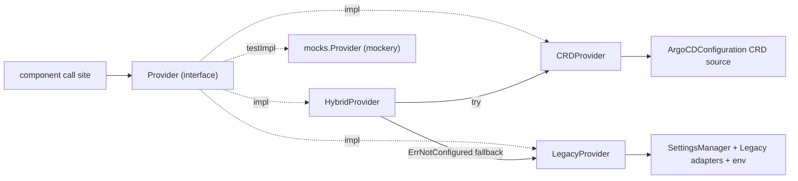

# Config bus

The **config bus** (`util/configbus`) exists to migrate Argo CD’s **durable
product settings** from ConfigMaps (`argocd-cm`, `argocd-cmd-params-cm`, and
related sources) to a **singleton configuration CRD**. The bus’s
`configbus.Provider` is the stable API that component code calls during that
migration: call sites read typed getters instead of reaching into flags, env
vars, or ConfigMaps directly. Backing sources change behind the Provider; the
call sites do not.

> [!NOTE]
> This page is for **contributors** changing how Argo CD reads configuration.
> It describes the bus as of the first consumer cutover (application-controller).
> Production processes use `HybridProvider` (CRD first, Legacy fallback). Until
> the CRD source is wired, every CRD read returns `ErrNotConfigured` and Hybrid
> falls through to Legacy.

## Why it exists

The end state is one declarative config object per install. Getting there
requires a single typed read path first—otherwise every binary keeps its own
ConfigMap / flag / env parsing, and a CRD cutover would mean rewriting call
sites again.

Without a shared bus:

- Precedence between flag, env, and ConfigMap differed by binary.
- Call sites often mixed ConfigMap reads, constructor fields, and ad hoc parsing.
- Resolve failures were easy to log-and-ignore, leaving zero/default values in
  effect.

The Provider gives one place to add settings, one place to swap ConfigMap-backed
resolution for CRD-backed resolution later, and a clear error path when a
required value cannot be resolved.

## Provider design

`Provider` is a **flat, alphabetical interface**. There are no sub-interfaces;
each component layer inserts its methods into this one block in alphabetical
order so PRs stay skimmable.

### Methodology

| Rule | Meaning |
| --- | --- |
| Method = smallest migrateable unit | When a method’s backing CRD field is set, every nested value under that field is considered migrated. |
| Alphabetical method names | Receivers are added in alphabetical position as each component is wired. |
| Every getter returns `(T, error)` | Even legacy-guaranteed values use this shape, because CRD-backed reads can fail via a Kubernetes client or informer. |
| `ErrNotConfigured` sentinel | CRD signals “field / CR absent”; Hybrid falls back to Legacy only on this error. |

### Implementations



| Implementation | Constructor | Behavior |
| --- | --- | --- |
| `LegacyProvider` | `NewLegacyProvider(settingsMgr, legacy)` | Resolves from `SettingsManager`, component Legacy adapters, and env. **Never** returns `ErrNotConfigured`. |
| `CRDProvider` | `NewCRDProvider(source)` | Resolves from the ArgoCDConfiguration CR. Until the CRD source is wired, every getter returns `ErrNotConfigured`. |
| `HybridProvider` | `NewHybridProvider(crd, legacy)` | Tries CRD first; on `errors.Is(err, ErrNotConfigured)` falls back to Legacy. Other CRD errors propagate. |

Production processes wire Hybrid:

```go
ctrl.configProvider = configbus.NewHybridProvider(
	configbus.NewCRDProvider(nil),
	configbus.NewLegacyProvider(settingsMgr, &configbus.LegacyValues{Controller: &ctrl}),
)
```

### Testing with mockery

Consumer tests inject `mocks.Provider` (generated by mockery from the `Provider`
interface; see `.mockery.yaml` and `make mockgen`):

```go
provider := mocks.NewProvider(t)
provider.EXPECT().SelfHealTimeout().Return(30*time.Second, nil)
```

Package-level tests in `util/configbus` still exercise `LegacyProvider` against
`ControllerLegacy` stubs, `CRDProvider`’s `ErrNotConfigured` behavior, and
`HybridProvider` / `configured()` fallback rules. Prefer `mocks.Provider` in
component packages instead of hand-rolled Provider fakes.

## Architecture (current)

| Piece | Path | Role |
| --- | --- | --- |
| `Provider` | `util/configbus/provider.go` | Flat alphabetical typed API (`ReconciliationTimeout()`, `ResourceOverrides()`, …). |
| `LegacyProvider` | `util/configbus/legacy_provider.go` | SettingsManager + Legacy adapters + env. |
| `CRDProvider` | `util/configbus/crd_provider.go` | CRD-only reads (stubbed until CRD source lands). |
| `HybridProvider` | `util/configbus/hybrid_provider.go` | CRD-first with Legacy fallback on `ErrNotConfigured`. |
| `LegacyValues` / `ControllerLegacy` | `util/configbus/legacy_provider.go` | Component Legacy adapters. Nil field means “not supplied by this binary.” |
| Legacy adapters | `controller/legacy_config.go` | **Sole** allowed readers of deprecated controller struct fields. |

There is **no** global setting registry. Provider methods call
`SettingsManager` and/or the component Legacy adapter (or, later, the CRD
source) directly.

### What is wired today

| Binary | Status |
| --- | --- |
| Application controller | Wired: `NewHybridProvider(NewCRDProvider(nil), NewLegacyProvider(...))` in `controller/appcontroller.go` |
| API server, repo-server, ApplicationSet, notifications, commit-server | Not yet on the bus (follow the same pattern when cut over) |

### Sources of truth (controller)

| Kind of setting | How the Provider gets it | Examples |
| --- | --- | --- |
| Flag / env captured at process start | `ControllerLegacy` → deprecated struct fields (via Legacy / Hybrid) | Reconciliation timeout, sync timeout, self-heal, metrics cluster labels |
| ConfigMap-backed product config | `SettingsManager` (via Legacy / Hybrid) | Resource overrides, app instance label key, tracking method |
| CRD-backed product config | `CRDProvider` (via Hybrid when set) | Same surface, once the CRD source is wired |

Deprecated struct fields stay on the controller for construction/tests, but
product code and tests must read via `configProvider.*`. Mark fields
`Deprecated: use configProvider.…` and confine Legacy readers to
`legacy_config.go`.

## How the controller wires the Provider

In `controller/appcontroller.go` (after settings manager and controller fields
exist):

```go
ctrl.configProvider = configbus.NewHybridProvider(
	configbus.NewCRDProvider(nil),
	configbus.NewLegacyProvider(settingsMgr, &configbus.LegacyValues{Controller: &ctrl}),
)
```

Call sites then use:

```go
timeout, err := ctrl.configProvider.SelfHealTimeout()
if err != nil {
	return fmt.Errorf("failed to resolve self heal timeout: %w", err)
}
```

Every Provider method returns `(T, error)`. Bubble errors at call sites
(return, fatal at startup, or requeue)—do **not** log-and-ignore and continue
with a zero value.

## Common tasks

### Add a controller setting (flag / env)

1. **Store the value** on `ApplicationController` (or a nested manager) at
   construction time, as today.
2. **Mark the field deprecated** toward the Provider:
   `// Deprecated: use configProvider.MySetting.`
3. **Extend `ControllerLegacy`** in `util/configbus/legacy_provider.go`
   with `LegacyMySetting() T`.
4. **Implement the Legacy method** in `controller/legacy_config.go` (sole reader
   of the deprecated field; keep the `SA1019` nolint pattern used by siblings).
5. **Add `MySetting() (T, error)`** to the flat `Provider` interface in
   alphabetical order, then implement it on `LegacyProvider`, `CRDProvider`
   (return `ErrNotConfigured` until the CRD field exists), and `HybridProvider`
   (one-liner via `configured(...)`).
6. **Update call sites** to use `configProvider.MySetting()` and handle errors.
7. **Tests:** prefer `mocks.Provider` in the controller package; assert Legacy
   behavior in `util/configbus` if needed. Run `make mockgen` after changing
   the interface.
8. Run `go test ./util/configbus/ ./controller/`.

### Add a SettingsManager-backed setting

1. Ensure the value is available from `util/settings` (existing or new getter).
2. Add `MySetting() (T, error)` to the `Provider` interface (alphabetical) and
   implement on all three providers (`LegacyProvider` calls
   `requireSettingsMgr()` then the settings getter; `CRDProvider` returns
   `ErrNotConfigured` until wired; `HybridProvider` uses `configured`).
3. Point controller call sites at the Provider method.
4. Regen mocks (`make mockgen`); add/adjust unit tests; run
   `go test ./util/configbus/ ./controller/`.

### Change how an existing setting is resolved

1. Find the Provider method (`rg 'func \(p \*LegacyProvider\) Foo' util/configbus`
   or the matching CRD/Hybrid receiver).
2. Prefer updating that single path over adding a parallel read in the
   controller.
3. Keep `legacy_config.go` as the only deprecated-field reader.

## Error handling

| Context | Prefer |
| --- | --- |
| Constructor / startup | Return `error` or fatal if the process cannot run correctly |
| Reconcile / workqueue | Return error or requeue; do not proceed with zero config |
| Optional best-effort paths | Rare; document why a default is safe |
| CRD unset field | `ErrNotConfigured` → Hybrid falls back to Legacy |

Anti-pattern: `log.WithError(err).Error(...); /* continue */` for Provider
resolve failures.

## File map

```text
util/configbus/
├── provider.go                      # Provider interface, ErrNotConfigured, configured()
├── legacy_provider.go               # LegacyProvider, LegacyValues, ControllerLegacy
├── legacy_provider_controller.go    # Controller Legacy getters
├── legacy_provider_settings.go      # SettingsManager-backed getters
├── legacy_provider_env.go           # Env-only getters
├── crd_provider.go                  # CRDProvider (ErrNotConfigured until CRD wired)
├── hybrid_provider.go               # HybridProvider (CRD → Legacy fallback)
├── mocks/Provider.go                # mockery-generated mocks.Provider
└── provider_test.go

controller/
├── appcontroller.go                 # Wires NewHybridProvider; call sites use configProvider
└── legacy_config.go                 # ControllerLegacy implementation
```

## Related

- Components overview: [Component Architecture](components.md)
- Local checks: [Development Cycle](../development-cycle.md)
