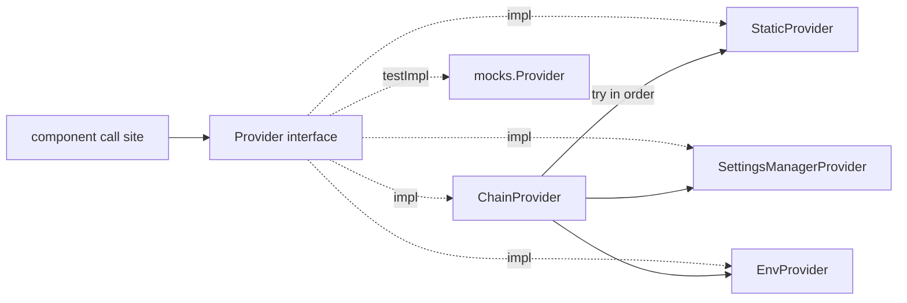

# Config bus

The **config bus** (`util/configbus`) exists to migrate Argo CD’s **durable
product settings** from ConfigMaps (`argocd-cm`, `argocd-cmd-params-cm`, and
related sources) to a **singleton configuration CRD**. The bus’s
`configbus.Provider` is the stable API that component code calls during that
migration: call sites read typed getters instead of reaching into flags, env
vars, or ConfigMaps directly. Backing sources change behind the Provider; the
call sites do not.

> [!NOTE]
> This page is for **contributors** changing how Argo CD reads configuration.
> It describes the bus as of the application-controller cutover with the
> composable provider chain. Production processes compose leaf providers with
> `ChainProvider` (`Static`, `SettingsManagerProvider`, `Env`). A CRD-backed
> leaf is added in a later change once the configuration CRD exists.

## Why it exists

The end state is one declarative config object per install. Getting there
requires a single typed read path first—otherwise every binary keeps its own
ConfigMap / flag / env parsing, and a CRD cutover would mean rewriting call
sites again.

Without a shared bus:

- Precedence between flag, env, and ConfigMap differed by binary.
- Call sites often mixed ConfigMap reads, constructor fields, and ad hoc parsing.
- Resolve failures were easy to log-and-ignore, leaving zero/default values in
  effect.

The Provider gives one place to add settings, one place to swap ConfigMap-backed
resolution for CRD-backed resolution later, and a clear error path when a
required value cannot be resolved.

## Provider design

`Provider` is a **flat, alphabetical interface**. There are no sub-interfaces;
each component layer inserts its methods into this one block in alphabetical
order so PRs stay skimmable.

### Methodology

| Rule | Meaning |
| --- | --- |
| Method = smallest migrateable unit | When a method’s backing CRD field is set, every nested value under that field is considered migrated. |
| Alphabetical method names | Receivers are added in alphabetical position as each component is wired. |
| Every getter returns `(T, error)` | Even process-local values use this shape, because CRD-backed reads can fail via a Kubernetes client or informer. |
| `ErrNotConfigured` sentinel | A leaf signals “I do not own / do not have this field”; `ChainProvider` skips to the next link. |
| Just-in-time reads | Call sites invoke `configProvider.Foo(ctx)` immediately before use. Do **not** resolve once and store the result on a struct field, local “cache”, or constructor argument that child code then treats as the source of truth. |
| Pass the Provider, not values | When wiring nested managers/handlers, pass `configbus.Provider` (or the owning component that holds it). Do not plumb resolved scalars (`hydratorEnabled`, `applicationNamespaces`, …) through constructors. |
| `SettingsManager` stays infrastructural | After a component is on the bus, **product settings must not be read from `settingsMgr`**. Call `configProvider.*` instead. Keep a `settingsMgr` field only when some API still requires `*settings.SettingsManager` (for example `Subscribe`, `db.NewDB`, or helpers that have not been updated to take a Provider yet). When you need a setting that only exists on `SettingsManager`, **add a Provider getter** and use that—do not reach around the bus. |
| Wrap Provider errors | Getters return `(T, error)`. Call sites that previously returned bare values must now wrap: `fmt.Errorf("failed to resolve …: %w", err)`. Never `return nil, err` for a Provider resolve without context. |

### Implementations



| Implementation | Constructor | Behavior |
| --- | --- | --- |
| `StaticProvider` | `&StaticProvider{Fields: StaticFields{...}}` | In-memory nilable fields. Unset → `ErrNotConfigured`. Used for component-captured flags and CLI overrides. |
| `SettingsManagerProvider` | `NewSettingsManagerProvider(mgr)` | ConfigMap-backed product settings. |
| `EnvProvider` | `NewEnvProvider()` | Process environment variables (e.g. `GitRequestTimeout`). |
| `ChainProvider` | `NewChainProvider(links...)` | Tries links in order; first non-`ErrNotConfigured` wins. |

Leaf providers embed an empty `ChainProvider` so they only implement owned
methods: a chain with no links resolves every promoted getter to
`ErrNotConfigured` and makes the lifecycle methods no-ops. `ChainProvider` and
`StaticProvider`/`StaticFields` are generated from the `Provider` interface by
`go run ./hack/gen-configbus-providers`.

Production processes (pre-CRD) wire:

```go
ctrl.configProvider = configbus.NewChainProvider(
	&configbus.StaticProvider{Fields: configbus.StaticFields{
		SyncTimeout: configbus.Ptr(syncTimeout),
		// ... other component-owned fields ...
	}},
	configbus.NewSettingsManagerProvider(settingsMgr),
	configbus.NewEnvProvider(),
)
```

CLI overrides put a leading `StaticProvider` ahead of the durable sources so
flags win by chain position.

### Precedence

`StaticProvider` has two roles with opposite precedence needs:

| Role | Chain position | Why |
| --- | --- | --- |
| CLI / one-off override | First | Must beat Settings / Env (and CRD once present) |
| Component-captured flags | Before Settings/Env | Flags remain the fallback behind durable sources |

- Today: `[StaticFallback, SettingsManager, Env]` (+ leading `StaticOverride` for admin CLI)
- Later with CRD: `[StaticOverride?, CRD, StaticFallback, SettingsManager, Env]`
- CRD-only: `[StaticOverride?, CRD]`

### Testing with mockery

Prefer **`mocks.Provider`** for consumer unit tests that stub one or a few
getters. Use a `StaticProvider` (or prepend one via `ChainProvider`) when you
need a multi-field fixture without per-method expectations. Do not invent ad
hoc stubs that bypass the generated mock when a mock would do.

```go
provider := mocks.NewProvider(t)
provider.EXPECT().SelfHealTimeout(mock.Anything).Return(30*time.Second, nil)
```

Package-level tests exercise leaf `ErrNotConfigured` behavior, chain
precedence, and a total-resolution coverage test for the controller chain.

## Architecture (current)

| Piece | Path | Role |
| --- | --- | --- |
| `Provider` | `util/configbus/provider.go` | Flat alphabetical typed API + `firstConfigured`. |
| `StaticProvider` / `StaticFields` | `util/configbus/zz_generated.static_provider.go` | In-memory nilable fields (generated). |
| `SettingsManagerProvider` | `util/configbus/settings_manager_provider.go` | ConfigMap-backed getters. |
| `EnvProvider` | `util/configbus/env_provider.go` | Env-backed getters. |
| `ChainProvider` | `util/configbus/zz_generated.chain_provider.go` | Ordered fallback (generated). Embedded empty in leaves as the `ErrNotConfigured` base. |

### What is wired today

| Binary | Status |
| --- | --- |
| Application controller | Wired: `NewChainProvider(Static, SettingsManager, Env)` in `controller/appcontroller.go` |
| API server, repo-server, ApplicationSet, notifications, commit-server | Follow the same pattern when cut over |

### Sources of truth (controller)

| Kind of setting | How the Provider gets it | Examples |
| --- | --- | --- |
| Flag / env captured at process start | `StaticProvider` fields | Reconciliation timeout, sync timeout, self-heal, metrics cluster labels |
| ConfigMap-backed product config | `SettingsManagerProvider` | Resource overrides, app instance label key, tracking method |
| Process env | `EnvProvider` | `ARGOCD_GIT_REQUEST_TIMEOUT` |

CLI-captured flag values may still appear on opts/structs **only** long enough to
feed the leading `StaticProvider` leaf at wire time. After that, product code
must read via `configProvider.*`—never from the opts field, and never from a
second cached copy of the resolved value.

**Allowed crystallization (rare):** values that define process topology and
cannot be cheaply reconfigured without restart (for example informer namespace
scope). Prefer documenting those exceptions next to the field. Everything else
is JIT.

## How the controller wires the Provider

```go
ctrl.configProvider = configbus.NewChainProvider(
	&configbus.StaticProvider{Fields: configbus.StaticFields{ /* … */ }},
	configbus.NewSettingsManagerProvider(settingsMgr),
	configbus.NewEnvProvider(),
)
```

Call sites then use (JIT, with context):

```go
timeout, err := ctrl.configProvider.SelfHealTimeout(ctx)
if err != nil {
	return fmt.Errorf("failed to resolve self heal timeout: %w", err)
}
```

When a call site previously returned an infallible value (or ignored errors),
**introducing a Provider getter always means introducing error handling**:

```go
// Before
key := settingsMgr.GetAppInstanceLabelKey() // or a field with no error

// After — wrap; do not forward a bare err
key, err := ctrl.configProvider.AppInstanceLabelKey(ctx)
if err != nil {
	return fmt.Errorf("failed to resolve app instance label key: %w", err)
}
```

Every Provider method returns `(T, error)`. Bubble errors at call sites
(return, fatal at startup, or requeue)—do **not** log-and-ignore and continue
with a zero value.

### Anti-patterns

```go
// BAD: crystallize then use the copy
insecure, _ := provider.Insecure(ctx)
server.configInsecure = insecure
// ...
if !server.configInsecure { /* ... */ }

// BAD: resolve a batch and pass scalars into children
hydratorEnabled, _ := provider.HydratorEnabled(ctx)
repoService := repository.NewServer(..., settingsMgr, hydratorEnabled)

// BAD: parallel read path after migration
overrides, _ := s.settingsMgr.GetResourceOverrides() // use configProvider.ResourceOverrides

// BAD: bare error from a Provider resolve
enabled, err := s.configProvider.ApplicationNamespaces(ctx)
if err != nil {
	return nil, err // missing wrap
}

// GOOD: pass the Provider; child resolves at the use site
repoService := repository.NewServer(..., settingsMgr, provider)
// inside an RPC handler:
hydratorEnabled, err := s.configProvider.HydratorEnabled(ctx)
if err != nil {
	return fmt.Errorf("failed to resolve hydrator enabled: %w", err)
}
```

## Common tasks

### Add a controller setting (flag / env)

1. **Capture the flag** into the component’s `StaticFields` literal at wire
   time (directly from the local flag variable is fine; no need to park it on
   a long-lived struct field).
2. If an opts field must remain for CLI/construction compatibility, mark it
   `// Deprecated: use configProvider.MySetting.` and stop reading it from
   product code.
3. **Add `MySetting(ctx) (T, error)`** to the flat `Provider` interface in
   alphabetical order.
4. **Regenerate** generated providers: `go run ./hack/gen-configbus-providers`.
5. **Update call sites** to use `configProvider.MySetting(ctx)` immediately
   before the value is needed (including inside nested packages that receive
   the Provider). Do not store the result on another struct field.
6. **Tests:** prefer `mocks.Provider` for targeted stubs; use `StaticProvider`
   for multi-field fixtures. Run `make mockgen` after changing the interface.
7. Run `go test ./util/configbus/ ./controller/`.

### Add a SettingsManager-backed setting

1. Ensure the value is available from `util/settings` (existing or new getter).
2. Add `MySetting(ctx) (T, error)` to the `Provider` interface (alphabetical).
3. Regenerate generated providers; implement the method on
   `SettingsManagerProvider` (call the settings getter). Leave other leaves on
   the generated `ErrNotConfigured` base.
4. Mark the SettingsManager product getter `Deprecated:` pointing at the
   Provider method so `staticcheck` SA1019 flags remaining direct call sites.
   Keep the only allowed use in `settings_manager_provider.go` (file-level
   `nolint:staticcheck`). Deprecate in the same stack layer that first wraps
   the getter on SettingsManagerProvider.
5. Point call sites at the Provider method (JIT). Remove any direct
   `settingsMgr.Get…` / field reads for that setting in the migrated component.
6. Regen mocks (`make mockgen`); prefer `mocks.Provider` in unit tests; run
   `go test ./util/configbus/ ./controller/`.

### Change how an existing setting is resolved

1. Find the owning leaf (`rg 'func \(p \*SettingsManagerProvider\) Foo'` or the
   StaticFields entry).
2. Prefer updating that single path over adding a parallel read in the
   controller.

## Error handling

| Context | Prefer |
| --- | --- |
| Constructor / startup | Return `error` or fatal if the process cannot run correctly |
| Reconcile / workqueue / RPC | Return `fmt.Errorf("…: %w", err)` or requeue; do not proceed with zero config |
| Transitioning an infallible call site | Always add a wrap string that names the setting; never forward a bare Provider `err` |
| Optional best-effort paths | Rare; document why a default is safe |
| Leaf unset field | `ErrNotConfigured` → Chain skips to next link |

Anti-pattern: `log.WithError(err).Error(...); /* continue */` for Provider
resolve failures.

Anti-pattern: `return nil, err` immediately after `configProvider.Foo(ctx)`
without wrapping—callers lose which setting failed.
The composed chain for a binary should resolve every field getter. The
`TestControllerChainResolvesAllFields` coverage test guards this for the
application controller.

## File map

```text
util/configbus/
├── provider.go                         # Provider interface, ErrNotConfigured, firstConfigured
├── ptr.go                              # Ptr helper for StaticFields literals
├── settings_manager_provider.go        # SettingsManagerProvider
├── env_provider.go                     # EnvProvider
├── zz_generated.chain_provider.go      # ChainProvider (generated; embedded empty as leaf base)
├── zz_generated.static_provider.go     # StaticProvider + StaticFields (generated)
├── mocks/Provider.go                   # mockery-generated mocks.Provider
├── provider_test.go
└── coverage_test.go                    # total-resolution coverage

hack/gen-configbus-providers/           # regenerates zz_generated.* from Provider

controller/
└── appcontroller.go                    # Wires NewChainProvider; call sites use configProvider
```

## Related

- Components overview: [Component Architecture](components.md)
- Local checks: [Development Cycle](../development-cycle.md)
