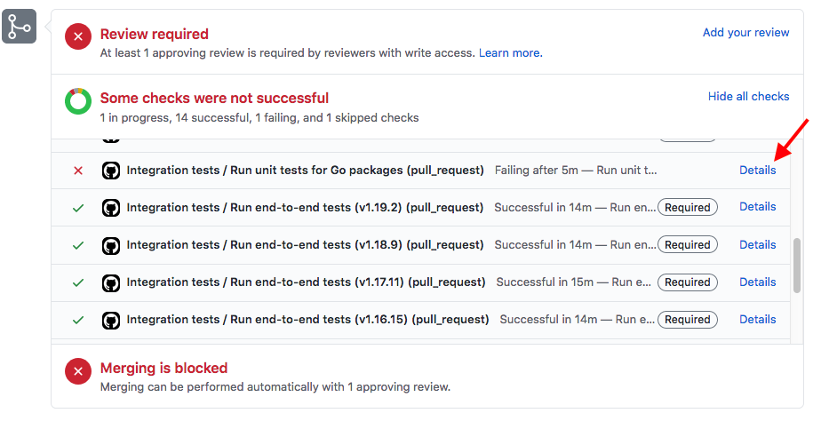

# Continuous Integration (CI)

## Troubleshooting CI checks

You can click on the "Details" link next to the failed step to get more information about the failure.



To read more about The GitHub actions are configured in [`ci-build.yaml`](https://github.com/argoproj/argo-cd/blob/master/.github/workflows/ci-build.yaml).

### Can I retrigger the checks without pushing a new commit?

Since the CI pipeline is triggered on Git commits, there is currently no (known) way on how to retrigger the CI checks without pushing a new commit to your branch.

If you are absolutely sure that the failure was due to a failure in the pipeline, and not an error within the changes you committed, you can push an empty commit to your branch, thus retriggering the pipeline without any code changes. To do so, issue

```bash
git commit -s --allow-empty -m "Retrigger CI pipeline"
git push origin <yourbranch>
```

### Why does the build step fail?

First, make sure the failing build step succeeds on your machine. Remember the containerized build toolchain is available, too.

If the build is failing at the `Ensure Go modules synchronicity` step, you need to first download all Go dependent modules locally via `go mod download` and then run `go mod tidy` to make sure the dependent Go modules are tidied up. Finally, commit and push your changes to `go.mod` and `go.sum` to your branch.

If the build is failing at the `Build & cache Go code`, you need to make sure `make build-local` runs successfully on your local machine.

### Why does the codegen step fail?

If the codegen step fails with "Check nothing has changed...", chances are high that you did not run `make codegen`, or did not commit the changes it made. You should double-check by running `make codegen` followed by `git status` in the local working copy of your branch. Commit any changes and push them to your GH branch to have the CI check it again.

A second common case for this is, when you modified any of the auto generated assets, as these will be overwritten upon `make codegen`.

Generally, this step runs `codegen` and compares the outcome against the Git branch it has checked out. If there are differences, the step will fail.

See [What checked-in code is generated and where does it come from?](faq.md#what-checked-in-code-is-generated-and-how-is-it-generated) for more information.

### Why does the lint step fail?

Your code failed to lint correctly, or modifications were performed by the `golangci-lint` process.

* You should run `make lint`, or `golangci-lint run` on your local branch and fix all the issues.

* If you receive an error like, ```File is not `goimports`-ed (goimports)```, the file is not formatted correctly. Run `gofmt -w $file.go` to resolve this linter error.

### Why does the test or e2e steps fail?

You should check for the cause of the failure in the check's detail page as described above. This will give you the name of the test that has failed, and details about why. If your test are passing locally (using the virtualized toolchain), chances are that the test might be flaky and will pass the next time it is run. Please retrigger the CI pipeline as described above and see if the test step now passes.

## Updating The Builder Image

Login to Docker Hub:

```bash
docker login
```

Build image:

```bash
make builder-image IMAGE_NAMESPACE=argoproj IMAGE_TAG=v1.0.0
```

## Public CD

Every commit to master is built and published to `ghcr.io/argoproj/argo-cd/argocd:<version>-<short-sha>`. The list of images is available at
[https://github.com/argoproj/argo-cd/packages](https://github.com/argoproj/argo-cd/packages).

!!! note
    GitHub docker registry [requires](https://github.community/t5/GitHub-Actions/docker-pull-from-public-GitHub-Package-Registry-fail-with-quot/m-p/32888#M1294) authentication to read
    even publicly available packages. Follow the steps from Kubernetes [documentation](https://kubernetes.io/docs/tasks/configure-pod-container/pull-image-private-registry)
    to configure image pull secret if you want to use `ghcr.io/argoproj/argo-cd/argocd` image.

The image is automatically deployed to the dev Argo CD instance: [https://cd.apps.argoproj.io/](https://cd.apps.argoproj.io/)
