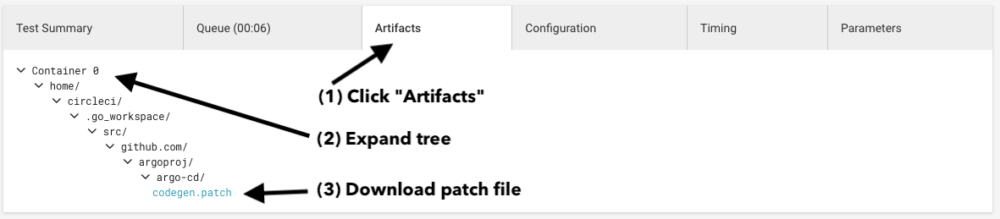

# CI

## Troubleshooting Builds

### "Check nothing has changed" step fails
 
If your PR fails the `codegen` CI step, you can either:

(1) Simple - download the `codgen.patch` file from CircleCI and apply it:



```bash
git apply codegen.patch 
git commit -am "Applies codegen patch"
```

(2) Advanced - if you have the tools installed (see the contributing guide), run the following:

```bash
make pre-commit
git commit -am 'Ran pre-commit checks'
```

## Updating The Builder Image

Login to Docker Hub:

```bash
docker login
```

Build image:

```bash
make builder-image IMAGE_NAMESPACE=argoproj IMAGE_TAG=v1.0.0
```

## Public CD

[https://cd.apps.argoproj.io/](https://cd.apps.argoproj.io/)