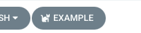
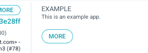
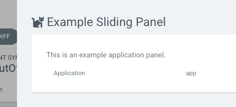
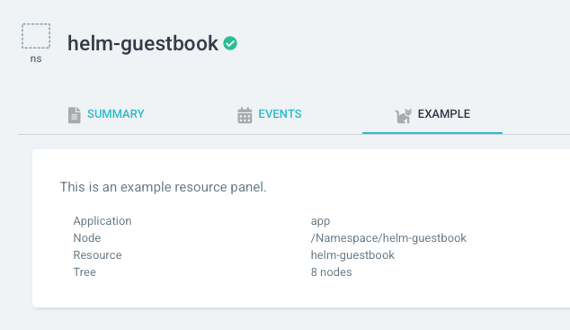

# Extensions

An extension is a way to add new capabilities to the UI.

Use cases include:

* Surfacing high-level application telemetry and insights.
* Recommending Kubernetes best practices.
* Alerting users about vulnerabilities in their application.

⚠️ Only install extensions from trusted sources. An extension will be able to make HTTP requests and have access to your
application details.

## UI Extension

A UI extension is:

* A Javascript module packaged into a single `.js` file.
* Installed on every Argo CD server at `/tmp/extensions/{name}.js`.
* Listed in `/tmp/extensions/index.json` (e.g. `{"items": ["name"]}`).

See [example](https://github.com/argoproj-labs/argocd-example-extension/v2/ui).

### `AppToolbarButton`

A button added to the application toolbar.

### `AppStatusPanelItem`

An item added to the application status panel.

### `AppPanel`

A sliding panel that can be activated by a toolbar button or status panel item.

### `ResourcePanel`

A panel shown when clicking into resources.

