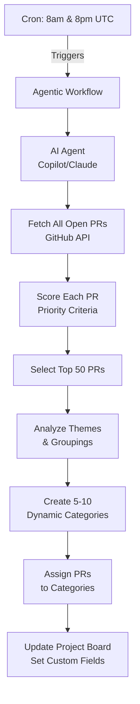

# PR Triage Agentic Workflow

This document describes the automated PR triage system for Argo CD using GitHub Agentic Workflows.

## Overview

The PR triage workflow analyzes all open pull requests on-demand, scores them by priority, selects the top 50, intelligently categorizes them, and updates a GitHub Project board to help maintainers focus on the most important work.

**Key Features:**

- **Automated Scoring**: Evaluates PRs based on multiple priority factors
- **Top 50 Focus**: Shows only the highest priority PRs to reduce noise
- **Dynamic Categorization**: AI creates 5-10 adaptive categories based on what's in the top 50
- **Non-Invasive**: Only updates the project board - no PR modifications
- **Manual Trigger**: Run on-demand when needed

### Project Board Update

The workflow updates a GitHub Project board with:

- All top 50 PRs
- Priority Score (numeric)
- Priority Tier (Critical/High/Medium)
- Category (dynamically assigned)
- Days Open
- Key Factors (emoji indicators like "🔴 Security, ✅ Approved")

## Usage

### Scheduled Runs

The workflow requires a `COPILOT_GITHUB_TOKEN` on the repository to execute. Currently, GitHub does not support
Copilot token at the organization or GitHub App level.

For argoproj deployment, consider:

- **Option A**: Create a service/bot account with Copilot license
- **Option B**: Switch to Claude (`ANTHROPIC_API_KEY`) or OpenAI (`OPENAI_API_KEY`) with org-managed API keys

For this reason, the workflow must be executed manually from a fork with the provisioned personal tokens.

### Manual Runs

The workflow is triggered manually when needed:

```bash
gh aw run pr-triage --repo YOUR_USERNAME/argo-cd --ref master
```

**Note**: Make sure to complete the **Personal Setup** instructions to configure the secrets on your fork.

### Viewing Results

1. Navigate to the [PR Priority Triage Project](https://github.com/orgs/argoproj/projects/38)
2. Use the pre-configured views:
   - **By Priority**: See top PRs first
   - **By Tier**: Focus on Critical/High priority
   - **By Category**: Filter by your area of expertise

## Personal Setup

### Prerequisites

1. **GitHub Project** with custom fields for PR triage
2. **GitHub Copilot license** or alternative AI engine (Claude/OpenAI)
3. **GitHub Personal Token** with organization-level permissions to edit projects

### Configure Required Secrets

The workflow requires two types of authentication secrets:

#### AI Engine Secret

**Important**: The name of the tokens must match what is defined in the Agentic Workflow [Token Reference](https://github.github.com/gh-aw/reference/tokens/) documentation.

**For GitHub Copilot:**

Argo Maintainers have access to a free [GitHub Copilot Enterprise](https://github.com/argoproj/argoproj/blob/main/community/membership.md#maintainers) provided by CNCF.

```bash
# Create fine-grained PAT at: https://github.com/settings/personal-access-tokens/new
# Required permission: Account permissions → Copilot Requests: Read
# Resource owner: Personal account (NOT organization)

gh secret set COPILOT_GITHUB_TOKEN --body "YOUR_TOKEN" --repo YOUR_USERNAME/argo-cd
```

**Alternative AI Engines:**

```bash
# For Claude (update workflow: engine: claude)
gh secret set ANTHROPIC_API_KEY --body "sk-ant-..." --repo YOUR_USERNAME/argo-cd

# For OpenAI (update workflow: engine: codex)
gh secret set OPENAI_API_KEY --body "sk-..." --repo YOUR_USERNAME/argo-cd
```

#### Personal Access Token (Testing from fork)

The workflow can use a fine-grained Personal Access Token (PAT) with organization project access to update the [PR Priority Triage Project](https://github.com/orgs/argoproj/projects/38).

**Required Secret:**

```bash
# Create fine-grained PAT at: https://github.com/settings/personal-access-tokens/new
# Configuration:
#   - Resource owner: argoproj (organization)
#   - Organization permissions → Projects: Read and write

gh secret set GH_AW_PROJECT_GITHUB_TOKEN --body "YOUR_PAT" --repo YOUR_USERNAME/argo-cd
```

**PAT Requirements:**

- **Resource owner**: `argoproj` organization
- **Organization permissions**:
  - Projects: Read and write
- **Note**: You must be a member of the argoproj organization with appropriate permissions

## Initial Setup (org level)

### Create GitHub Project (argo)

1. Navigate to https://github.com/orgs/argoproj/projects
2. Click "New project" and name it "PR Priority Triage"
3. Add custom fields:
   - **Priority Score** (Number)
   - **Priority Tier** (Single Select: Critical, High, Medium)
   - **Category** (Text)
   - **Days Open** (Number)
   - **Key Factors** (Text)
4. Note the project number from the URL (e.g., `/projects/38`)
5. Update `.github/workflows/pr-triage.md` with the project number:
   ```yaml
   safe-outputs:
     update-project:
       project: https://github.com/orgs/argoproj/projects/38
   ```

#### GitHub App Secrets (Project Write Access)

**Note**: Since this workflow can only be called from fork due to the AI Engine Secret limitation, a Github App is not used to authenticate to argoproj. A Github App is supported and should be configured when the limitation is lifted.

A GitHub App provides organization-level authentication for updating the project board.

**GitHub App Configuration:**

- **Name**: PR Triage Workflow
- **Repository Permissions**:
  - Contents: Read-only
  - Issues: Read and write
  - Pull requests: Read-only
- **Organization Permissions**:
  - Projects: Read and write

**Required Secrets:**

```bash
# App ID from GitHub App settings
gh secret set PR_TRIAGE_GH_CLIENT_ID --body "CLIENT_ID" --repo argoproj/argo-cd

# Private key (.pem file contents)
gh secret set PR_TRIAGE_GH_APP_PRIVATE_KEY --body "$(cat key.pem)" --repo argoproj/argo-cd
```

Update the workflow to use the GitHub App:

```yaml
tools:
  github:
    toolsets: [default]
    github-app:
      app-id: ${{ secrets.PR_TRIAGE_GH_APP_CLIENT_ID }}
      private-key: ${{ secrets.PR_TRIAGE_GH_APP_PRIVATE_KEY }}
```

## Maintenance

### Compile and Test

```bash
# Compile workflow
gh aw compile .github/workflows/pr-triage.md

# Test run
gh aw run pr-triage --repo YOUR_USERNAME/argo-cd --ref YOUR_BRANCH

# Or via GitHub UI: Your fork → Actions → PR Triage → Run workflow
```

### Updating Criteria

To adjust priority scoring or categorization logic:

1. Edit `.github/workflows/pr-triage.md`
2. Modify the instructions in the markdown body
3. Recompile: `gh aw compile`
4. Commit and push changes

**Example**: To increase weight of documentation PRs:

```markdown
### High Priority (Score 50-69)

- PRs with all CI checks passing and linked to approved issues
- PRs from frequent contributors
- Bug fixes with small changes (<100 lines)
- **Documentation improvements** (NEW)
```

### Monitoring

Check workflow health:

```bash
gh aw health pr-triage --repo YOUR_USERNAME/argo-cd
```

View recent logs:

```bash
gh aw logs pr-triage --repo YOUR_USERNAME/argo-cd --ref YOUR_BRANCH
```

Audit a specific run:

```bash
gh aw audit <run-id-or-url>
```

### Troubleshooting

**Missing `COPILOT_GITHUB_TOKEN`:**

- Ensure you have exported your token to your fork
- Ensure you are running the workflow on your fork

**Workflow fails to compile:**

- Check YAML formatter syntax
- Ensure project URL follows correct format
- Run `gh aw validate` to see detailed errors

**No PRs added to project:**

- Verify project permissions
- Check that project URL is correct
- Ensure AI engine has proper authentication

**Categories seem off:**

- Review the categorization guidelines in the workflow
- Adjust instructions to be more specific
- Consider providing examples of desired categories

## Cost Estimation

**Using GitHub Copilot**:

- ~$0.10-0.30 per run

**Using Claude Sonnet**:

- ~$0.20-0.50 per run

**Using OpenAI GPT-4**:

- ~$0.30-0.80 per run

## Architecture



## References

- [GitHub Agentic Workflows Documentation](https://github.com/github/gh-aw)
- [Agentic Workflows Blog Post](https://github.blog/ai-and-ml/automate-repository-tasks-with-github-agentic-workflows/)
