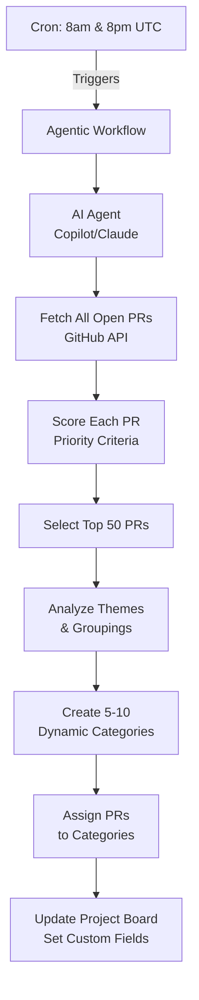

# PR Triage Agentic Workflow

This document describes the automated PR triage system for Argo CD using GitHub Agentic Workflows.

## Overview

The PR triage workflow automatically analyzes all open pull requests twice daily (8am and 8pm UTC), scores them by priority, selects the top 50, intelligently categorizes them, and updates a GitHub Project board to help maintainers focus on the most important work.

**Key Features:**

- **Automated Scoring**: Evaluates PRs based on multiple priority factors
- **Top 50 Focus**: Shows only the highest priority PRs to reduce noise
- **Dynamic Categorization**: AI creates 5-10 adaptive categories based on what's in the top 50
- **Non-Invasive**: Only updates the project board - no PR modifications
- **Twice Daily**: Runs at 8am and 8pm UTC to keep priorities current

### Project Board Update

The workflow updates a GitHub Project board with:

- All top 50 PRs
- Priority Score (numeric)
- Priority Tier (Critical/High/Medium)
- Category (dynamically assigned)
- Days Open
- Key Factors (emoji indicators like "🔴 Security, ✅ Approved")

## Usage

### Scheduled Runs

The workflow runs automatically twice daily:

- **8:00 AM UTC** (start of European workday)
- **8:00 PM UTC** (start of US West Coast workday)

### Manual Runs

Trigger anytime:

```bash
gh aw run pr-triage
```

### Viewing Results

1. Navigate to the [PR Priority Triage Project](https://github.com/orgs/argoproj/projects/YOUR_PROJECT_NUMBER)
2. Use the pre-configured views:
   - **By Priority**: See top PRs first
   - **By Tier**: Focus on Critical/High priority
   - **By Category**: Filter by your area of expertise

## Setup Instructions

### Prerequisites

1. **GitHub Project**: Create a new project for PR triage
2. **Permissions**: Workflow needs `contents: read`, `pull-requests: read`, and ability to update the project
3. **AI Engine**: GitHub Copilot access or API key for Claude/GPT

### Step 1: Create GitHub Project

1. Navigate to https://github.com/orgs/argoproj/projects
2. Click "New project"
3. Name it "PR Priority Triage"
4. Add custom fields:
   - **Priority Score** (Number)
   - **Priority Tier** (Single Select: Critical, High, Medium)
   - **Category** (Text) - will be populated dynamically
   - **Days Open** (Number)
   - **Key Factors** (Text)
5. Create views:
   - **By Priority**: Sort by Priority Score descending
   - **By Tier**: Group by Priority Tier
   - **By Category**: Group by Category field
6. Note the project number from the URL (e.g., `/projects/123`)

### Step 2: Update Workflow Configuration

Edit `.github/workflows/pr-triage.md` and replace:

```markdown
project: https://github.com/orgs/argoproj/projects/38
```

With your actual project number:

```markdown
project: https://github.com/orgs/argoproj/projects/123
```

### Step 3: Configure Secrets

Add a GitHub Actions secret for the AI engine:

**For GitHub Copilot** (current):

```bash
# No additional secret needed if using GitHub-hosted runners
# Copilot uses the workflow's GITHUB_TOKEN automatically
```

**For Claude**:

```bash
gh secret set ANTHROPIC_API_KEY --body "sk-ant-..."
```

**For OpenAI**:

```bash
gh secret set OPENAI_API_KEY --body "sk-..."
```

If using Claude or OpenAI, update the `engine:` field in the workflow:

```markdown
engine: claude # or codex for OpenAI
```

### Step 4: Compile Workflow

```bash
gh aw compile
```

This generates `.github/workflows/pr-triage.lock.yml` - the actual GitHub Actions workflow.

### Step 5: Test Run (Manual)

Test the workflow manually before the first scheduled run:

```bash
gh aw run pr-triage
```

Or via GitHub UI:

1. Go to Actions → PR Triage workflow
2. Click "Run workflow"
3. Monitor the execution

## Maintenance

### Updating Criteria

To adjust priority scoring or categorization logic:

1. Edit `.github/workflows/pr-triage.md`
2. Modify the instructions in the markdown body
3. Recompile: `gh aw compile`
4. Commit and push changes

**Example**: To increase weight of documentation PRs:

```markdown
### High Priority (Score 50-69)

- PRs with all CI checks passing and linked to approved issues
- PRs from frequent contributors
- Bug fixes with small changes (<100 lines)
- **Documentation improvements** (NEW)
```

### Monitoring

Check workflow health:

```bash
gh aw health pr-triage
```

View recent logs:

```bash
gh aw logs pr-triage
```

Audit a specific run:

```bash
gh aw audit <run-id-or-url>
```

### Troubleshooting

**Workflow fails to compile:**

- Check YAML formatter syntax
- Ensure project URL follows correct format
- Run `gh aw validate` to see detailed errors

**No PRs added to project:**

- Verify project permissions
- Check that project URL is correct
- Ensure AI engine has proper authentication

**Categories seem off:**

- Review the categorization guidelines in the workflow
- Adjust instructions to be more specific
- Consider providing examples of desired categories

## Cost Estimation

**Using GitHub Copilot**:

- ~$0.10-0.30 per run
- ~$6-18 per month (twice daily)

**Using Claude Sonnet**:

- ~$0.20-0.50 per run
- ~$12-30 per month (twice daily)

**Using OpenAI GPT-4**:

- ~$0.30-0.80 per run
- ~$18-48 per month (twice daily)

## Architecture



## References

- [GitHub Agentic Workflows Documentation](https://github.com/github/gh-aw)
- [Agentic Workflows Blog Post](https://github.blog/ai-and-ml/automate-repository-tasks-with-github-agentic-workflows/)
