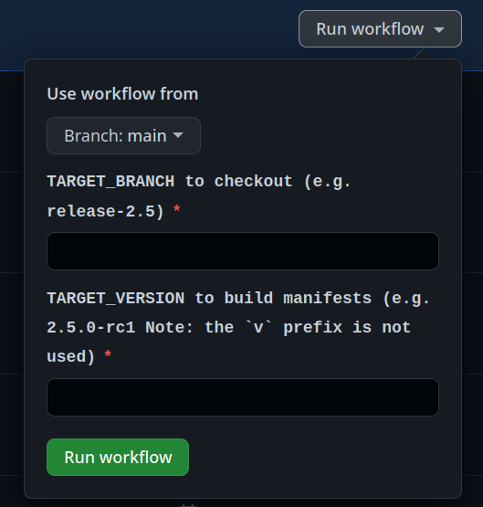

# Releasing

## Introduction

Argo CD is released in a 2 step automated fashion using GitHub actions. The release process takes about 60 minutes,
sometimes a little less, depending on the performance of GitHub Actions runners.

The target release branch must already exist in the GitHub repository. If you for
example want to create a release `v2.7.0`, the corresponding release branch
`release-2.7` needs to exist, otherwise, the release cannot be built. Also,
the trigger tag should always be created in the release branch, checked out
in your local repository clone.

Before triggering the release automation, the `CHANGELOG.md` should be updated
with the latest information, and this change should be committed and pushed to
the GitHub repository to the release branch. Afterward, the automation can be
triggered. This will be automated in the very near future.

**Manual steps before release creation:**

* Update `CHANGELOG.md` with changes for this release
* Commit & push changes to `CHANGELOG.md`

**The `Init ARGOCD Release` workflow will perform the following steps:**

* Update `VERSION` file in the release branch
* Update manifests with image tags of the new version in the release branch
* Create a pull request to submit the above changes

**The `Publish ArgoCD Release` workflow will perform the following steps:**

* Build, push, and signs the container image to Quay.io
* Generate a provenance for the container image
* Builds the CLI binaries, release-notes, and then creates a GitHub release and attaches the required assets.
* Generate a provenance for the CLI binaries
* Generate and sign a sbom
* Update the stable tag when applicable
* Update `VERSION` file in the master branch when a new release is GA

## Steps

### Step 1 - Update Version and Manifest

1. Ensure that the TARGET_BRANCH already exist.
2. Visit the [Release GitHub Action](https://github.com/argoproj/argo-cd/actions/workflows/init-release.yaml)
and choose which branch you would like to work from.
3. Enter the TARGET_BRANCH to checkout.
4. Enter the TARGET_VERSION that will be used to build manifest and `VERSION` file. (e.g `2.7.0-rc1`)



When the action is completed a pull request will be generated that contains the updated manifest and `Version` file.

5. Merge the pull request and proceed to step 2.

### Step 2 - Tag Release Branch

The steps below need to be executed by someone with write access in Argo CD upstream repo.

1. Checkout the release branch. Example: `git fetch upstream && git
   checkout release-2.7`
2. Run the script found at `hack/trigger-release.sh` as follows:

```shell
./hack/trigger-release.sh <version> <remote name>
```

Example: 
```shell
./hack/trigger-release.sh v2.7.2 upstream
```

!!! tip
    The tag must be in one of the following formats to trigger the GH workflow:<br>
    * GA: `v<MAJOR>.<MINOR>.<PATCH>`<br>
    * Pre-release: `v<MAJOR>.<MINOR>.<PATCH>-rc<RC#>`

Once the script is executed successfully, a GitHub workflow will start
execution. You can follow its progress under the [Actions](https://github.com/argoproj/argo-cd/actions/workflows/release.yaml) tab, the name of the action is `Publish ArgoCD Release`. 

!!! warning
    You cannot perform more than one release on the same release branch at the
    same time.

### Verifying automated release

After the automatic release creation has finished, you should perform manual
checks to see if the release came out correctly:

* Check status & output of the GitHub action
* Check [https://github.com/argoproj/argo-cd/releases](https://github.com/argoproj/argo-cd/releases)
  to see if the release has been correctly created and if all required assets
  are attached.
* Check whether the image has been published on Quay.io correctly

### If something went wrong

If something went wrong, damage should be limited. Depending on the steps that
have been performed, you will need to manually clean up.

* If the container image has been pushed to Quay.io, delete it
* Delete the release (if created) from the `Releases` page on GitHub

### Manual releasing

The release process does not allow a manual release process. Image signatures and provenance need to be created using GitHub Actions.

## Notable files that involve the release process.

| File                               | Description                                            |
|------------------------------------|--------------------------------------------------------|
|goreleaser.yaml                     |Config to build CLI binaries, checksums, release-notes  |
|.github/workflows/image-reuse.yaml  |Reusable workflow used to generate container images     |
|.github/workflows/init-release.yaml |Used to generate manifest and `VERSION` file            |
|.github/workflows/release.yaml      |Build image, CLI binaries, provenances, sbom, post jobs |
|./hack/trigger-release.sh           |Ensures all pre-requistes are met and pushes the tag    |  
