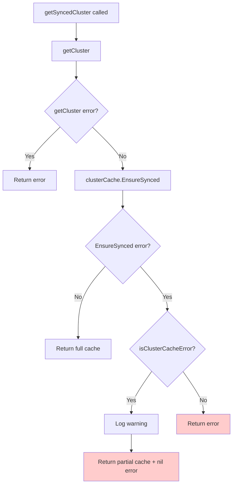
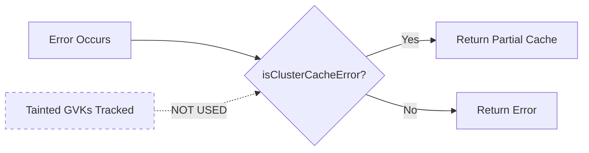
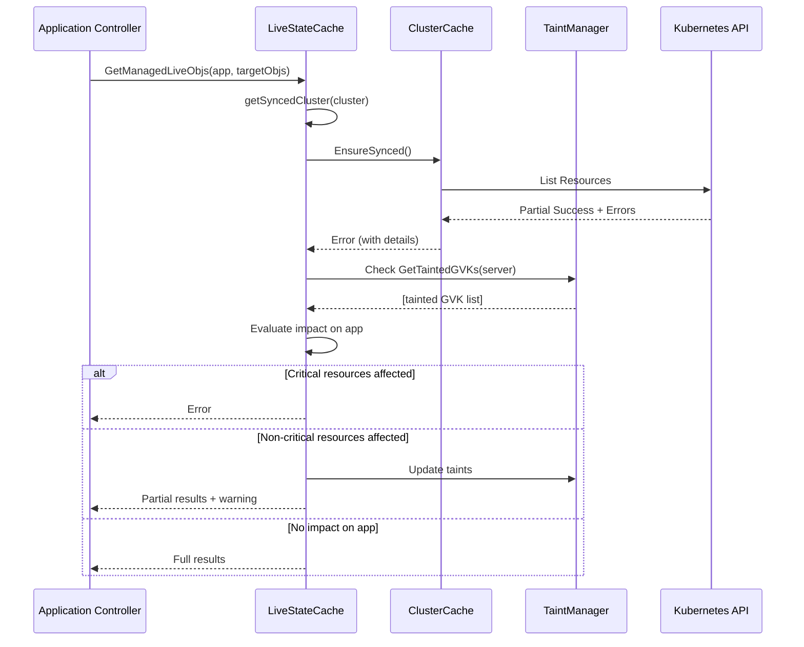

# getSyncedCluster Error Handling Architecture Analysis

## Executive Summary

The `getSyncedCluster` function is at the heart of ArgoCD's cluster cache management, serving as the gateway between the application controller and the underlying Kubernetes cluster state. Recent changes have expanded its error handling to return partial cache states for a broader range of errors, which has significant architectural implications.

## Current Architecture

### 1. Error Flow and Decision Points



### 2. Error Classification System

The system uses two parallel error tracking mechanisms:

#### A. isClusterCacheError (Broad Pattern Matching)
- **Purpose**: Identifies errors that indicate partial cache availability
- **Scope**: Very broad - catches multiple error types
- **Decision**: Returns partial cache for ANY matching error

```
Current Patterns:
├── Conversion webhook errors
├── Pagination token expiration  
├── Resource list failures
├── Connection issues (refused, reset, timeout)
├── Server timeouts
└── Context deadline exceeded
```

#### B. Cluster Taint Management (Specific GVK Tracking)
- **Purpose**: Tracks which specific resource types (GVKs) are affected
- **Scope**: Precise - tracks individual GVK failures
- **Usage**: Currently informational only, not used for cache decisions

```
Taint Structure:
server -> {
    "apps/v1/Deployment": "ConversionError",
    "custom.io/v1/Resource": "ListError"
}
```

## Architectural Issues

### 1. Decision Criteria Mismatch

**Problem**: The decision to return partial cache vs error is based on broad error patterns, not on the actual impact to the application.



**Impact**:
- Connection timeout → Returns partial cache (might be completely empty)
- Single GVK conversion error → Returns partial cache (rest might be fine)
- All app resources affected → Still returns partial cache (app can't function)

### 2. Upstream Consumer Assumptions

Applications consuming `getSyncedCluster` expect either:
- **Full cache with nil error**: Proceed normally
- **Error**: Handle failure appropriately

Current behavior introduces a third state:
- **Partial cache with nil error**: Consumers don't know cache is incomplete

```go
// Consumer code pattern
cache, err := getSyncedCluster(cluster)
if err != nil {
    // Handle error
    return err
}
// Assumes cache is complete - WRONG!
resources := cache.GetResources()
```

### 3. Impact Analysis by Consumer

| Consumer Method | Impact of Partial Cache | Severity |
|----------------|------------------------|----------|
| GetManagedLiveObjs | Missing resources treated as deleted | HIGH |
| GetVersionsInfo | May return incomplete API info | MEDIUM |
| IsNamespaced | Might not find resource type | MEDIUM |
| IterateHierarchyV2 | Incomplete hierarchy traversal | HIGH |
| GetNamespaceTopLevelResources | Missing top-level resources | HIGH |

## Architectural Recommendations

### 1. Use Tainted GVKs for Decision Making

**Principle**: Return partial cache only when the application can still function meaningfully.

```go
func (c *liveStateCache) getSyncedCluster(server *appv1.Cluster) (clustercache.ClusterCache, error) {
    clusterCache, err := c.getCluster(server)
    if err != nil {
        return nil, err
    }
    
    err = clusterCache.EnsureSynced()
    if err != nil {
        // Check if error affects resources this app cares about
        if shouldReturnPartialCache(server, err) {
            log.Warnf("Returning partial cache: %v", err)
            return clusterCache, nil
        }
        return nil, err
    }
    
    return clusterCache, nil
}

func shouldReturnPartialCache(server string, err error) bool {
    // Only return partial cache if:
    // 1. We have tainted GVKs (specific failures)
    // 2. The error is recoverable
    // 3. Some resources are still accessible
    
    taintedGVKs := GetTaintedGVKs(server.Server)
    if len(taintedGVKs) == 0 {
        // No specific GVK failures tracked - likely total failure
        return false
    }
    
    // Check if it's a known partial failure pattern
    if !isPartialCacheError(err) {
        return false
    }
    
    return true
}
```

### 2. Enhance Error Classification

Split `isClusterCacheError` into two categories:

```go
// Errors where partial cache makes sense
func isPartialCacheError(err error) bool {
    patterns := []string{
        `conversion webhook.*failed`,  // Specific resource issue
        `failed to list resources.*Kind=`, // Specific GVK issue
    }
    // Check patterns...
}

// Errors where cache should not be used
func isTotalCacheFailure(err error) bool {
    patterns := []string{
        `connection refused`,     // Can't reach cluster
        `context deadline exceeded`, // Timeout - unknown state
        `i/o timeout`,           // Network failure
    }
    // Check patterns...
}
```

### 3. Explicit Partial Cache Handling

Make partial cache state explicit in the return:

```go
type CacheState int

const (
    CacheComplete CacheState = iota
    CachePartial
    CacheFailed
)

type ClusterCacheResult struct {
    Cache  clustercache.ClusterCache
    State  CacheState
    TaintedGVKs []string
}

func (c *liveStateCache) getSyncedClusterV2(server *appv1.Cluster) (*ClusterCacheResult, error) {
    // Implementation...
}
```

### 4. Application-Aware Decisions

Consider the application's target resources when deciding on partial cache:

```go
func (c *liveStateCache) shouldUsePartialCacheForApp(
    server string, 
    app *appv1.Application,
    targetGVKs []schema.GroupVersionKind,
) bool {
    taintedGVKs := GetTaintedGVKs(server)
    
    // Check if any target resources are affected
    for _, targetGVK := range targetGVKs {
        gvkString := fmt.Sprintf("%s/%s/%s", 
            targetGVK.Group, targetGVK.Version, targetGVK.Kind)
        if contains(taintedGVKs, gvkString) {
            // App resources are affected
            return false
        }
    }
    
    // App resources not affected by taints
    return true
}
```

## Implementation Sequence Diagram



## Summary Recommendations

1. **Immediate**: Add logging to track when partial cache is returned and which GVKs are affected
2. **Short-term**: Use tainted GVKs to make smarter decisions about partial cache returns
3. **Medium-term**: Make partial cache state explicit in the API
4. **Long-term**: Implement application-aware cache decisions based on target resources

The current approach of returning partial cache for any `isClusterCacheError` is too broad and can lead to incorrect application behavior. The system should leverage the existing taint tracking to make informed decisions about when partial cache is acceptable.

## Risk Assessment

| Current Behavior | Risk Level | Mitigation |
|-----------------|------------|------------|
| Partial cache returned for connection errors | HIGH - Empty cache treated as "all deleted" | Check tainted GVKs before returning partial |
| No indication cache is partial | HIGH - Consumers assume complete data | Add cache state indicator |
| Broad error pattern matching | MEDIUM - Over-inclusive | Refine patterns based on actual failure modes |
| Taint data not used for decisions | LOW - Missed optimization | Integrate taint checking into decision flow |