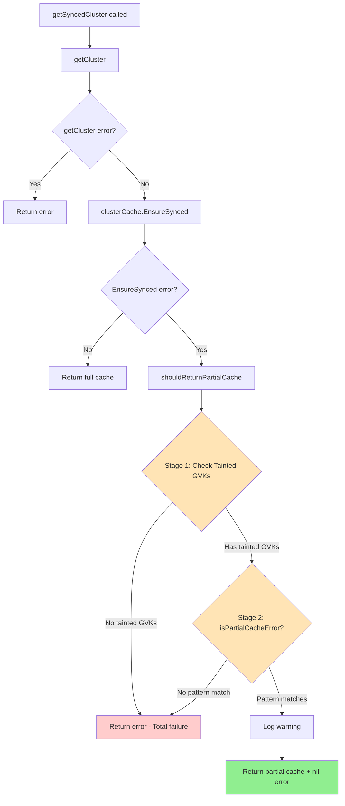
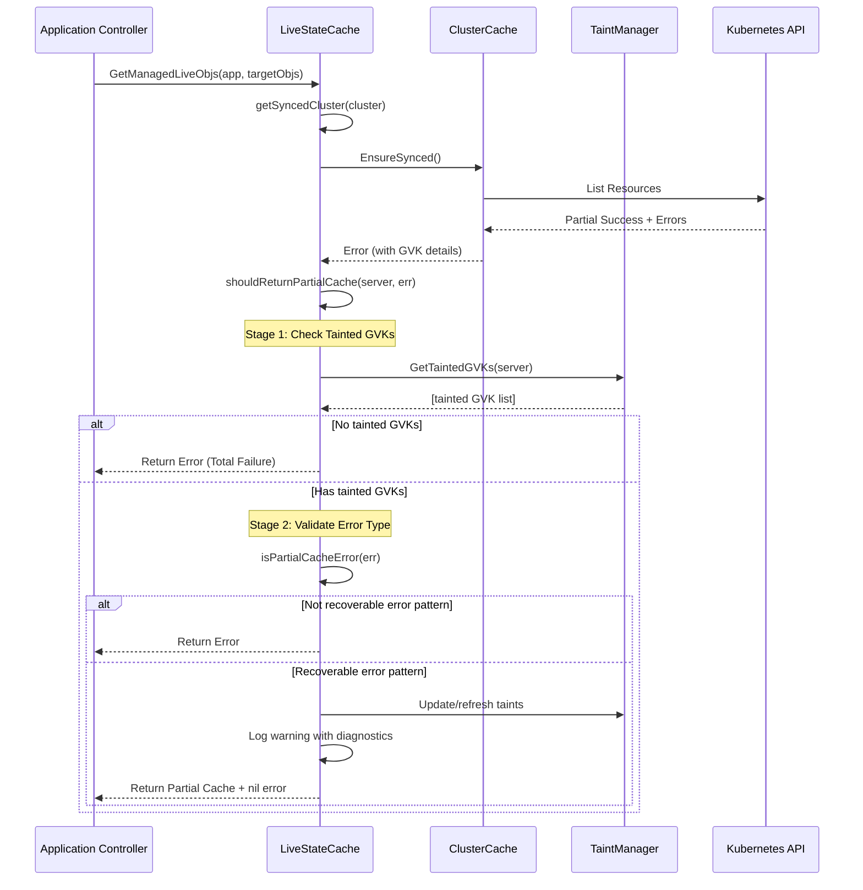

# getSyncedCluster Error Handling Architecture

## Executive Summary

The `getSyncedCluster` function is at the heart of ArgoCD's cluster cache management, serving as the gateway between the application controller and the underlying Kubernetes cluster state. The system employs a two-stage validation approach that intelligently distinguishes between partial and total cluster failures, ensuring appropriate cache behavior for different failure scenarios.

## Architecture Overview

### 1. Two-Stage Validation Flow

The system implements a two-stage validation process that requires BOTH conditions to be met before returning partial cache:



### 2. Error Classification System

The system uses a coordinated approach where both mechanisms work together:

#### A. Primary Decision Factor: Taint Manager (Thread-Safe GVK Tracking)
- **Purpose**: Primary source of truth for cluster health decisions
- **Scope**: Precise tracking of individual GVK failures with TTL-based expiration
- **Decision Role**: MUST have tainted GVKs for partial cache to be considered

```go
type TaintManager struct {
    taints map[string]map[string]time.Time  // server -> GVK -> expiry
    mu     sync.RWMutex
    ttl    time.Duration  // Default: 10 minutes
}

// Taint Structure with expiration:
server -> {
    "apps/v1/Deployment": expiryTime,
    "custom.io/v1/Resource": expiryTime
}
```

#### B. Secondary Validation: isPartialCacheError (Error Type Classification)
- **Purpose**: Validates that the error type is recoverable/partial
- **Scope**: Pattern matching for known partial failure scenarios
- **Decision Role**: Acts as a guard - prevents partial cache for total failures

```
Recoverable Error Patterns (allow partial cache):
├── Conversion webhook failures (specific resources affected)
├── Pagination token expiration (can retry)
├── Resource list failures for specific GVKs
└── Partial API discovery issues

Non-Recoverable Patterns (force full error):
├── Connection refused/reset (total connectivity loss)
├── Context deadline exceeded (unknown state)
├── I/O timeout (network failure)
└── Authentication failures
```

## Core Components

### 1. Consolidated Error Analysis

The centralized `analyzeClusterHealth()` function eliminates duplicate string matching logic:

```go
func analyzeClusterHealth(err error) *ClusterHealthStatus {
    return &ClusterHealthStatus{
        HasError:    err != nil,
        IssueType:   classifyIssue(err),
        Severity:    determineSeverity(err),
        Message:     err.Error(),
        Diagnostics: extractDiagnosticInfo(err),
    }
}
```

This provides structured error classification with rich diagnostic information:

```go
type ClusterHealthStatus struct {
    HasError    bool
    IssueType   ClusterHealthIssueType  // ConversionWebhook, Pagination, Connection, etc.
    Severity    ClusterHealthSeverity    // Critical, Warning, Info
    Message     string
    Diagnostics map[string]interface{}
}
```

### 2. Two-Stage Validation Logic

The `shouldReturnPartialCache()` function requires BOTH conditions:

```go
func (c *liveStateCache) shouldReturnPartialCache(server string, err error) bool {
    // Stage 1: Check if we have specific GVK failures (not total failure)
    taintedGVKs := c.taintManager.GetTaintedGVKs(server)
    if len(taintedGVKs) == 0 {
        // No tainted GVKs = likely total failure (connection issues, auth, etc.)
        return false
    }
    
    // Stage 2: Verify error type is recoverable
    if !isPartialCacheError(err) {
        // Not a known partial failure pattern
        return false
    }
    
    // Both conditions met: specific GVKs affected + recoverable error type
    return true
}
```

This prevents incorrect partial cache returns for total failures like connection timeouts.

### 3. Cluster Status Determination

Empty clusters correctly show "Successful" status instead of "Unknown":

```go
// clusterinfoupdater.go:
if cluster.Info.ConnectionState.Status == "" {
    cluster.Info.ConnectionState.Status = appv1.ConnectionStatusSuccessful
}
```

This ensures clusters start in a healthy state and only degrade when actual errors occur.

## Thread-Safe Taint Manager

### Lifecycle Management

The TaintManager provides comprehensive taint tracking with automatic cleanup:

```go
type TaintManager struct {
    taints    map[string]map[string]time.Time
    mu        sync.RWMutex
    ttl       time.Duration
    stopCh    chan struct{}
    cleanupWg sync.WaitGroup
}

// Key features:
// - Thread-safe read/write operations
// - TTL-based automatic expiration (default 10 minutes)
// - Background cleanup goroutine (runs every 5 minutes)
// - Graceful shutdown support

func (tm *TaintManager) TaintGVK(server, gvk string) {
    tm.mu.Lock()
    defer tm.mu.Unlock()
    
    if tm.taints[server] == nil {
        tm.taints[server] = make(map[string]time.Time)
    }
    tm.taints[server][gvk] = time.Now().Add(tm.ttl)
}

func (tm *TaintManager) GetTaintedGVKs(server string) []string {
    tm.mu.RLock()
    defer tm.mu.RUnlock()
    
    var result []string
    now := time.Now()
    for gvk, expiry := range tm.taints[server] {
        if expiry.After(now) {
            result = append(result, gvk)
        }
    }
    return result
}
```

## Implementation Sequence Diagram



## Test Infrastructure

### E2E Test Fixtures with Retry Logic

The test infrastructure includes retry mechanisms for cluster state transitions:

```go
func (f *Fixture) EnsureClusterHealthy(t *testing.T, server string) {
    f.EventuallyWithRetry(func() (bool, error) {
        cluster, err := f.GetCluster(server)
        if err != nil {
            return false, err
        }
        
        return cluster.ConnectionState.Status == "Successful", nil
    }, time.Second*30, time.Second)
}

// Proper cleanup ensures no dangling state:
func (f *Fixture) CleanupConversionWebhook(t *testing.T) {
    // Delete CRD with broken webhook BEFORE cleaning namespaces
    f.RunCli("kubectl", "delete", "crd", "brokenwebhook.io", "--ignore-not-found")
    
    // Wait for taint expiration
    time.Sleep(time.Second * 5)
    
    // Verify cluster returns to healthy state
    f.EnsureClusterHealthy(t, "https://kubernetes.default.svc")
}
```

## Architecture Summary

### Key Design Principles

1. **Two-Stage Validation**: Partial cache only returned when BOTH tainted GVKs exist AND error is recoverable
2. **Centralized Health Analysis**: Single `analyzeClusterHealth()` function eliminates code duplication
3. **Thread-Safe Taint Manager**: Full lifecycle management with TTL expiration and cleanup
4. **Proper Cluster Status Logic**: Empty clusters start as "Successful" not "Unknown"
5. **Structured Error Classification**: Rich diagnostic information with typed severity levels

### System Benefits

| Feature | Impact | Result |
|-------------|---------|---------|
| Two-stage validation | Prevents partial cache for total failures | Empty cache never treated as "all deleted" |
| Taint-based decisions | Precise GVK-level failure tracking | Only affected resources marked as problematic |
| TTL expiration | Automatic recovery after transient issues | Self-healing without manual intervention |
| Structured diagnostics | Rich error context for debugging | Faster root cause analysis |
| Thread-safe operations | Concurrent access without race conditions | Production-ready reliability |

### Risk Mitigation

| Risk Scenario | Mitigation Strategy | Outcome |
|---------------|---------|-----------------|
| Connection errors returning partial cache | Two-stage validation prevents this | Total failures properly identified |
| No indication of partial cache | Structured health status with diagnostics | Clear visibility into cache state |
| Broad error pattern matching | Tainted GVKs required for partial cache | Precise failure detection |
| Concurrent access issues | Thread-safe taint manager | Race-free operations |

## Conclusion

The ArgoCD cluster cache error handling architecture employs a robust two-stage validation process. By requiring both tainted GVKs (indicating specific resource failures) and recoverable error patterns, the system correctly distinguishes between partial and total cluster failures. This prevents critical issues like empty caches being treated as "all resources deleted" while still allowing graceful degradation for isolated resource problems.

The architecture provides production-ready reliability through thread-safe operations, automatic TTL-based recovery, and comprehensive diagnostic information for troubleshooting.