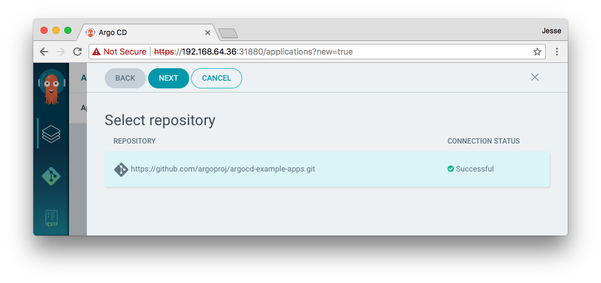
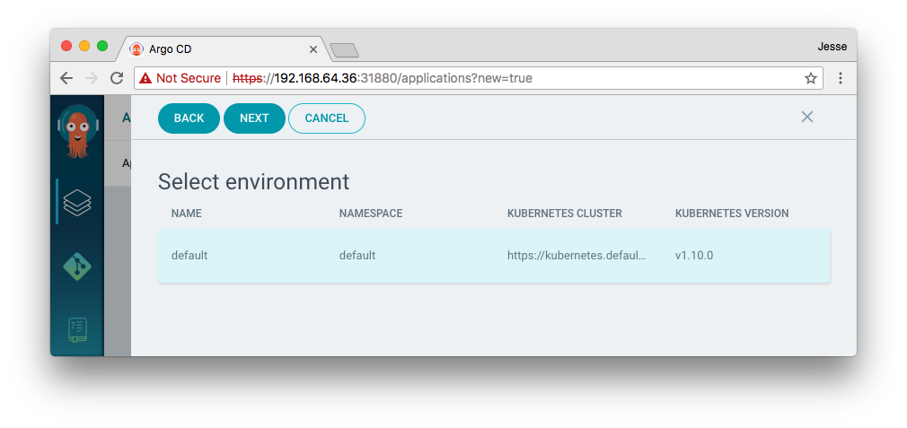

# ArgoCD Getting Started

An example guestbook application is provided to demonstrate how ArgoCD works.

## Requirements
* Installed [kubectl](https://kubernetes.io/docs/tasks/tools/install-kubectl/) command-line tool
* Have a [kubeconfig](https://kubernetes.io/docs/tasks/access-application-cluster/configure-access-multiple-clusters/) file (default location is `~/.kube/config`).

## 1. Install ArgoCD
```
kubectl create namespace argocd
kubectl apply -n argocd -f https://raw.githubusercontent.com/argoproj/argo-cd/master/manifests/install.yaml
```
This will create a new namespace, `argocd`, where ArgoCD services and application resources will live.

NOTE:
* On GKE with RBAC enabled, you may need to grant your account the ability to create new cluster roles
```
$ kubectl create clusterrolebinding YOURNAME-cluster-admin-binding --clusterrole=cluster-admin --user=YOUREMAIL@gmail.com
```

## 2. Download ArgoCD CLI

Download the latest ArgoCD version:
```
curl -sSL -o /usr/local/bin/argocd https://github.com/argoproj/argo-cd/releases/download/v0.7.0/argocd-darwin-amd64
chmod +x /usr/local/bin/argocd
```

## 3. Open access to ArgoCD API server

By default, the ArgoCD API server is not exposed with an external IP. To expose the API server,
change the service type to `LoadBalancer`:

```
kubectl patch svc argocd-server -n argocd -p '{"spec": {"type": "LoadBalancer"}}'
```

## 4. Login to the server from the CLI

Login with using the `admin` user. The initial password is autogenerated to be the pod name of the
ArgoCD API server. This can be retrieved with the command:
```
kubectl get pods -n argocd -l app=argocd-server -o name | cut -d'/' -f 2
```

Using the above password, login to ArgoCD's external IP:

On Minikube:
```
argocd login $(minikube service argocd-server -n argocd --url | cut -d'/' -f 3) --name minikube
```
Other clusters:
```
kubectl get svc -n argocd argocd-server
argocd login <EXTERNAL-IP>
```

After logging in, change the password using the command:
```
argocd account update-password
argocd relogin
```


## 5. Register a cluster to deploy apps to

We will now register a cluster to deploy applications to. First list all clusters contexts in your
kubconfig:
```
argocd cluster add
```

Choose a context name from the list and supply it to `argocd cluster add CONTEXTNAME`. For example,
for minikube context, run:
```
argocd cluster add minikube --in-cluster
```

The above command installs an `argocd-manager` ServiceAccount and ClusterRole into the cluster
associated with the supplied kubectl context. ArgoCD uses the service account token to perform its
management tasks (i.e. deploy/monitoring).

The `--in-cluster` option indicates that the cluster we are registering, is the same cluster that
ArgoCD is running in. This allows ArgoCD to connect to the cluster using the internal kubernetes
hostname (kubernetes.default.svc). When registering a cluster external to ArgoCD, the `--in-cluster`
flag should be omitted.

## 6. Create the application from a git repository

### Creating apps via UI

Open a browser to the ArgoCD external UI, and login using the credentials set in step 4.

On Minikube:
```
minikube service argocd-server -n argocd
```

Connect a git repository containing your apps. An example repository containing a sample 
guestbook application is available at https://github.com/argoproj/argocd-example-apps.git.


After connecting a git repository, select the guestbook application for creation:






### Creating apps via CLI

Applications can be also be created using the ArgoCD CLI:

```
argocd app create guestbook-default --repo https://github.com/argoproj/argocd-example-apps.git --path guestbook --env default
```

## 7. Sync (deploy) the application

Once the guestbook application is created, you can now view its status:

From UI:


From CLI:
```
$ argocd app get guestbook-default
Name:          guestbook-default
Server:        https://kubernetes.default.svc
Namespace:     default
URL:           https://192.168.64.36:31880/applications/argocd/guestbook-default
Environment:   default
Repo:          https://github.com/argoproj/argocd-example-apps.git
Path:          guestbook
Target:        HEAD

KIND        NAME          STATUS     HEALTH
Service     guestbook-ui  OutOfSync
Deployment  guestbook-ui  OutOfSync
```

The application status is initially in an `OutOfSync` state, since the application has yet to be
deployed, and no Kubernetes resources have been created. To sync (deploy) the application, run:

```
$ argocd app sync guestbook-default
Application:        guestbook-default
Operation:          Sync
Phase:              Succeeded
Message:            successfully synced

KIND        NAME          MESSAGE
Service     guestbook-ui  service "guestbook-ui" created
Deployment  guestbook-ui  deployment.apps "guestbook-ui" created
```

This command retrieves the manifests from git repository and performs a `kubectl apply` of the 
manifests. The guestbook app is now running and you can now view its resource
components, logs, events, and assessed health:


## 8. Next Steps

ArgoCD supports additional features such as SSO, WebHooks, RBAC, Projects. See the rest of 
the [documentation](./) for details.
