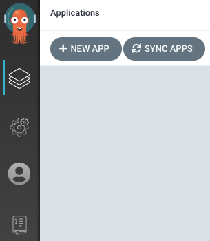
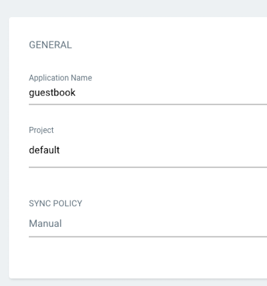
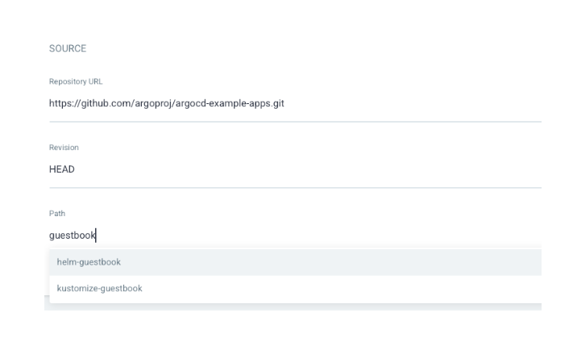
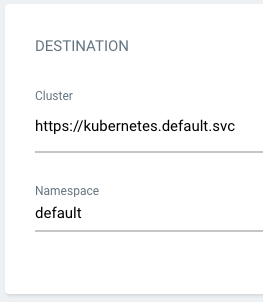
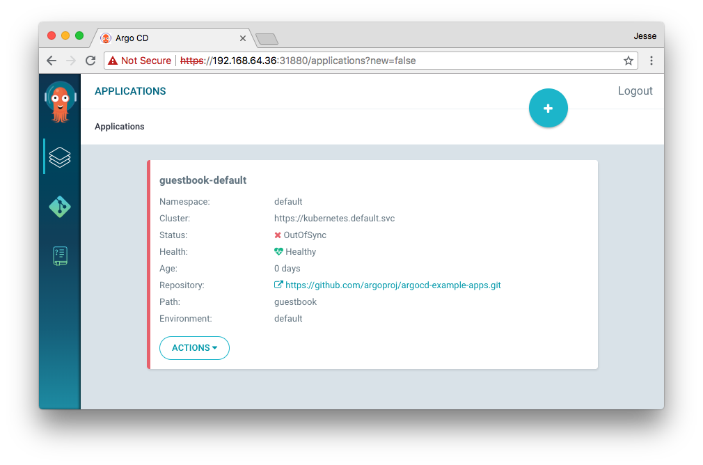
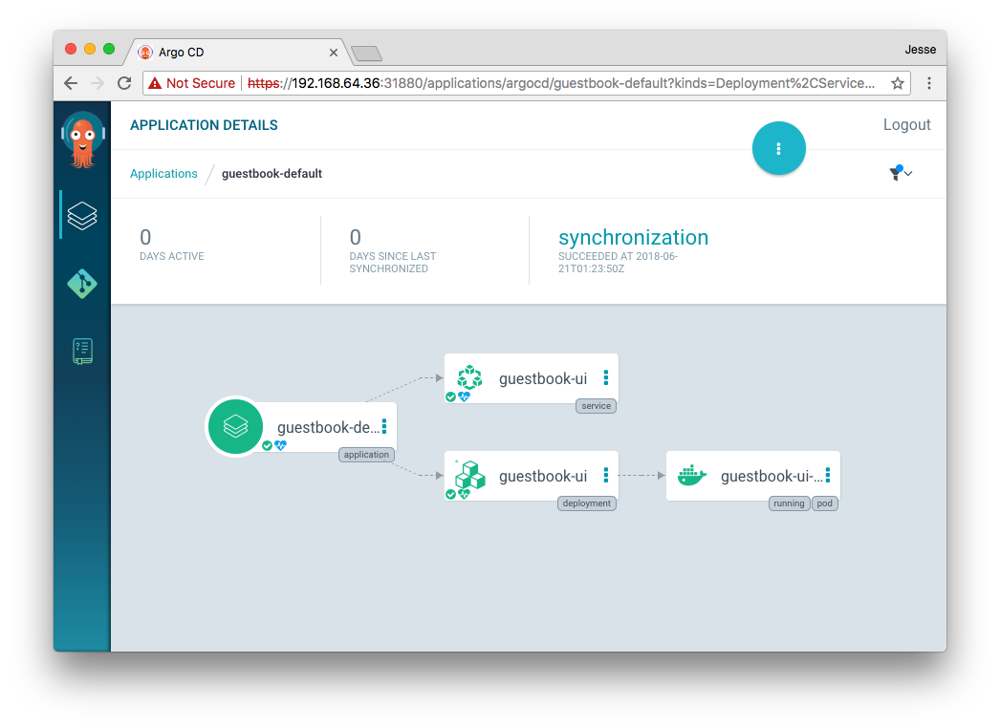

# Getting Started

!!! tip
    This guide assumes you have a grounding in the tools that Argo CD is based on. Please read [understanding the basics](understand_the_basics.md) to learn about these tools.

## Requirements

* Installed [kubectl](https://kubernetes.io/docs/tasks/tools/install-kubectl/) command-line tool.
* Have a [kubeconfig](https://kubernetes.io/docs/tasks/access-application-cluster/configure-access-multiple-clusters/) file (default location is `~/.kube/config`).
* CoreDNS. Can be enabled for microk8s by `microk8s enable dns && microk8s stop && microk8s start`

## 1. Install Argo CD

```bash
kubectl create namespace argocd
kubectl apply -n argocd -f https://raw.githubusercontent.com/argoproj/argo-cd/stable/manifests/install.yaml
```

This will create a new namespace, `argocd`, where Argo CD services and application resources will live.

!!! warning
    The installation manifests include `ClusterRoleBinding` resources that reference `argocd` namespace. If you are installing Argo CD into a different
    namespace then make sure to update the namespace reference.

!!! tip
    If you are not interested in UI, SSO, and multi-cluster features, then you can install only the [core](operator-manual/core.md#installing) Argo CD components.

This default installation will have a self-signed certificate and cannot be accessed without a bit of extra work.
Do one of:

* Follow the [instructions to configure a certificate](operator-manual/tls.md) (and ensure that the client OS trusts it).
* Configure the client OS to trust the self signed certificate.
* Use the --insecure flag on all Argo CD CLI operations in this guide.

!!! note 
    Default namespace for `kubectl` config must be set to `argocd`.
    This is only needed for the following commands since the previous commands have -n argocd already:
    `kubectl config set-context --current --namespace=argocd`
    

Use `argocd login --core` to [configure](./user-guide/commands/argocd_login.md) CLI access and skip steps 3-5.

!!! note
    This default installation for Redis is using password authentication. The Redis password is stored in Kubernetes secret `argocd-redis` with key `auth` in the namespace where Argo CD is installed.

## 2. Download Argo CD CLI

Download the latest Argo CD version from [https://github.com/argoproj/argo-cd/releases/latest](https://github.com/argoproj/argo-cd/releases/latest). More detailed installation instructions can be found via the [CLI installation documentation](cli_installation.md).

Also available in Mac, Linux and WSL Homebrew:

```bash
brew install argocd
```

## 3. Access The Argo CD API Server

By default, the Argo CD API server is not exposed with an external IP. To access the API server,
choose one of the following techniques to expose the Argo CD API server:

### Service Type Load Balancer
Change the argocd-server service type to `LoadBalancer`:

```bash
kubectl patch svc argocd-server -n argocd -p '{"spec": {"type": "LoadBalancer"}}'
```

### Ingress
Follow the [ingress documentation](operator-manual/ingress.md) on how to configure Argo CD with ingress.

### Port Forwarding
Kubectl port-forwarding can also be used to connect to the API server without exposing the service.

```bash
kubectl port-forward svc/argocd-server -n argocd 8080:443
```

The API server can then be accessed using https://localhost:8080


## 4. Login Using The CLI

The initial password for the `admin` account is auto-generated and stored as
clear text in the field `password` in a secret named `argocd-initial-admin-secret`
in your Argo CD installation namespace. You can simply retrieve this password
using the `argocd` CLI:

```bash
argocd admin initial-password -n argocd
```

!!! warning
    You should delete the `argocd-initial-admin-secret` from the Argo CD
    namespace once you changed the password. The secret serves no other
    purpose than to store the initially generated password in clear and can
    safely be deleted at any time. It will be re-created on demand by Argo CD
    if a new admin password must be re-generated.

Using the username `admin` and the password from above, login to Argo CD's IP or hostname:

```bash
argocd login <ARGOCD_SERVER>
```

!!! note
    The CLI environment must be able to communicate with the Argo CD API server. If it isn't directly accessible as described above in step 3, you can tell the CLI to access it using port forwarding through one of these mechanisms: 1) add `--port-forward-namespace argocd` flag to every CLI command; or 2) set `ARGOCD_OPTS` environment variable: `export ARGOCD_OPTS='--port-forward-namespace argocd'`.

Change the password using the command:

```bash
argocd account update-password
```

## 5. Register A Cluster To Deploy Apps To (Optional)

This step registers a cluster's credentials to Argo CD, and is only necessary when deploying to
an external cluster. When deploying internally (to the same cluster that Argo CD is running in),
https://kubernetes.default.svc should be used as the application's K8s API server address.

First list all clusters contexts in your current kubeconfig:
```bash
kubectl config get-contexts -o name
```

Choose a context name from the list and supply it to `argocd cluster add CONTEXTNAME`. For example,
for docker-desktop context, run:
```bash
argocd cluster add docker-desktop
```

The above command installs a ServiceAccount (`argocd-manager`), into the kube-system namespace of
that kubectl context, and binds the service account to an admin-level ClusterRole. Argo CD uses this
service account token to perform its management tasks (i.e. deploy/monitoring).

!!! note
    The rules of the `argocd-manager-role` role can be modified such that it only has `create`, `update`, `patch`, `delete` privileges to a limited set of namespaces, groups, kinds.
    However `get`, `list`, `watch` privileges are required at the cluster-scope for Argo CD to function.

## 6. Create An Application From A Git Repository

An example repository containing a guestbook application is available at
[https://github.com/argoproj/argocd-example-apps.git](https://github.com/argoproj/argocd-example-apps.git) to demonstrate how Argo CD works.

### Creating Apps Via CLI

First we need to set the current namespace to argocd running the following command:

```bash
kubectl config set-context --current --namespace=argocd
```

Create the example guestbook application with the following command:

```bash
argocd app create guestbook --repo https://github.com/argoproj/argocd-example-apps.git --path guestbook --dest-server https://kubernetes.default.svc --dest-namespace default
```

### Creating Apps Via UI

Open a browser to the Argo CD external UI, and login by visiting the IP/hostname in a browser and use the credentials set in step 4.

After logging in, click the **+ New App** button as shown below:



Give your app the name `guestbook`, use the project `default`, and leave the sync policy as `Manual`:



Connect the [https://github.com/argoproj/argocd-example-apps.git](https://github.com/argoproj/argocd-example-apps.git) repo to Argo CD by setting repository url to the github repo url, leave revision as `HEAD`, and set the path to `guestbook`:



For **Destination**, set cluster URL to `https://kubernetes.default.svc` (or `in-cluster` for cluster name) and namespace to `default`:



After filling out the information above, click **Create** at the top of the UI to create the `guestbook` application:


## 7. Sync (Deploy) The Application

### Syncing via CLI

Once the guestbook application is created, you can now view its status:

```bash
$ argocd app get guestbook
Name:               guestbook
Server:             https://kubernetes.default.svc
Namespace:          default
URL:                https://10.97.164.88/applications/guestbook
Repo:               https://github.com/argoproj/argocd-example-apps.git
Target:
Path:               guestbook
Sync Policy:        <none>
Sync Status:        OutOfSync from  (1ff8a67)
Health Status:      Missing

GROUP  KIND        NAMESPACE  NAME          STATUS     HEALTH
apps   Deployment  default    guestbook-ui  OutOfSync  Missing
       Service     default    guestbook-ui  OutOfSync  Missing
```

The application status is initially in `OutOfSync` state since the application has yet to be
deployed, and no Kubernetes resources have been created. To sync (deploy) the application, run:

```bash
argocd app sync guestbook
```

This command retrieves the manifests from the repository and performs a `kubectl apply` of the
manifests. The guestbook app is now running and you can now view its resource components, logs,
events, and assessed health status.

### Syncing via UI

On the Applications page, click on *Sync* button of the guestbook application:



A panel will be opened and then, click on *Synchronize* button.

You can see more details by clicking at the guestbook application:


