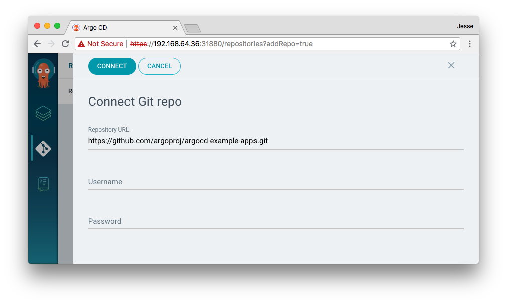
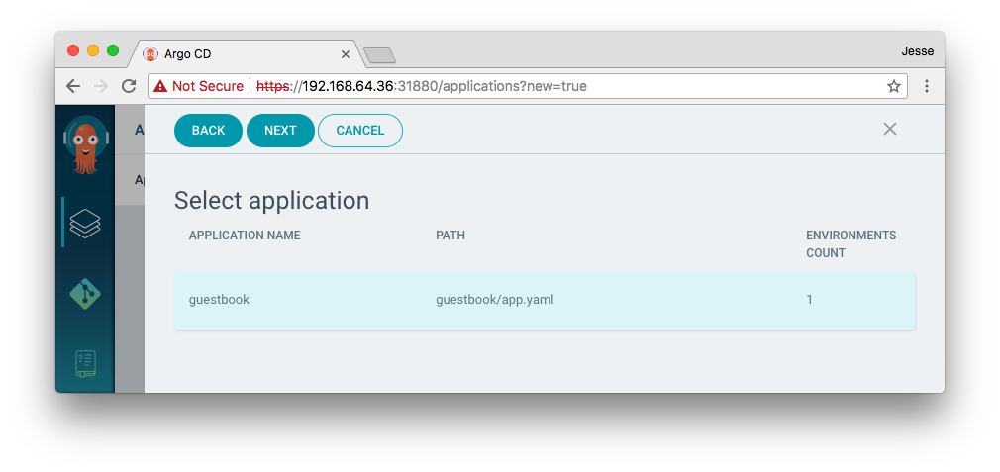
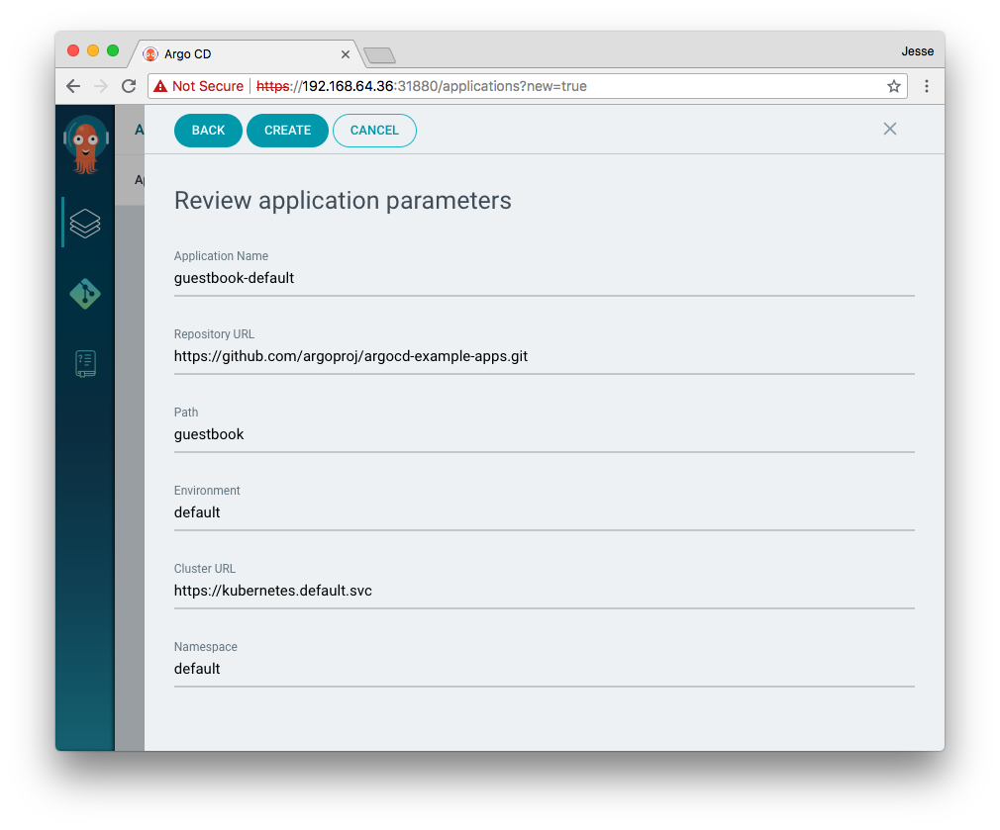

# Getting Started

!!! tip
    This guide assumes you have a grounding in the tools that Argo CD is based on. Please read the [understanding the basics](understand_the_basics.md).

## Requirements

* Installed [kubectl](https://kubernetes.io/docs/tasks/tools/install-kubectl/) command-line tool
* Have a [kubeconfig](https://kubernetes.io/docs/tasks/access-application-cluster/configure-access-multiple-clusters/) file (default location is `~/.kube/config`).

## 1. Install Argo CD

```bash
kubectl create namespace argocd
kubectl apply -n argocd -f https://raw.githubusercontent.com/argoproj/argo-cd/stable/manifests/install.yaml
```

This will create a new namespace, `argocd`, where Argo CD services and application resources will live.

On GKE, you will need grant your account the ability to create new cluster roles:
    
```bash
kubectl create clusterrolebinding YOURNAME-cluster-admin-binding --clusterrole=cluster-admin --user=YOUREMAIL@gmail.com
```

## 2. Download Argo CD CLI

Download the latest Argo CD version from [https://github.com/argoproj/argo-cd/releases/latest].

Also available in Mac Homebrew:

```bash
brew tap argoproj/tap
brew install argoproj/tap/argocd
```


## 3. Access The Argo CD API Server

By default, the Argo CD API server is not exposed with an external IP. To access the API server,
choose one of the following techniques to expose the Argo CD API server:

### Service Type Load Balancer
Change the argocd-server service type to `LoadBalancer`:

```bash
kubectl patch svc argocd-server -n argocd -p '{"spec": {"type": "LoadBalancer"}}'
```

### Ingress
Follow the [ingress documentation](operator-manual/ingress.md) on how to configure Argo CD with ingress.

### Port Forwarding
Kubectl port-forwarding can also be used to connect to the API server without exposing the service.

```bash
kubectl port-forward svc/argocd-server -n argocd 8080:443
```

The API server can then be accessed using the localhost:8080


## 4. Login Using The CLI

Login as the `admin` user. The initial password is autogenerated to be the pod name of the
Argo CD API server. This can be retrieved with the command:

```bash
kubectl get pods -n argocd -l app.kubernetes.io/name=argocd-server -o name | cut -d'/' -f 2
```

Using the above password, login to Argo CD's IP or hostname:

```bash
argocd login <ARGOCD_SERVER>
```

Change the password using the command:

```bash
argocd account update-password
```


## 5. Register A Cluster To Deploy Apps To (Optional)

This step registers a cluster's credentials to Argo CD, and is only necessary when deploying to
an external cluster. When deploying internally (to the same cluster that Argo CD is running in),
https://kubernetes.default.svc should be used as the application's K8s API server address.

First list all clusters contexts in your current kubconfig:
```bash
argocd cluster add
```

Choose a context name from the list and supply it to `argocd cluster add CONTEXTNAME`. For example,
for docker-for-desktop context, run:
```bash
argocd cluster add docker-for-desktop
```

The above command installs a ServiceAccount (`argocd-manager`), into the kube-system namespace of 
that kubectl context, and binds the service account to an admin-level ClusterRole. Argo CD uses this
service account token to perform its management tasks (i.e. deploy/monitoring).

!!! note
    The rules of the `argocd-manager-role` role can be modified such that it only has `create`, `update`, `patch`, `delete` privileges to a limited set of namespaces, groups, kinds. 
    However `get`, `list`, `watch` privileges are required at the cluster-scope for Argo CD to function.

## 6. Create An Application From A Git Repository

An example repository containing a guestbook application is available at
https://github.com/argoproj/argocd-example-apps.git to demonstrate how Argo CD works.

### Creating Apps Via CLI

~~~bash
argocd app create guestbook \
  --repo https://github.com/argoproj/argocd-example-apps.git \
  --path guestbook \
  --dest-server https://kubernetes.default.svc \
  --dest-namespace default
~~~

### Creating Apps Via UI

Open a browser to the Argo CD external UI, and login using the credentials, IP/hostname set in step 4.
Connect the https://github.com/argoproj/argocd-example-apps.git repo to Argo CD:



After connecting a repository, select the guestbook application for creation:





## 7. Sync (Deploy) The Application

Once the guestbook application is created, you can now view its status:

```bash
$ argocd app get guestbook
Name:               guestbook
Server:             https://kubernetes.default.svc
Namespace:          default
URL:                https://10.97.164.88/applications/guestbook
Repo:               https://github.com/argoproj/argocd-example-apps.git
Target:
Path:               guestbook
Sync Policy:        <none>
Sync Status:        OutOfSync from  (1ff8a67)
Health Status:      Missing

GROUP  KIND        NAMESPACE  NAME          STATUS     HEALTH
apps   Deployment  default    guestbook-ui  OutOfSync  Missing
       Service     default    guestbook-ui  OutOfSync  Missing
```

The application status is initially `OutOfSync` state, since the application has yet to be
deployed, and no Kubernetes resources have been created. To sync (deploy) the application, run:

```bash
argocd app sync guestbook
```

This command retrieves the manifests from the repository and performs a `kubectl apply` of the
manifests. The guestbook app is now running and you can now view its resource components, logs,
events, and assessed health status:

### From UI:


