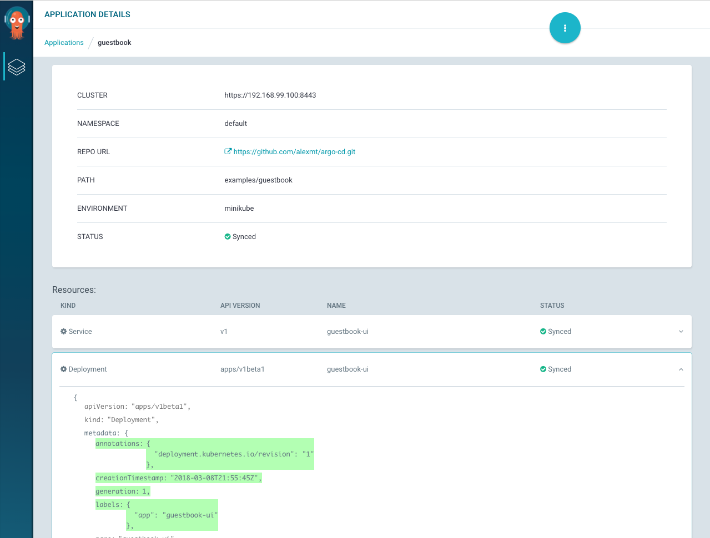

# Argo CD Getting Started

An example Ksonnet guestbook application is provided to demonstrates how Argo CD works.

## Requirements
* Installed [minikube](https://github.com/kubernetes/minikube#installation)
* Installed the [kubectl](https://kubernetes.io/docs/tasks/tools/install-kubectl/) command-line tool
* Have a [kubeconfig](https://kubernetes.io/docs/tasks/access-application-cluster/configure-access-multiple-clusters/) file (default location is `~/.kube/config`).

## 1. Download Argo CD

Download the latest Argo CD version
```
curl -sSL -o /usr/local/bin/argocd https://github.com/argoproj/argo-cd/releases/download/v0.4.3/argocd-darwin-amd64
chmod +x /usr/local/bin/argocd
```


## 2. Install Argo CD
```
argocd install
```
This will create a new namespace, `argocd`, where Argo CD services and application resources will live.

## 3. Open access to Argo CD API server

By default, the Argo CD API server is not exposed with an external IP. To expose the API server,
change service type to `LoadBalancer`:

```
kubectl patch svc argocd-server -n argocd -p '{"spec": {"type": "LoadBalancer"}}'
```

## 4. Login to the server from the CLI

```
argocd login $(minikube service argocd-server -n argocd --url | cut -d'/' -f 3)
```

Now, the Argo CD cli is configured to talk to API server and you can deploy your first application.

## 5. Connect and deploy the Guestbook application

1. Register the minikube cluster to Argo CD:

```
argocd cluster add minikube
```
The `argocd cluster add CONTEXT` command installs an `argocd-manager` ServiceAccount and ClusterRole into
the cluster associated with the supplied kubectl context. Argo CD then uses the associated service account
token to perform its required management tasks (i.e. deploy/monitoring).

2. Add the guestbook application and github repository containing the Guestbook application

```
argocd app create --name guestbook --repo https://github.com/argoproj/argo-cd.git --path examples/guestbook --env minikube --dest-server https://$(minikube ip):8443
```

Once the application is added, you can now see its status:

```
argocd app list
argocd app get guestbook
```

The application status is initially in an `OutOfSync` state, since the application has yet to be
deployed, and no Kubernetes resources have been created. To sync (deploy) the application, run:

```
argocd app sync guestbook
```

[](https://asciinema.org/a/uYnbFMy5WI2rc9S49oEAyGLb0)

Argo CD also allows to view and manager applications using web UI. Get the web UI URL by running:

```
minikube service argocd-server -n argocd --url
```


