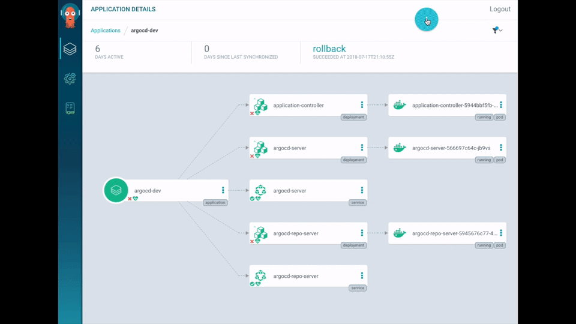
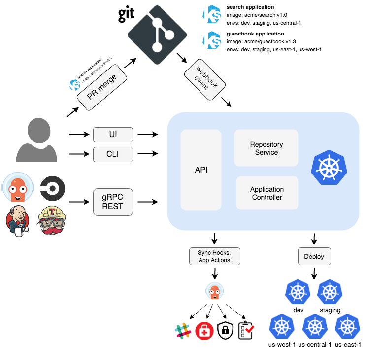

# Overview

<!-- markdownlint-disable MD026 -->
## What Is Argo CD?
<!-- markdownlint-enable MD026 -->

Argo CD is a declarative, GitOps continuous delivery tool for Kubernetes.



<!-- markdownlint-disable MD026 -->
## Why Argo CD?
<!-- markdownlint-enable MD026 -->

Application definitions, configurations, and environments should be declarative and version controlled.
Application deployment and lifecycle management should be automated, auditable, and easy to understand.

## Getting Started

### Quick Start

```bash
kubectl create namespace argocd
kubectl apply -n argocd -f https://raw.githubusercontent.com/argoproj/argo-cd/stable/manifests/install.yaml
```

Follow our [getting started guide](getting_started.md). Further user oriented [documentation](user-guide/)
is provided for additional features. If you are looking to upgrade ArgoCD, see the [upgrade guide](./operator-manual/upgrading/overview.md).
Developer oriented [documentation](developer-guide/) is available for people interested in building third-party integrations.

## How it works

Argo CD follows the **GitOps** pattern of using Git repositories as the source of truth for defining
the desired application state. Kubernetes manifests can be specified in several ways:

* [kustomize](https://kustomize.io) applications
* [helm](https://helm.sh) charts
* [jsonnet](https://jsonnet.org) files
* Plain directory of YAML/json manifests
* Any custom config management tool configured as a config management plugin

Argo CD automates the deployment of the desired application states in the specified target environments.
Application deployments can track updates to branches, tags, or pinned to a specific version of
manifests at a Git commit. See [tracking strategies](user-guide/tracking_strategies.md) for additional
details about the different tracking strategies available.

For a quick 10 minute overview of Argo CD, check out the demo presented to the Sig Apps community
meeting:

[](https://youtu.be/aWDIQMbp1cc?t=1m4s)

## Architecture



Argo CD is implemented as a kubernetes controller which continuously monitors running applications
and compares the current, live state against the desired target state (as specified in the Git repo).
A deployed application whose live state deviates from the target state is considered `OutOfSync`.
Argo CD reports & visualizes the differences, while providing facilities to automatically or
manually sync the live state back to the desired target state. Any modifications made to the desired
target state in the Git repo can be automatically applied and reflected in the specified target
environments.

For additional details, see [architecture overview](operator-manual/architecture.md).

## Features

* Automated deployment of applications to specified target environments
* Support for multiple config management/templating tools (Kustomize, Helm, Jsonnet, plain-YAML)
* Ability to manage and deploy to multiple clusters
* SSO Integration (OIDC, OAuth2, LDAP, SAML 2.0, GitHub, GitLab, Microsoft, LinkedIn)
* Multi-tenancy and RBAC policies for authorization
* Rollback/Roll-anywhere to any application configuration committed in Git repository
* Health status analysis of application resources
* Automated configuration drift detection and visualization
* Automated or manual syncing of applications to its desired state
* Web UI which provides real-time view of application activity
* CLI for automation and CI integration
* Webhook integration (GitHub, BitBucket, GitLab)
* Access tokens for automation
* PreSync, Sync, PostSync hooks to support complex application rollouts (e.g.blue/green & canary upgrades)
* Audit trails for application events and API calls
* Prometheus metrics
* Parameter overrides for overriding helm parameters in Git

## Development Status

Argo CD is being actively developed by the community. Our releases can be found [here](https://github.com/argoproj/argo-cd/releases).

## Adoption

Organizations who have officially adopted Argo CD can be found [here](https://github.com/argoproj/argo-cd/blob/master/USERS.md).
