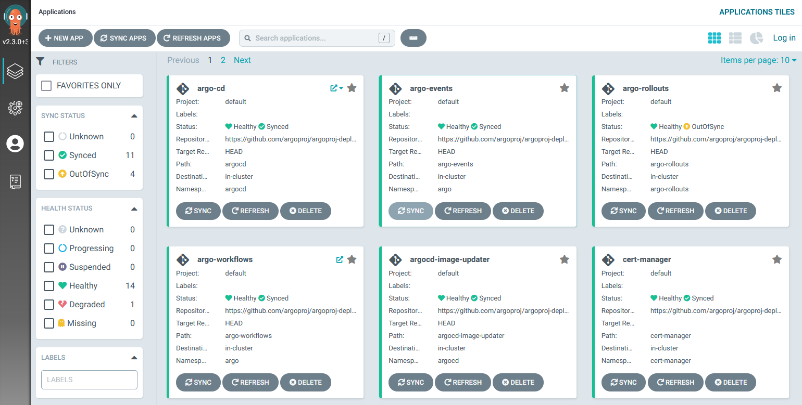

Argo CD is a declarative, GitOps continuous delivery tool for Kubernetes.

Argo CD is one of the core subprojects of the [Argo Family of projects](https://argoproj.github.io/).

## How it works

Argo CD is a Kubernetes native application. You install it on a Kubernetes cluster as a controller. It then monitors a set of Git repositories and automatically creates/updates the Kubernetes Objects and resources described in Git.

Argo CD follows the **GitOps** pattern of using Git repositories as the source of truth for defining
the desired application state. 
You can learn more about the GitOps principles at [http://opengitops.dev](http://opengitops.dev).

You can learn more about the major Argo CD concepts by looking at
the [terminology page](basics/terminology.md).

## Argo CD Live instance

If you want to see quickly how the Web Interface looks like, The Argo CD team maintains a public instance at [https://cd.apps.argoproj.io/applications](https://cd.apps.argoproj.io/applications).

This instance is used to test/deploy Argo CD and other associated Argo projects.

## Managing multiple clusters

In the simplest case, Argo CD can manage applications on the same cluster that it is running on. It is also possible to connect additional clusters to a single Argo CD instance and manage them externally without the need of running extra Argo CD instances.

You can also disable the deployment/management of applications on the cluster Argo CD is running on if you prefer having a "management cluster" that only controls external clusters.

## Types of applications supported

Kubernetes manifests can be specified in [several ways](tools):

* [kustomize](https://kustomize.io) applications
* [helm](https://helm.sh) charts
* [jsonnet](https://jsonnet.org) files
* Plain directory of YAML/json manifests
* Any custom config management tool configured as a [config management plugin](tools/plugins.md)

Argo CD automates the deployment of the desired application states in the specified target environments.
Application deployments can track updates to branches, tags, or pinned to a specific version of
manifests at a Git commit. See [tracking strategies](syncing/tracking.md) for additional
details about the different tracking strategies available.

## Feature highlight

* Automated deployment of applications to specified target environments
* Support for multiple config management/templating tools (Kustomize, Helm, Jsonnet, plain-YAML)
* Ability to manage and deploy to [multiple clusters](basics/clusters/external.md)
* [SSO Integration](operations/sso/overview.md) (OIDC, OAuth2, LDAP, SAML 2.0, GitHub, GitLab, Microsoft, LinkedIn)
* Multi-tenancy and [RBAC policies](rbac) for authorization
* Rollback/Roll-anywhere to any application configuration committed in Git repository
* [Health status analysis](syncing/health.md) of application resources
* Automated configuration drift detection and visualization
* Automated or manual [syncing](syncing/index.md) of applications to its desired state
* Web UI which provides real-time view of application activity
* CLI for automation and CI integration
* [Webhook integration](syncing/git_webhooks.md) (GitHub, BitBucket, GitLab)
* Access tokens for automation
* [PreSync, Sync, PostSync hooks](syncing/waves.md) to support complex application rollouts (e.g.blue/green & canary upgrades)
* [Sync waves](syncing/waves.md) to control order of resource deployment
* Audit trails for application events and API calls
* [Prometheus metrics](operations/metrics.md)
* [Parameter overrides for overriding Helm parameters in Git](basics/apps/overrides.md)

## Argo CD Adoption

Organizations who have officially adopted Argo CD can be found [at the USERS file](https://github.com/argoproj/argo-cd/blob/master/USERS.md). Feel free to create a Pull Request and add your own organization if you are using Argo CD.  

## Community 

* Follow the development of the project at [https://github.com/argoproj/argo-cd](https://github.com/argoproj/argo-cd)
* Visit the [Argo blog](https://blog.argoproj.io/)
* Join the `#argo-cd` channel at the [CNCF slack](https://argoproj.github.io/community/join-slack/) 
* Get Twitter updates at [https://twitter.com/argoproj](https://twitter.com/argoproj)
* Visit the [Argo Subreddit](https://www.reddit.com/r/argoproj/)
* Connect with us at [https://www.linkedin.com/company/argoproj/](https://www.linkedin.com/company/argoproj/)
* See more videos and blog posts at the [README file](https://github.com/argoproj/argo-cd/#blogs-and-presentations).
