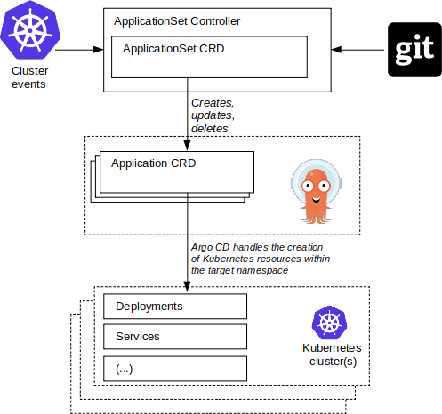

# How ApplicationSet controller interacts with Argo CD

When you create, update, or delete an `ApplicationSet` resource, the ApplicationSet controller responds by creating, updating, or deleting one or more corresponding Argo CD `Application` resources.

In fact, the *sole* responsibility of the ApplicationSet controller is to create, update, and delete `Application` resources within the Argo CD namespace. The controller's only job is to ensure that the `Application` resources remain consistent with the defined declarative `ApplicationSet` resource, and nothing more.

Thus the ApplicationSet controller:

- Does not create/modify/delete Kubernetes resources (other than the `Application` CR)
- Does not connect to clusters other than the one Argo CD is deployed to
- Does not interact with namespaces other than the one Argo CD is deployed within

!!!important "Use the Argo CD namespace"
    All ApplicationSet resources and the ApplicationSet controller must be installed in the same namespace as Argo CD. 
    ApplicationSet resources in a different namespace will be ignored.

It is Argo CD itself that is responsible for the actual deployment of the generated child `Application` resources, such as Deployments, Services, and ConfigMaps.

The ApplicationSet controller can thus be thought of as an `Application` 'factory', taking an `ApplicationSet` resource as input, and outputting one or more Argo CD `Application` resources that correspond to the parameters of that set.

In this diagram an `ApplicationSet` resource is defined, and it is the responsibility of the ApplicationSet controller to create the corresponding `Application` resources. The resulting `Application` resources are then managed Argo CD: that is, Argo CD is responsible for actually deploying the child resources. 

Argo CD generates the application's Kubernetes resources based on the contents of the Git repository defined within the Application `spec` field, deploying e.g. Deployments, Service, and other resources.

Creation, update, or deletion of ApplicationSets will have a direct effect on the Applications present in the Argo CD namespace. Likewise, cluster events (the addition/deletion of Argo CD cluster secrets, when using Cluster generator), or changes in Git (when using Git generator), will be used as input to the ApplicationSet controller in constructing `Application` resources.

Argo CD and the ApplicationSet controller work together to ensure a consistent set of Application resources exist, and are deployed across the target clusters.
