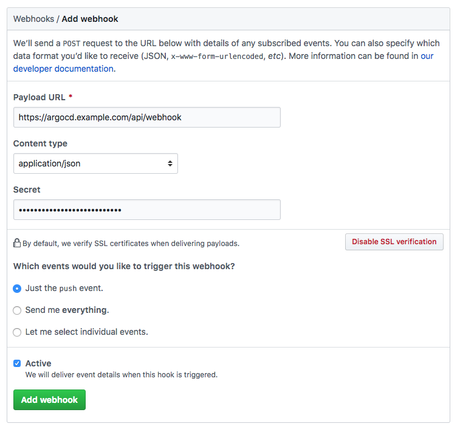

# Git Generator

The Git generator contains two subtypes: the Git directory generator, and Git file generator.

!!! warning
    Git generators are often used to make it easier for (non-admin) developers to create Applications.
    If the `project` field in your ApplicationSet is templated, developers may be able to create Applications under Projects with excessive permissions.
    For ApplicationSets with a templated `project` field, [the source of truth _must_ be controlled by admins](./Security.md#templated-project-field)
    - in the case of git generators, PRs must require admin approval.
    - Git generator does not support Signature Verification For ApplicationSets with a templated `project` field.
    

## Git Generator: Directories

The Git directory generator, one of two subtypes of the Git generator, generates parameters using the directory structure of a specified Git repository.

Suppose you have a Git repository with the following directory structure:
```
├── argo-workflows
│   ├── kustomization.yaml
│   └── namespace-install.yaml
└── prometheus-operator
    ├── Chart.yaml
    ├── README.md
    ├── requirements.yaml
    └── values.yaml
```

This repository contains two directories, one for each of the workloads to deploy:

- an Argo Workflow controller kustomization YAML file
- a Prometheus Operator Helm chart

We can deploy both workloads, using this example:
```yaml
apiVersion: argoproj.io/v1alpha1
kind: ApplicationSet
metadata:
  name: cluster-addons
  namespace: argocd
spec:
  goTemplate: true
  goTemplateOptions: ["missingkey=error"]
  generators:
  - git:
      repoURL: https://github.com/argoproj/argo-cd.git
      revision: HEAD
      directories:
      - path: applicationset/examples/git-generator-directory/cluster-addons/*
  template:
    metadata:
      name: '{{.path.basename}}'
    spec:
      project: "my-project"
      source:
        repoURL: https://github.com/argoproj/argo-cd.git
        targetRevision: HEAD
        path: '{{.path.path}}'
      destination:
        server: https://kubernetes.default.svc
        namespace: '{{.path.basename}}'
      syncPolicy:
        syncOptions:
        - CreateNamespace=true
```
(*The full example can be found [here](https://github.com/argoproj/argo-cd/tree/master/applicationset/examples/git-generator-directory).*)

The generator parameters are:

- `{{.path.path}}`: The directory paths within the Git repository that match the `path` wildcard.
- `{{index .path.segments n}}`: The directory paths within the Git repository that match the `path` wildcard, split into array elements (`n` - array index)
- `{{.path.basename}}`: For any directory path within the Git repository that matches the `path` wildcard, the right-most path name is extracted (e.g. `/directory/directory2` would produce `directory2`).
- `{{.path.basenameNormalized}}`: This field is the same as `path.basename` with unsupported characters replaced with `-` (e.g. a `path` of `/directory/directory_2`, and `path.basename` of `directory_2` would produce `directory-2` here).

**Note**: The right-most path name always becomes `{{.path.basename}}`. For example, for `- path: /one/two/three/four`, `{{.path.basename}}` is `four`.

**Note**: If the `pathParamPrefix` option is specified, all `path`-related parameter names above will be prefixed with the specified value and a dot separator. E.g., if `pathParamPrefix` is `myRepo`, then the generated parameter name would be `.myRepo.path` instead of `.path`. Using this option is necessary in a Matrix generator where both child generators are Git generators (to avoid conflicts when merging the child generators’ items).

Whenever a new Helm chart/Kustomize YAML/Application/plain subdirectory is added to the Git repository, the ApplicationSet controller will detect this change and automatically deploy the resulting manifests within new `Application` resources.

As with other generators, clusters *must* already be defined within Argo CD, in order to generate Applications for them.

### Exclude directories

The Git directory generator will automatically exclude directories that begin with `.` (such as `.git`).

The Git directory generator also supports an `exclude` option in order to exclude directories in the repository from being scanned by the ApplicationSet controller:

```yaml
apiVersion: argoproj.io/v1alpha1
kind: ApplicationSet
metadata:
  name: cluster-addons
  namespace: argocd
spec:
  goTemplate: true
  goTemplateOptions: ["missingkey=error"]
  generators:
  - git:
      repoURL: https://github.com/argoproj/argo-cd.git
      revision: HEAD
      directories:
      - path: applicationset/examples/git-generator-directory/excludes/cluster-addons/*
      - path: applicationset/examples/git-generator-directory/excludes/cluster-addons/exclude-helm-guestbook
        exclude: true
  template:
    metadata:
      name: '{{.path.basename}}'
    spec:
      project: "my-project"
      source:
        repoURL: https://github.com/argoproj/argo-cd.git
        targetRevision: HEAD
        path: '{{.path.path}}'
      destination:
        server: https://kubernetes.default.svc
        namespace: '{{.path.basename}}'
```
(*The full example can be found [here](https://github.com/argoproj/argo-cd/tree/master/applicationset/examples/git-generator-directory/excludes).*)

This example excludes the `exclude-helm-guestbook` directory from the list of directories scanned for this `ApplicationSet` resource.

!!! note "Exclude rules have higher priority than include rules"

    If a directory matches at least one `exclude` pattern, it will be excluded. Or, said another way, *exclude rules take precedence over include rules.*

    As a corollary, which directories are included/excluded is not affected by the order of `path`s in the `directories` field list (because, as above, exclude rules always take precedence over include rules). 

For example, with these directories:

```
.
└── d
    ├── e
    ├── f
    └── g
```
Say you want to include `/d/e`, but exclude `/d/f` and `/d/g`. This will *not* work:

```yaml
- path: /d/e
  exclude: false
- path: /d/*
  exclude: true
```
Why? Because the exclude `/d/*` exclude rule will take precedence over the `/d/e` include rule. When the `/d/e` path in the Git repository is processed by the ApplicationSet controller, the controller detects that at least one exclude rule is matched, and thus that directory should not be scanned.

You would instead need to do:

```yaml
- path: /d/*
- path: /d/f
  exclude: true
- path: /d/g
  exclude: true
```

Or, a shorter way (using [path.Match](https://golang.org/pkg/path/#Match) syntax) would be:

```yaml
- path: /d/*
- path: /d/[fg]
  exclude: true
```

### Root Of Git Repo

The Git directory generator can be configured to deploy from the root of the git repository by providing `'*'` as the `path`.

To exclude directories, you only need to put the name/[path.Match](https://golang.org/pkg/path/#Match) of the directory you do not want to deploy.

```yaml
apiVersion: argoproj.io/v1alpha1
kind: ApplicationSet
metadata:
  name: cluster-addons
  namespace: argocd
spec:
  goTemplate: true
  goTemplateOptions: ["missingkey=error"]
  generators:
  - git:
      repoURL: https://github.com/example/example-repo.git
      revision: HEAD
      directories:
      - path: '*'
      - path: donotdeploy
        exclude: true
  template:
    metadata:
      name: '{{.path.basename}}'
    spec:
      project: "my-project"
      source:
        repoURL: https://github.com/example/example-repo.git
        targetRevision: HEAD
        path: '{{.path.path}}'
      destination:
        server: https://kubernetes.default.svc
        namespace: '{{.path.basename}}'
```

### Pass additional key-value pairs via `values` field

You may pass additional, arbitrary string key-value pairs via the `values` field of the git directory generator. Values added via the `values` field are added as `values.(field)`.

In this example, a `cluster` parameter value is passed. It is interpolated from the `branch` and `path` variable, to then be used to determine the destination namespace.
```yaml
apiVersion: argoproj.io/v1alpha1
kind: ApplicationSet
metadata:
  name: cluster-addons
  namespace: argocd
spec:
  goTemplate: true
  goTemplateOptions: ["missingkey=error"]
  generators:
  - git:
      repoURL: https://github.com/example/example-repo.git
      revision: HEAD
      directories:
      - path: '*'
      values:
        cluster: '{{.branch}}-{{.path.basename}}'
  template:
    metadata:
      name: '{{.path.basename}}'
    spec:
      project: "my-project"
      source:
        repoURL: https://github.com/example/example-repo.git
        targetRevision: HEAD
        path: '{{.path.path}}'
      destination:
        server: https://kubernetes.default.svc
        namespace: '{{.values.cluster}}'
```

!!! note
    The `values.` prefix is always prepended to values provided via `generators.git.values` field. Ensure you include this prefix in the parameter name within the `template` when using it.

In `values` we can also interpolate all fields set by the git directory generator as mentioned above.

## Git Generator: Files

The Git file generator is the second subtype of the Git generator. The Git file generator generates parameters using the contents of JSON/YAML files found within a specified repository.

Suppose you have a Git repository with the following directory structure:
```
├── apps
│   └── guestbook
│       ├── guestbook-ui-deployment.yaml
│       ├── guestbook-ui-svc.yaml
│       └── kustomization.yaml
├── cluster-config
│   └── engineering
│       ├── dev
│       │   └── config.json
│       └── prod
│           └── config.json
└── git-generator-files.yaml
```

The directories are:

- `guestbook` contains the Kubernetes resources for a simple guestbook application
- `cluster-config` contains JSON/YAML files describing the individual engineering clusters: one for `dev` and one for `prod`.
- `git-generator-files.yaml` is the example `ApplicationSet` resource that deploys `guestbook` to the specified clusters.

The `config.json` files contain information describing the cluster (along with extra sample data):
```json
{
  "aws_account": "123456",
  "asset_id": "11223344",
  "cluster": {
    "owner": "cluster-admin@company.com",
    "name": "engineering-dev",
    "address": "https://1.2.3.4"
  }
}
```

Git commits containing changes to the `config.json` files are automatically discovered by the Git generator, and the contents of those files are parsed and converted into template parameters. Here are the parameters generated for the above JSON:
```text
aws_account: 123456
asset_id: 11223344
cluster.owner: cluster-admin@company.com
cluster.name: engineering-dev
cluster.address: https://1.2.3.4
```


And the generated parameters for all discovered `config.json` files will be substituted into ApplicationSet template:
```yaml
apiVersion: argoproj.io/v1alpha1
kind: ApplicationSet
metadata:
  name: guestbook
  namespace: argocd
spec:
  goTemplate: true
  goTemplateOptions: ["missingkey=error"]
  generators:
  - git:
      repoURL: https://github.com/argoproj/argo-cd.git
      revision: HEAD
      files:
      - path: "applicationset/examples/git-generator-files-discovery/cluster-config/**/config.json"
  template:
    metadata:
      name: '{{.cluster.name}}-guestbook'
    spec:
      project: default
      source:
        repoURL: https://github.com/argoproj/argo-cd.git
        targetRevision: HEAD
        path: "applicationset/examples/git-generator-files-discovery/apps/guestbook"
      destination:
        server: '{{.cluster.address}}'
        namespace: guestbook
```
(*The full example can be found [here](https://github.com/argoproj/argo-cd/tree/master/applicationset/examples/git-generator-files-discovery).*)

Any `config.json` files found under the `cluster-config` directory will be parameterized based on the `path` wildcard pattern specified. Within each file JSON fields are flattened into key/value pairs, with this ApplicationSet example using the `cluster.address` and `cluster.name` parameters in the template.

As with other generators, clusters *must* already be defined within Argo CD, in order to generate Applications for them.

In addition to the flattened key/value pairs from the configuration file, the following generator parameters are provided:

- `{{.path.path}}`: The path to the directory containing matching configuration file within the Git repository. Example: `/clusters/clusterA`, if the config file was `/clusters/clusterA/config.json`
- `{{index .path.segments n}}`: The path to the matching configuration file within the Git repository, split into array elements (`n` - array index). Example: `index .path.segments 0: clusters`, `index .path.segments 1: clusterA`
- `{{.path.basename}}`: Basename of the path to the directory containing the configuration file (e.g. `clusterA`, with the above example.)
- `{{.path.basenameNormalized}}`: This field is the same as `.path.basename` with unsupported characters replaced with `-` (e.g. a `path` of `/directory/directory_2`, and `.path.basename` of `directory_2` would produce `directory-2` here).
- `{{.path.filename}}`: The matched filename. e.g., `config.json` in the above example.
- `{{.path.filenameNormalized}}`: The matched filename with unsupported characters replaced with `-`.

**Note**: The right-most *directory* name always becomes `{{.path.basename}}`. For example, from `- path: /one/two/three/four/config.json`, `{{.path.basename}}` will be `four`. 
The filename can always be accessed using `{{.path.filename}}`. 

**Note**: If the `pathParamPrefix` option is specified, all `path`-related parameter names above will be prefixed with the specified value and a dot separator. E.g., if `pathParamPrefix` is `myRepo`, then the generated parameter name would be `myRepo.path` instead of `path`. Using this option is necessary in a Matrix generator where both child generators are Git generators (to avoid conflicts when merging the child generators’ items).

**Note**: The default behavior of the Git file generator is very greedy. Please see [Git File Generator Globbing](./Generators-Git-File-Globbing.md) for more information.

### Pass additional key-value pairs via `values` field

You may pass additional, arbitrary string key-value pairs via the `values` field of the git files generator. Values added via the `values` field are added as `values.(field)`.

In this example, a `base_dir` parameter value is passed. It is interpolated from `path` segments, to then be used to determine the source path.
```yaml
apiVersion: argoproj.io/v1alpha1
kind: ApplicationSet
metadata:
  name: guestbook
  namespace: argocd
spec:
  goTemplate: true
  goTemplateOptions: ["missingkey=error"]
  generators:
  - git:
      repoURL: https://github.com/argoproj/argo-cd.git
      revision: HEAD
      files:
      - path: "applicationset/examples/git-generator-files-discovery/cluster-config/**/config.json"
      values:
        base_dir: "{{index .path.segments 0}}/{{index .path.segments 1}}/{{index .path.segments 2}}"
  template:
    metadata:
      name: '{{.cluster.name}}-guestbook'
    spec:
      project: default
      source:
        repoURL: https://github.com/argoproj/argo-cd.git
        targetRevision: HEAD
        path: "{{.values.base_dir}}/apps/guestbook"
      destination:
        server: '{{.cluster.address}}'
        namespace: guestbook
```

!!! note
    The `values.` prefix is always prepended to values provided via `generators.git.values` field. Ensure you include this prefix in the parameter name within the `template` when using it.

In `values` we can also interpolate all fields set by the git files generator as mentioned above.

## Webhook Configuration

When using a Git generator, ApplicationSet polls Git repositories every three minutes to detect changes. To eliminate
this delay from polling, the ApplicationSet webhook server can be configured to receive webhook events. ApplicationSet supports
Git webhook notifications from GitHub and GitLab. The following explains how to configure a Git webhook for GitHub, but the same process should be applicable to other providers.

!!! note
    The ApplicationSet controller webhook does not use the same webhook as the API server as defined [here](../webhook.md). ApplicationSet exposes a webhook server as a service of type ClusterIP. An ApplicationSet specific Ingress resource needs to be created to expose this service to the webhook source.

### 1. Create the webhook in the Git provider

In your Git provider, navigate to the settings page where webhooks can be configured. The payload
URL configured in the Git provider should use the `/api/webhook` endpoint of your ApplicationSet instance
(e.g. `https://applicationset.example.com/api/webhook`). If you wish to use a shared secret, input an
arbitrary value in the secret. This value will be used when configuring the webhook in the next step.



!!! note
    When creating the webhook in GitHub, the "Content type" needs to be set to "application/json". The default value "application/x-www-form-urlencoded" is not supported by the library used to handle the hooks

### 2. Configure ApplicationSet with the webhook secret (Optional)

Configuring a webhook shared secret is optional, since ApplicationSet will still refresh applications
generated by Git generators, even with unauthenticated webhook events. This is safe to do since
the contents of webhook payloads are considered untrusted, and will only result in a refresh of the
application (a process which already occurs at three-minute intervals). If ApplicationSet is publicly
accessible, then configuring a webhook secret is recommended to prevent a DDoS attack.

In the `argocd-secret` Kubernetes secret, include the Git provider's webhook secret configured in step 1.

Edit the Argo CD Kubernetes secret:

```bash
kubectl edit secret argocd-secret -n argocd
```

TIP: for ease of entering secrets, Kubernetes supports inputting secrets in the `stringData` field,
which saves you the trouble of base64 encoding the values and copying it to the `data` field.
Simply copy the shared webhook secret created in step 1, to the corresponding
GitHub/GitLab/BitBucket key under the `stringData` field:

```yaml
apiVersion: v1
kind: Secret
metadata:
  name: argocd-secret
  namespace: argocd
type: Opaque
data:
...

stringData:
  # github webhook secret
  webhook.github.secret: shhhh! it's a github secret

  # gitlab webhook secret
  webhook.gitlab.secret: shhhh! it's a gitlab secret
```

After saving, please restart the ApplicationSet pod for the changes to take effect.
