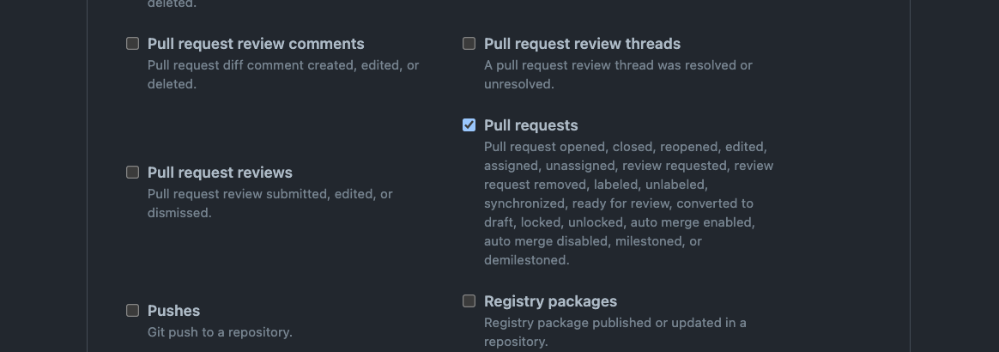

# Pull Request Generator

The Pull Request generator uses the API of an SCMaaS provider (eg GitHub/GitLab) to automatically discover open pull requests within an repository. This fits well with the style of building a test environment when you create a pull request.


```yaml
apiVersion: argoproj.io/v1alpha1
kind: ApplicationSet
metadata:
  name: myapps
spec:
  generators:
  - pullRequest:
      # See below for provider specific options.
      github:
        # ...
```

## GitHub

Specify the repository from which to fetch the Github Pull requests.

```yaml
apiVersion: argoproj.io/v1alpha1
kind: ApplicationSet
metadata:
  name: myapps
spec:
  generators:
  - pullRequest:
      github:
        # The GitHub organization or user.
        owner: myorg
        # The Github repository
        repo: myrepository
        # For GitHub Enterprise (optional)
        api: https://git.example.com/
        # Reference to a Secret containing an access token. (optional)
        tokenRef:
          secretName: github-token
          key: token
        # Labels is used to filter the PRs that you want to target. (optional)
        labels:
        - preview
  requeueAfterSeconds: 1800
  template:
  # ...
```

* `owner`: Required name of the GitHub organization or user.
* `repo`: Required name of the Github repository.
* `api`: If using GitHub Enterprise, the URL to access it. (Optional)
* `tokenRef`: A `Secret` name and key containing the GitHub access token to use for requests. If not specified, will make anonymous requests which have a lower rate limit and can only see public repositories. (Optional)
* `labels`: Labels is used to filter the PRs that you want to target. (Optional)

## Gitea

Specify the repository from which to fetch the Gitea Pull requests.

```yaml
apiVersion: argoproj.io/v1alpha1
kind: ApplicationSet
metadata:
  name: myapps
spec:
  generators:
  - pullRequest:
      gitea:
        # The Gitea organization or user.
        owner: myorg
        # The Gitea repository
        repo: myrepository
        # The Gitea url to use
        api: https://gitea.mydomain.com/
        # Reference to a Secret containing an access token. (optional)
        tokenRef:
          secretName: gitea-token
          key: token
        # many gitea deployments use TLS, but many are self-hosted and self-signed certificates
        insecure: true
  requeueAfterSeconds: 1800
  template:
  # ...
```

* `owner`: Required name of the Gitea organization or user.
* `repo`: Required name of the Gitea repository.
* `api`: The url of the Gitea instance.
* `tokenRef`: A `Secret` name and key containing the Gitea access token to use for requests. If not specified, will make anonymous requests which have a lower rate limit and can only see public repositories. (Optional)
* `insecure`: `Allow for self-signed certificates, primarily for testing.`

## Bitbucket Server

Fetch pull requests from a repo hosted on a Bitbucket Server (not the same as Bitbucket Cloud).

```yaml
apiVersion: argoproj.io/v1alpha1
kind: ApplicationSet
metadata:
  name: myapps
spec:
  generators:
  - pullRequest:
      bitbucketServer:
        project: myproject
        repo: myrepository
        # URL of the Bitbucket Server. Required.
        api: https://mycompany.bitbucket.org
        # Credentials for Basic authentication. Required for private repositories.
        basicAuth:
          # The username to authenticate with
          username: myuser
          # Reference to a Secret containing the password or personal access token.
          passwordRef:
            secretName: mypassword
            key: password
      # Labels are not supported by Bitbucket Server, so filtering by label is not possible.
      # Filter PRs using the source branch name. (optional)
      filters:
      - branchMatch: ".*-argocd"
  template:
  # ...
```

* `project`: Required name of the Bitbucket project
* `repo`: Required name of the Bitbucket repository.
* `api`: Required URL to access the Bitbucket REST API. For the example above, an API request would be made to `https://mycompany.bitbucket.org/rest/api/1.0/projects/myproject/repos/myrepository/pull-requests`
* `branchMatch`: Optional regexp filter which should match the source branch name. This is an alternative to labels which are not supported by Bitbucket server.

If you want to access a private repository, you must also provide the credentials for Basic auth (this is the only auth supported currently):
* `username`: The username to authenticate with. It only needs read access to the relevant repo.
* `passwordRef`: A `Secret` name and key containing the password or personal access token to use for requests.

## Filters

Filters allow selecting which pull requests to generate for. Each filter can declare one or more conditions, all of which must pass. If multiple filters are present, any can match for a repository to be included. If no filters are specified, all pull requests will be processed.
Currently, only a subset of filters is available when comparing with SCM provider filters.

```yaml
apiVersion: argoproj.io/v1alpha1
kind: ApplicationSet
metadata:
  name: myapps
spec:
  generators:
  - scmProvider:
      # ...
      # Include any pull request ending with "argocd". (optional)
      filters:
      - branchMatch: ".*-argocd"
  template:
  # ...
```

* `branchMatch`: A regexp matched against source branch names.


## Template

As with all generators, several keys are available for replacement in the generated application.

The following is a comprehensive Helm Application example;

```yaml
apiVersion: argoproj.io/v1alpha1
kind: ApplicationSet
metadata:
  name: myapps
spec:
  generators:
  - pullRequest:
    # ...
  template:
    metadata:
      name: 'myapp-{{branch}}-{{number}}'
    spec:
      source:
        repoURL: 'https://github.com/myorg/myrepo.git'
        targetRevision: '{{head_sha}}'
        path: kubernetes/
        helm:
          parameters:
          - name: "image.tag"
            value: "pull-{{head_sha}}"
      project: default
      destination:
        server: https://kubernetes.default.svc
        namespace: default
```

And, here is a robust Kustomize example;

```yaml
apiVersion: argoproj.io/v1alpha1
kind: ApplicationSet
metadata:
  name: myapps
spec:
  generators:
  - pullRequest:
    # ...
  template:
    metadata:
      name: 'myapp-{{branch}}-{{number}}'
    spec:
      source:
        repoURL: 'https://github.com/myorg/myrepo.git'
        targetRevision: '{{head_sha}}'
        path: kubernetes/
        kustomize:
          nameSuffix: {{branch}}
          commonLabels:
            app.kubernetes.io/instance: {{branch}}-{{number}}
          images:
          - ghcr.io/myorg/myrepo:{{head_sha}}
      project: default
      destination:
        server: https://kubernetes.default.svc
        namespace: default
```

* `number`: The ID number of the pull request.
* `branch`: The name of the branch of the pull request head.
* `head_sha`: This is the SHA of the head of the pull request.

## Webhook Configuration

When using a Pull Request generator, the ApplicationSet controller polls every `requeueAfterSeconds` interval (defaulting to every 30 minutes) to detect changes. To eliminate this delay from polling, the ApplicationSet webhook server can be configured to receive webhook events, which will trigger Application generation by the Pull Request generator.

The configuration is almost the same as the one described [in the Git generator](Generators-Git.md), but there is one difference: if you want to use the Pull Request Generator as well, additionally configure the following settings.

In section 1, _"Create the webhook in the Git provider"_, add an event so that a webhook request will be sent when a pull request is created, closed, or label changed.
Select `Let me select individual events` and enable the checkbox for `Pull requests`.



The Pull Request Generator will requeue when the next action occurs.

- `opened`
- `closed`
- `reopened`
- `labeled`
- `unlabeled`
- `synchronized`

For more information about each event, please refer to the [official documentation](https://docs.github.com/en/developers/webhooks-and-events/webhooks/webhook-events-and-payloads).
