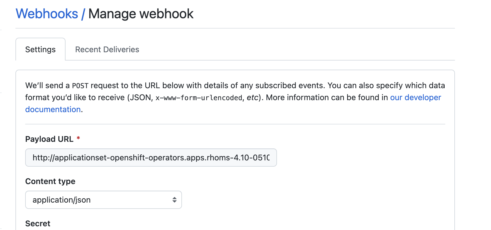
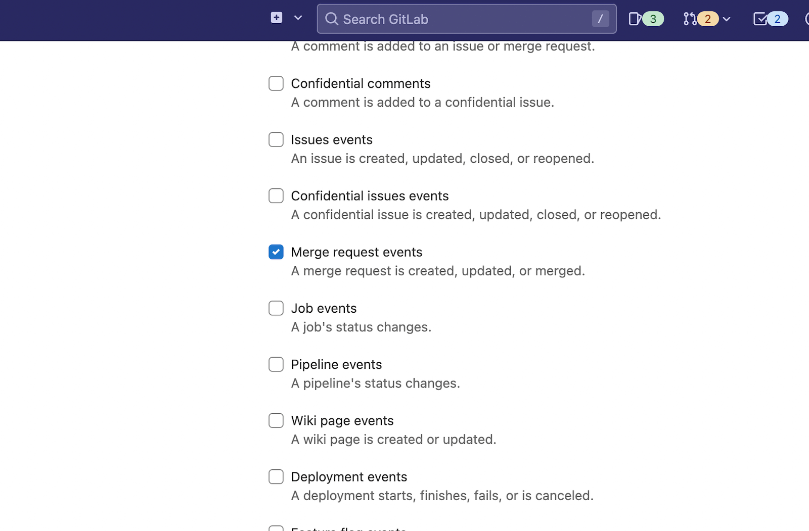

# Pull Request Generator

The Pull Request generator uses the API of an SCMaaS provider (GitHub, Gitea, or Bitbucket Server) to automatically discover open pull requests within a repository. This fits well with the style of building a test environment when you create a pull request.

```yaml
apiVersion: argoproj.io/v1alpha1
kind: ApplicationSet
metadata:
  name: myapps
spec:
  goTemplate: true
  goTemplateOptions: ["missingkey=error"]
  generators:
  - pullRequest:
      # When using a Pull Request generator, the ApplicationSet controller polls every `requeueAfterSeconds` interval (defaulting to every 30 minutes) to detect changes.
      requeueAfterSeconds: 1800
      # See below for provider specific options.
      github:
        # ...
```

!!! note
    Know the security implications of PR generators in ApplicationSets.
    [Only admins may create ApplicationSets](./Security.md#only-admins-may-createupdatedelete-applicationsets) to avoid
    leaking Secrets, and [only admins may create PRs](./Security.md#templated-project-field) if the `project` field of
    an ApplicationSet with a PR generator is templated, to avoid granting management of out-of-bounds resources.

## GitHub

Specify the repository from which to fetch the GitHub Pull requests.

```yaml
apiVersion: argoproj.io/v1alpha1
kind: ApplicationSet
metadata:
  name: myapps
spec:
  goTemplate: true
  goTemplateOptions: ["missingkey=error"]
  generators:
  - pullRequest:
      github:
        # The GitHub organization or user.
        owner: myorg
        # The Github repository
        repo: myrepository
        # For GitHub Enterprise (optional)
        api: https://git.example.com/
        # Reference to a Secret containing an access token. (optional)
        tokenRef:
          secretName: github-token
          key: token
        # (optional) use a GitHub App to access the API instead of a PAT.
        appSecretName: github-app-repo-creds
        # Labels is used to filter the PRs that you want to target. (optional)
        labels:
        - preview
      requeueAfterSeconds: 1800
  template:
  # ...
```

* `owner`: Required name of the GitHub organization or user.
* `repo`: Required name of the GitHub repository.
* `api`: If using GitHub Enterprise, the URL to access it. (Optional)
* `tokenRef`: A `Secret` name and key containing the GitHub access token to use for requests. If not specified, will make anonymous requests which have a lower rate limit and can only see public repositories. (Optional)
* `labels`: Filter the PRs to those containing **all** of the labels listed. (Optional)
* `appSecretName`: A `Secret` name containing a GitHub App secret in [repo-creds format][repo-creds].

[repo-creds]: ../declarative-setup.md#repository-credentials

## GitLab

Specify the project from which to fetch the GitLab merge requests.

```yaml
apiVersion: argoproj.io/v1alpha1
kind: ApplicationSet
metadata:
  name: myapps
spec:
  goTemplate: true
  goTemplateOptions: ["missingkey=error"]
  generators:
  - pullRequest:
      gitlab:
        # The GitLab project ID.
        project: "12341234"
        # For self-hosted GitLab (optional)
        api: https://git.example.com/
        # Reference to a Secret containing an access token. (optional)
        tokenRef:
          secretName: gitlab-token
          key: token
        # Labels is used to filter the MRs that you want to target. (optional)
        labels:
        - preview
        # MR state is used to filter MRs only with a certain state. (optional)
        pullRequestState: opened
        # If true, skips validating the SCM provider's TLS certificate - useful for self-signed certificates.
        insecure: false
        # Reference to a ConfigMap containing trusted CA certs - useful for self-signed certificates. (optional)
        caRef:
          configMapName: argocd-tls-certs-cm
          key: gitlab-ca
      requeueAfterSeconds: 1800
  template:
  # ...
```

* `project`: Required project ID of the GitLab project.
* `api`: If using self-hosted GitLab, the URL to access it. (Optional)
* `tokenRef`: A `Secret` name and key containing the GitLab access token to use for requests. If not specified, will make anonymous requests which have a lower rate limit and can only see public repositories. (Optional)
* `labels`: Labels is used to filter the MRs that you want to target. (Optional)
* `pullRequestState`: PullRequestState is an additional MRs filter to get only those with a certain state. Default: "" (all states)
* `insecure`: By default (false) - Skip checking the validity of the SCM's certificate - useful for self-signed TLS certificates.
* `caRef`: Optional `ConfigMap` name and key containing the GitLab certificates to trust - useful for self-signed TLS certificates. Possibly reference the ArgoCD CM holding the trusted certs.

As a preferable alternative to setting `insecure` to true, you can configure self-signed TLS certificates for Gitlab by [mounting self-signed certificate to the applicationset controller](./Generators-SCM-Provider.md#self-signed-tls-certificates).

## Gitea

Specify the repository from which to fetch the Gitea Pull requests.

```yaml
apiVersion: argoproj.io/v1alpha1
kind: ApplicationSet
metadata:
  name: myapps
spec:
  goTemplate: true
  goTemplateOptions: ["missingkey=error"]
  generators:
  - pullRequest:
      gitea:
        # The Gitea organization or user.
        owner: myorg
        # The Gitea repository
        repo: myrepository
        # The Gitea url to use
        api: https://gitea.mydomain.com/
        # Reference to a Secret containing an access token. (optional)
        tokenRef:
          secretName: gitea-token
          key: token
        # many gitea deployments use TLS, but many are self-hosted and self-signed certificates
        insecure: true
      requeueAfterSeconds: 1800
  template:
  # ...
```

* `owner`: Required name of the Gitea organization or user.
* `repo`: Required name of the Gitea repository.
* `api`: The url of the Gitea instance.
* `tokenRef`: A `Secret` name and key containing the Gitea access token to use for requests. If not specified, will make anonymous requests which have a lower rate limit and can only see public repositories. (Optional)
* `insecure`: `Allow for self-signed certificates, primarily for testing.`

## Bitbucket Server

Fetch pull requests from a repo hosted on a Bitbucket Server (not the same as Bitbucket Cloud).

```yaml
apiVersion: argoproj.io/v1alpha1
kind: ApplicationSet
metadata:
  name: myapps
spec:
  goTemplate: true
  goTemplateOptions: ["missingkey=error"]
  generators:
  - pullRequest:
      bitbucketServer:
        project: myproject
        repo: myrepository
        # URL of the Bitbucket Server. Required.
        api: https://mycompany.bitbucket.org
        # Credentials for Basic authentication (App Password). Either basicAuth or bearerToken
        # authentication is required to access private repositories
        basicAuth:
          # The username to authenticate with
          username: myuser
          # Reference to a Secret containing the password or personal access token.
          passwordRef:
            secretName: mypassword
            key: password
        # Credentials for Bearer Token (App Token) authentication. Either basicAuth or bearerToken
        # authentication is required to access private repositories
        bearerToken:
          # Reference to a Secret containing the bearer token.
          tokenRef:
            secretName: repotoken
            key: token
        # If true, skips validating the SCM provider's TLS certificate - useful for self-signed certificates.
        insecure: true
        # Reference to a ConfigMap containing trusted CA certs - useful for self-signed certificates. (optional)
        caRef:
          configMapName: argocd-tls-certs-cm
          key: bitbucket-ca
      # Labels are not supported by Bitbucket Server, so filtering by label is not possible.
      # Filter PRs using the source branch name. (optional)
      filters:
      - branchMatch: ".*-argocd"
  template:
  # ...
```

* `project`: Required name of the Bitbucket project
* `repo`: Required name of the Bitbucket repository.
* `api`: Required URL to access the Bitbucket REST API. For the example above, an API request would be made to `https://mycompany.bitbucket.org/rest/api/1.0/projects/myproject/repos/myrepository/pull-requests`
* `branchMatch`: Optional regexp filter which should match the source branch name. This is an alternative to labels which are not supported by Bitbucket server.

If you want to access a private repository, you must also provide the credentials for Basic auth (this is the only auth supported currently):
* `username`: The username to authenticate with. It only needs read access to the relevant repo.
* `passwordRef`: A `Secret` name and key containing the password or personal access token to use for requests.

In case of Bitbucket App Token, go with `bearerToken` section.
* `tokenRef`: A `Secret` name and key containing the app token to use for requests.

In case self-signed BitBucket Server certificates, the following options can be usefully:
* `insecure`: By default (false) - Skip checking the validity of the SCM's certificate - useful for self-signed TLS certificates.
* `caRef`: Optional `ConfigMap` name and key containing the BitBucket server certificates to trust - useful for self-signed TLS certificates. Possibly reference the ArgoCD CM holding the trusted certs.

## Bitbucket Cloud

Fetch pull requests from a repo hosted on a Bitbucket Cloud.

```yaml
apiVersion: argoproj.io/v1alpha1
kind: ApplicationSet
metadata:
  name: myapps
spec:
  goTemplate: true
  goTemplateOptions: ["missingkey=error"]
  generators:
    - pullRequest:
        bitbucket:
          # Workspace name where the repoistory is stored under. Required.
          owner: myproject
          # Repository slug. Required.
          repo: myrepository
          # URL of the Bitbucket Server. (optional) Will default to 'https://api.bitbucket.org/2.0'.
          api: https://api.bitbucket.org/2.0
          # Credentials for Basic authentication (App Password). Either basicAuth or bearerToken
          # authentication is required to access private repositories
          basicAuth:
            # The username to authenticate with
            username: myuser
            # Reference to a Secret containing the password or personal access token.
            passwordRef:
              secretName: mypassword
              key: password
          # Credentials for Bearer Token (App Token) authentication. Either basicAuth or bearerToken
          # authentication is required to access private repositories
          bearerToken:
            # Reference to a Secret containing the bearer token.
            tokenRef:
              secretName: repotoken
              key: token
        # Labels are not supported by Bitbucket Cloud, so filtering by label is not possible.
        # Filter PRs using the source branch name. (optional)
        filters:
          - branchMatch: ".*-argocd"
  template:
  # ...
```

- `owner`: Required name of the Bitbucket workspace
- `repo`: Required name of the Bitbucket repository.
- `api`: Optional URL to access the Bitbucket REST API. For the example above, an API request would be made to `https://api.bitbucket.org/2.0/repositories/{workspace}/{repo_slug}/pullrequests`. If not set, defaults to `https://api.bitbucket.org/2.0`
- `branchMatch`: Optional regexp filter which should match the source branch name. This is an alternative to labels which are not supported by Bitbucket server.

If you want to access a private repository, Argo CD will need credentials to access repository in Bitbucket Cloud. You can use Bitbucket App Password (generated per user, with access to whole workspace), or Bitbucket App Token (generated per repository, with access limited to repository scope only). If both App Password and App Token are defined, App Token will be used.

To use Bitbucket App Password, use `basicAuth` section.
- `username`: The username to authenticate with. It only needs read access to the relevant repo.
- `passwordRef`: A `Secret` name and key containing the password or personal access token to use for requests.

In case of Bitbucket App Token, go with `bearerToken` section.
- `tokenRef`: A `Secret` name and key containing the app token to use for requests.

## Azure DevOps

Specify the organization, project and repository from which you want to fetch pull requests.

```yaml
apiVersion: argoproj.io/v1alpha1
kind: ApplicationSet
metadata:
  name: myapps
spec:
  goTemplate: true
  goTemplateOptions: ["missingkey=error"]
  generators:
  - pullRequest:
      azuredevops:
        # Azure DevOps org to scan. Required.
        organization: myorg
        # Azure DevOps project name to scan. Required.
        project: myproject
        # Azure DevOps repo name to scan. Required.
        repo: myrepository
        # The Azure DevOps API URL to talk to. If blank, use https://dev.azure.com/.
        api: https://dev.azure.com/
        # Reference to a Secret containing an access token. (optional)
        tokenRef:
          secretName: azure-devops-token
          key: token
        # Labels is used to filter the PRs that you want to target. (optional)
        labels:
        - preview
      requeueAfterSeconds: 1800
  template:
  # ...
```

* `organization`: Required name of the Azure DevOps organization.
* `project`: Required name of the Azure DevOps project.
* `repo`: Required name of the Azure DevOps repository.
* `api`: If using self-hosted Azure DevOps Repos, the URL to access it. (Optional)
* `tokenRef`: A `Secret` name and key containing the Azure DevOps access token to use for requests. If not specified, will make anonymous requests which have a lower rate limit and can only see public repositories. (Optional)
* `labels`: Filter the PRs to those containing **all** of the labels listed. (Optional)

## Filters

Filters allow selecting which pull requests to generate for. Each filter can declare one or more conditions, all of which must pass. If multiple filters are present, any can match for a repository to be included. If no filters are specified, all pull requests will be processed.
Currently, only a subset of filters is available when comparing with [SCM provider](Generators-SCM-Provider.md) filters.

```yaml
apiVersion: argoproj.io/v1alpha1
kind: ApplicationSet
metadata:
  name: myapps
spec:
  goTemplate: true
  goTemplateOptions: ["missingkey=error"]
  generators:
  - pullRequest:
      # ...
      # Include any pull request ending with "argocd". (optional)
      filters:
      - branchMatch: ".*-argocd"
  template:
  # ...
```

* `branchMatch`: A regexp matched against source branch names.
* `targetBranchMatch`: A regexp matched against target branch names.

[GitHub](#github) and [GitLab](#gitlab) also support a `labels` filter.

## Template

As with all generators, several keys are available for replacement in the generated application.

The following is a comprehensive Helm Application example;

```yaml
apiVersion: argoproj.io/v1alpha1
kind: ApplicationSet
metadata:
  name: myapps
spec:
  goTemplate: true
  goTemplateOptions: ["missingkey=error"]
  generators:
  - pullRequest:
    # ...
  template:
    metadata:
      name: 'myapp-{{.branch}}-{{.number}}'
    spec:
      source:
        repoURL: 'https://github.com/myorg/myrepo.git'
        targetRevision: '{{.head_sha}}'
        path: kubernetes/
        helm:
          parameters:
          - name: "image.tag"
            value: "pull-{{.author}}-{{.head_sha}}"
      project: "my-project"
      destination:
        server: https://kubernetes.default.svc
        namespace: default
```

And, here is a robust Kustomize example;

```yaml
apiVersion: argoproj.io/v1alpha1
kind: ApplicationSet
metadata:
  name: myapps
spec:
  goTemplate: true
  goTemplateOptions: ["missingkey=error"]
  generators:
  - pullRequest:
    # ...
  template:
    metadata:
      name: 'myapp-{{.branch}}-{{.number}}'
    spec:
      source:
        repoURL: 'https://github.com/myorg/myrepo.git'
        targetRevision: '{{.head_sha}}'
        path: kubernetes/
        kustomize:
          nameSuffix: '{{.branch}}'
          commonLabels:
            app.kubernetes.io/instance: '{{.branch}}-{{.number}}'
          images:
          - 'ghcr.io/myorg/myrepo:{{.author}}-{{.head_sha}}'
      project: "my-project"
      destination:
        server: https://kubernetes.default.svc
        namespace: default
```

* `number`: The ID number of the pull request.
* `title`: The title of the pull request.
* `branch`: The name of the branch of the pull request head.
* `branch_slug`: The branch name will be cleaned to be conform to the DNS label standard as defined in [RFC 1123](https://kubernetes.io/docs/concepts/overview/working-with-objects/names/#dns-label-names), and truncated to 50 characters to give room to append/suffix-ing it with 13 more characters.
* `target_branch`: The name of the target branch of the pull request.
* `target_branch_slug`: The target branch name will be cleaned to be conform to the DNS label standard as defined in [RFC 1123](https://kubernetes.io/docs/concepts/overview/working-with-objects/names/#dns-label-names), and truncated to 50 characters to give room to append/suffix-ing it with 13 more characters.
* `head_sha`: This is the SHA of the head of the pull request.
* `head_short_sha`: This is the short SHA of the head of the pull request (8 characters long or the length of the head SHA if it's shorter).
* `head_short_sha_7`: This is the short SHA of the head of the pull request (7 characters long or the length of the head SHA if it's shorter).
* `labels`: The array of pull request labels. (Supported only for Go Template ApplicationSet manifests.)
* `author`: The author/creator of the pull request.

## Webhook Configuration

When using a Pull Request generator, the ApplicationSet controller polls every `requeueAfterSeconds` interval (defaulting to every 30 minutes) to detect changes. To eliminate this delay from polling, the ApplicationSet webhook server can be configured to receive webhook events, which will trigger Application generation by the Pull Request generator.

The configuration is almost the same as the one described [in the Git generator](Generators-Git.md), but there is one difference: if you want to use the Pull Request Generator as well, additionally configure the following settings.

!!! note
    The ApplicationSet controller webhook does not use the same webhook as the API server as defined [here](../webhook.md). ApplicationSet exposes a webhook server as a service of type ClusterIP. An ApplicationSet specific Ingress resource needs to be created to expose this service to the webhook source.

### Github webhook configuration

In section 1, _"Create the webhook in the Git provider"_, add an event so that a webhook request will be sent when a pull request is created, closed, or label changed.

Add Webhook URL with uri `/api/webhook` and select content-type as json


Select `Let me select individual events` and enable the checkbox for `Pull requests`.


The Pull Request Generator will requeue when the next action occurs.

- `opened`
- `closed`
- `reopened`
- `labeled`
- `unlabeled`
- `synchronized`

For more information about each event, please refer to the [official documentation](https://docs.github.com/en/developers/webhooks-and-events/webhooks/webhook-events-and-payloads).

### Gitlab webhook configuration

Enable checkbox for "Merge request events" in triggers list.



The Pull Request Generator will requeue when the next action occurs.

- `open`
- `close`
- `reopen`
- `update`
- `merge`

For more information about each event, please refer to the [official documentation](https://docs.gitlab.com/ee/user/project/integrations/webhook_events.html#merge-request-events).

## Lifecycle

An Application will be generated when a Pull Request is discovered when the configured criteria is met - i.e. for GitHub when a Pull Request matches the specified `labels` and/or `pullRequestState`. Application will be removed when a Pull Request no longer meets the specified criteria.
