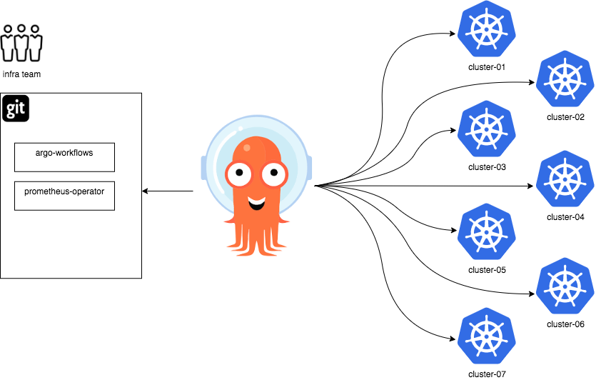
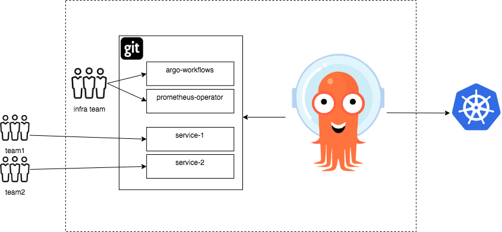

# Use cases supported by the ApplicationSet controller

With the concept of generators, the ApplicationSet controller provides a powerful set of tools to automate the templating and modification of Argo CD Applications. Generators produce template parameter data from a variety of sources, including Argo CD clusters and Git repositories, supporting and enabling new use cases.

While these tools may be utilized for whichever purpose is desired, here are some of the specific use cases that the ApplicationSet controller was designed to support.

## Use case: cluster add-ons

An initial design focus of the ApplicationSet controller was to allow an infrastructure team's Kubernetes cluster administrators the ability to automatically create a large, diverse set of Argo CD Applications, across a significant number of clusters, and manage those Applications as a single unit. One example of why this is needed is the *cluster add-on use case*.

In the *cluster add-on use case*, an administrator is responsible for provisioning cluster add-ons to one or more Kubernetes clusters: cluster-addons are operators such as the [Prometheus operator](https://github.com/prometheus-operator/prometheus-operator), or controllers such as the [argo-workflows controller](https://argoproj.github.io/argo-workflows/) (part of the [Argo ecosystem](https://argoproj.github.io/)).

Typically these add-ons are required by the applications of development teams (as tenants of a multi-tenant cluster, for instance, they may wish to provide metrics data to Prometheus or orchestrate workflows via Argo Workflows).

Since installing these add-ons requires cluster-level permissions not held by individual development teams, installation is the responsibility of the infrastructure/ops team of an organization, and within a large organization this team might be responsible for tens, hundreds, or thousands of Kubernetes clusters (with new clusters being added/modified/removed on a regular basis).

The need to scale across a large number of clusters, and automatically respond to the lifecycle of new clusters, necessarily mandates some form of automation. A further requirement would be allowing the targeting of add-ons to a subset of clusters using specific criteria (eg staging vs production).



In this example, the infrastructure team maintains a Git repository containing application manifests for the Argo Workflows controller, and Prometheus operator.

The infrastructure team would like to deploy both these add-on to a large number of clusters, using Argo CD, and likewise wishes to easily manage the creation/deletion of new clusters.

In this use case, we may use either the List, Cluster, or Git generators of the ApplicationSet controller to provide the required behaviour:

- *List generator*: Administrators maintain two `ApplicationSet` resources, one for each application (Workflows and Prometheus), and include the list of clusters they wish to target within the List generator elements of each.
    - With this generator, adding/removing clusters requires manually updating the `ApplicationSet` resource's list elements.
- *Cluster generator*: Administrators maintain two  `ApplicationSet` resources, one for each application (Workflows and Prometheus), and ensure that all new cluster are defined within Argo CD.
    - Since the Cluster generator automatically detects and targets the clusters defined within Argo CD, [adding/remove a cluster from Argo CD](../../declarative-setup/#clusters) will automatically cause Argo CD Application resources (for each application) to be created by the ApplicationSet controller.
- *Git generator*: The Git generator is the most flexible/powerful of the generators, and thus there are a number of different ways to tackle this use case. Here are a couple:
    - Using the Git generator `files` field: A list of clusters is kept as a JSON file within a Git repository. Updates to the JSON file, through Git commits, cause new clusters to be added/removed.
    - Using the Git generator `directories` field: For each target cluster, a corresponding directory of that name exists in a Git repository. Adding/modifying a directory, through Git commits, would trigger an update for the cluster that has shares the directory name.

See the [generators section](Generators.md) for details on each of the generators.

## Use case: monorepos

In the *monorepo use case*, Kubernetes cluster administrators manage the entire state of a single Kubernetes cluster from a single Git repository.

Manifest changes merged into the Git repository should automatically deploy to the cluster.



In this example, the infrastructure team maintains a Git repository containing application manifests for an Argo Workflows controller, and a Prometheus operator. Independent development teams also have added additional services they wish to deploy to the cluster.

Changes made to the Git repository -- for example, updating the version of a deployed artifact -- should automatically cause that update to be applied to the corresponding Kubernetes cluster by Argo CD.

The Git generator may be used to support this use case:

- The Git generator `directories` field may be used to specify particular subdirectories (using wildcards) containing the individual applications to deploy.
- The Git generator `files` field may reference Git repository files containing JSON metadata, with that metadata describing the individual applications to deploy.
- See the Git generator documentation for more details.

## Use case: self-service of Argo CD Applications on multitenant clusters

The *self-service use case* seeks to allow developers (as the end users of a multitenant Kubernetes cluster) greater flexibility to:

- Deploy multiple applications to a single cluster, in an automated fashion, using Argo CD
- Deploy to multiple clusters, in an automated fashion, using Argo CD
- But, in both cases, to empower those developers to be able to do so without needing to involve a cluster administrator (to create the necessarily Argo CD Applications/AppProject resources on their behalf)

One potential solution to this use case is for development teams to define Argo CD `Application` resources within a Git repository (containing the manifests they wish to deploy), in an [app-of-apps pattern](../../cluster-bootstrapping/#app-of-apps-pattern), and for cluster administrators to then review/accept changes to this repository via merge requests.

While this might sound like an effective solution, a major disadvantage is that a high degree of trust/scrutiny is needed to accept commits containing Argo CD `Application` spec changes. This is because there are many sensitive fields contained within the `Application` spec, including `project`, `cluster`, and `namespace`. An inadvertent merge might allow applications to access namespaces/clusters where they did not belong.

Thus in the self-service use case, administrators desire to only allow some fields of the `Application` spec to be controlled by developers (eg the Git source repository) but not other fields (eg the target namespace, or target cluster, should be restricted).

Fortunately, the ApplicationSet controller presents an alternative solution to this use case: cluster administrators may safely create an `ApplicationSet` resource containing a Git generator that restricts deployment of application resources to fixed values with the `template` field, while allowing customization of 'safe' fields by developers, at will.

```yaml
kind: ApplicationSet
# (...)
spec:
  generators:
  - git:
      repoURL: https://github.com/argoproj/argo-cd.git
      files:
      - path: "apps/**/config.json"
  template:
    spec:
      project: dev-team-one # project is restricted
      source:
        # developers may customize app details using JSON files from above repo URL
        repoURL: {{app.source}}
        targetRevision: {{app.revision}}
        path: {{app.path}}
      destination:
        name: production-cluster # cluster is restricted
        namespace: dev-team-one # namespace is restricted
```
See the [Git generator](Generators-Git.md) for more details.
