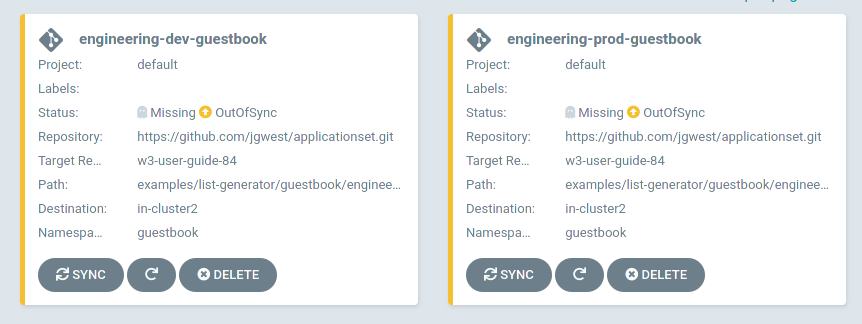

# Introduction to ApplicationSet controller

## Introduction

The ApplicationSet controller is a [Kubernetes controller](https://kubernetes.io/docs/concepts/architecture/controller/) that adds support for an `ApplicationSet` [CustomResourceDefinition](https://kubernetes.io/docs/tasks/extend-kubernetes/custom-resources/custom-resource-definitions/) (CRD). This controller/CRD enables both automation and greater flexibility managing [Argo CD](../../index.md) Applications across a large number of clusters and within monorepos, plus it makes self-service usage possible on multitenant Kubernetes clusters.

The ApplicationSet controller works alongside an existing [Argo CD installation](../../index.md). Argo CD is a declarative, GitOps continuous delivery tool, which allows developers to define and control deployment of Kubernetes application resources from within their existing Git workflow.

Starting with Argo CD v2.3, the ApplicationSet controller is bundled with Argo CD.

The ApplicationSet controller, supplements Argo CD by adding additional features in support of cluster-administrator-focused scenarios. The `ApplicationSet` controller provides:

- The ability to use a single Kubernetes manifest to target multiple Kubernetes clusters with Argo CD
- The ability to use a single Kubernetes manifest to deploy multiple applications from one or multiple Git repositories with Argo CD
- Improved support for monorepos: in the context of Argo CD, a monorepo is multiple Argo CD Application resources defined within a single Git repository
- Within multitenant clusters, improves the ability of individual cluster tenants to deploy applications using Argo CD (without needing to involve privileged cluster administrators in enabling the destination clusters/namespaces)

## The ApplicationSet resource

This example defines a new `guestbook` resource of kind `ApplicationSet`:
```yaml
apiVersion: argoproj.io/v1alpha1
kind: ApplicationSet
metadata:
  name: guestbook
spec:
  generators:
  - list:
      elements:
      - cluster: engineering-dev
        url: https://1.2.3.4
      - cluster: engineering-prod
        url: https://2.4.6.8
      - cluster: finance-preprod
        url: https://9.8.7.6
  template:
    metadata:
      name: '{{cluster}}-guestbook'
    spec:
      source:
        repoURL: https://github.com/infra-team/cluster-deployments.git
        targetRevision: HEAD
        path: guestbook/{{cluster}}
      destination:
        server: '{{url}}'
        namespace: guestbook
```

In this example, we want to deploy our `guestbook` application (with the Kubernetes resources for this application coming from Git, since this is GitOps) to a list of Kubernetes clusters (with the list of target clusters defined in the List items element of the `ApplicationSet` resource).

While there are multiple types of *generators* that are available to use with the `ApplicationSet` resource, this example uses the List generator, which simply contains a fixed, literal list of clusters to target. This list of clusters will be the clusters upon which Argo CD deploys the `guestbook` application resources, once the ApplicationSet controller has processed the `ApplicationSet` resource.

Generators, such as the List generator, are responsible for generating *parameters*. Parameters are key-values pairs that are substituted into the `template:` section of the ApplicationSet resource during template rendering.

There are multiple generators currently supported by the ApplicationSet controller:

- **List generator**: Generates parameters based on a fixed list of cluster name/URL values, as seen in the example above.
- **Cluster generator**: Rather than a literal list of clusters (as with the list generator), the cluster generator automatically generates cluster parameters based on the clusters that are defined within Argo CD.
- **Git generator**: The Git generator generates parameters based on files or folders that are contained within the Git repository defined within the generator resource.
    - Files containing JSON values will be parsed and converted into template parameters.
    - Individual directory paths within the Git repository may be used as parameter values, as well.
- **Matrix generator**: The Matrix generators combines the generated parameters of two other generators.

See the [generator section](Generators.md) for more information about individual generators, and the other generators not listed above.

## Parameter substitution into templates

Independent of which generator is used, parameters generated by a generator are substituted into `{{parameter name}}` values within the `template:` section of the `ApplicationSet` resource. In this example, the List generator defines `cluster` and `url` parameters, which are then substituted into the template's `{{cluster}}` and `{{url}}` values, respectively.

After substitution, this `guestbook` `ApplicationSet` resource is applied to the Kubernetes cluster:

1. The ApplicationSet controller processes the generator entries, producing a set of template parameters.
2. These parameters are substituted into the template, once for each set of parameters.
3. Each rendered template is converted into an Argo CD `Application` resource, which is then created (or updated) within the Argo CD namespace.
4. Finally, the Argo CD controller is notified of these `Application` resources and is responsible for handling them.


With the three different clusters defined in our example -- `engineering-dev`, `engineering-prod`, and `finance-preprod` -- this will produce three new Argo CD `Application` resources: one for each cluster.

Here is an example of one of the `Application` resources that would be created, for the `engineering-dev` cluster at `1.2.3.4`:
```yaml
apiVersion: argoproj.io/v1alpha1
kind: Application
metadata:
  name: engineering-dev-guestbook
spec:
  source:
    repoURL: https://github.com/infra-team/cluster-deployments.git
    targetRevision: HEAD
    path: guestbook/engineering-dev
  destination:
    server: https://1.2.3.4
    namespace: guestbook
```
We can see that the generated values have been substituted into the `server` and `path` fields of the template, and the template has been rendered into a fully-fleshed out Argo CD Application.

The Applications are now also visible from within the Argo CD UI:



The ApplicationSet controller will ensure that any changes, updates, or deletions made to `ApplicationSet` resources are automatically applied to the corresponding `Application`(s).

For instance, if a new cluster/URL list entry was added to the List generator, a new Argo CD `Application` resource would be accordingly created for this new cluster. Any edits made to the `guestbook` `ApplicationSet` resource will affect all the Argo CD Applications that were instantiated by that resource, including the new Application.

While the List generator's literal list of clusters is fairly simplistic, much more sophisticated scenarios are supported by the other available generators in the ApplicationSet controller.
