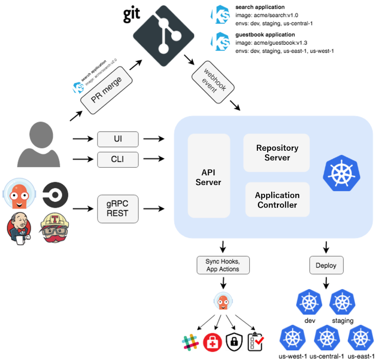

# Architectural Overview

## Components

### API Server
The API server is a gRPC/REST server which exposes the API consumed by the Web UI, CLI, and CI/CD 
systems. It has the following responsibilities:

* application management and status reporting
* invoking of application operations (e.g. sync, rollback, user-defined actions)
* repository and cluster credential management (stored as K8s secrets)
* authentication and auth delegation to external identity providers
* RBAC enforcement
* listener/forwarder for Git webhook events

### Repository Server
The repository server is an internal service which maintains a local cache of the Git repository
holding the application manifests. It is responsible for generating and returning the Kubernetes
manifests when provided the following inputs:

* repository URL
* revision (commit, tag, branch)
* application path
* template specific settings: parameters, helm values.yaml

### Application Controller
The application controller is a Kubernetes controller which continuously monitors running
applications and compares the current, live state against the desired target state (as specified in
the repo). It detects `OutOfSync` application state and optionally takes corrective action. It
is responsible for invoking any user-defined hooks for lifecycle events (PreSync, Sync, PostSync)
