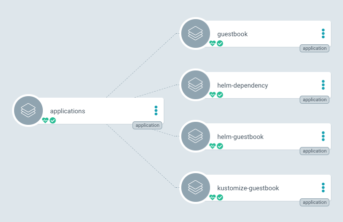
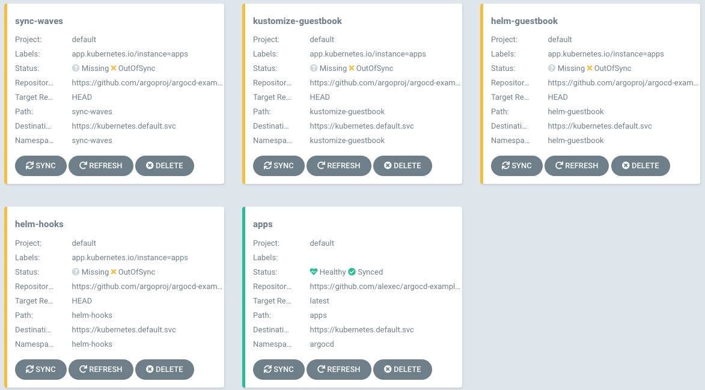
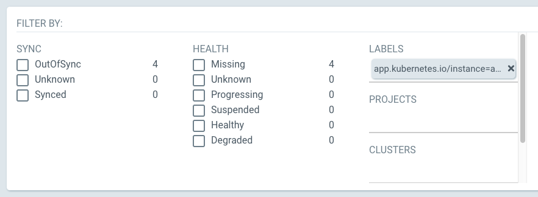
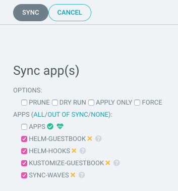

# Cluster Bootstrapping

This guide is for operators who have already installed Argo CD, and have a new cluster and are looking to install many apps in that cluster.

There's no one particular pattern to solve this problem, e.g. you could write a script to create your apps, or you could even manually create them. However, users of Argo CD tend to use the **app of apps pattern**.

!!!warning "App of Apps is an admin-only tool"
    The ability to create Applications in arbitrary [Projects](./declarative-setup.md#projects) 
    is an admin-level capability. Only admins should have push access to the parent Application's source repository. 
    Admins should review pull requests to that repository, paying particular attention to the `project` field in each 
    Application. Projects with access to the namespace in which Argo CD is installed effectively have admin-level 
    privileges.

## App Of Apps Pattern

[Declaratively](declarative-setup.md) specify one Argo CD app that consists only of other apps.



### Helm Example

This example shows how to use Helm to achieve this. You can, of course, use another tool if you like.

A typical layout of your Git repository for this might be:

```
├── Chart.yaml
├── templates
│   ├── guestbook.yaml
│   ├── helm-dependency.yaml
│   ├── helm-guestbook.yaml
│   └── kustomize-guestbook.yaml
└── values.yaml
```

`Chart.yaml` is boiler-plate.

`templates` contains one file for each child app, roughly:

```yaml
apiVersion: argoproj.io/v1alpha1
kind: Application
metadata:
  name: guestbook
  namespace: argocd
  finalizers:
  - resources-finalizer.argocd.argoproj.io
spec:
  destination:
    namespace: argocd
    server: {{ .Values.spec.destination.server }}
  project: default
  source:
    path: guestbook
    repoURL: https://github.com/argoproj/argocd-example-apps
    targetRevision: HEAD
``` 

The sync policy to automated + prune, so that child apps are automatically created, synced, and deleted when the manifest is changed, but you may wish to disable this. I've also added the finalizer, which will ensure that your apps are deleted correctly.

Fix the revision to a specific Git commit SHA to make sure that, even if the child apps repo changes, the app will only change when the parent app change that revision. Alternatively, you can set it to HEAD or a branch name.

As you probably want to override the cluster server, this is a templated values.

`values.yaml` contains the default values:

```yaml
spec:
  destination:
    server: https://kubernetes.default.svc
```

Next, you need to create and sync your parent app, e.g. via the CLI:

```bash
argocd app create apps \
    --dest-namespace argocd \
    --dest-server https://kubernetes.default.svc \
    --repo https://github.com/argoproj/argocd-example-apps.git \
    --path apps  
argocd app sync apps  
```

The parent app will appear as in-sync but the child apps will be out of sync:



> NOTE: You may want to modify this behavior to bootstrap your cluster in waves; see [v1.8 upgrade notes](upgrading/1.7-1.8.md) for information on changing this.

You can either sync via the UI, firstly filter by the correct label:



Then select the "out of sync" apps and sync: 



Or, via the CLI: 

```bash
argocd app sync -l app.kubernetes.io/instance=apps
```

View [the example on GitHub](https://github.com/argoproj/argocd-example-apps/tree/master/apps).


### Cascading deletion

If you want to ensure that child-apps and all of their resources are deleted when the parent-app is deleted make sure to add the appropriate [finalizer](../user-guide/app_deletion.md#about-the-deletion-finalizer) to your `Application` definition

```yaml
apiVersion: argoproj.io/v1alpha1
kind: Application
metadata:
  name: guestbook
  namespace: argocd
  finalizers:
  - resources-finalizer.argocd.argoproj.io
spec:
 ...
```

### Ignoring differences in child applications

To allow changes in child apps without triggering an out-of-sync status, or modification for debugging etc, the app of apps pattern works with [diff customization](../user-guide/diffing/). The example below shows how to ignore changes to syncPolicy and other common values.

```yaml
spec:
  ...
  syncPolicy:
    ...
    syncOptions:
      - RespectIgnoreDifferences=true
    ...
  ignoreDifferences:
    - group: "*"
      kind: "Application"
      namespace: "*"
      jsonPointers:
        # Allow manually disabling auto sync for apps, useful for debugging.
        - /spec/syncPolicy/automated
        # These are automatically updated on a regular basis. Not ignoring last applied configuration since it's used for computing diffs after normalization.
        - /metadata/annotations/argocd.argoproj.io~1refresh
        - /operation
  ...
```
