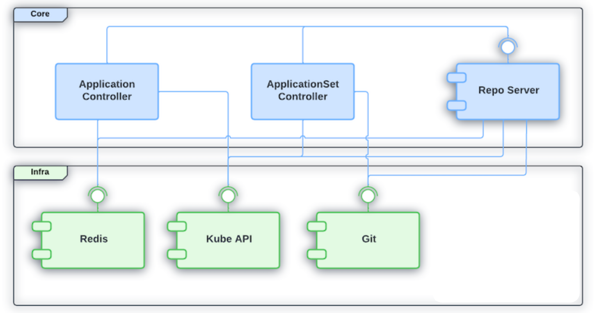

# Argo CD Core

## Introduction

Argo CD Core is a different installation that runs Argo CD in headless
mode. With this installation, you will have a fully functional GitOps
engine capable of getting the desired state from Git repositories and
applying it in Kubernetes.

The following groups of features won't be available in this
installation:

- Argo CD RBAC model
- Argo CD API
- Argo CD Notification Controller
- OIDC based authentication

The following features will be partially available (see the
[usage](#using) section below for more details):

- Argo CD Web UI
- Argo CD CLI
- Multi-tenancy (strictly GitOps based on git push permissions)

A few use-cases that justify running Argo CD Core are:

- As a cluster admin, I want to rely on Kubernetes RBAC only.
- As a devops engineer, I don't want to learn a new API or depend on
  another CLI to automate my deployments. I want to rely on the
  Kubernetes API only.
- As a cluster admin, I don't want to provide Argo CD UI or Argo CD
  CLI to developers.

## Architecture

Because Argo CD is designed with a component based architecture in
mind, it is possible to have a more minimalist installation. In this
case fewer components are installed and yet the main GitOps
functionality remains operational.

In the diagram below, the Core box, shows the components that will be
installed while opting for Argo CD Core:



Note that even if the Argo CD controller can run without Redis, it
isn't recommended. The Argo CD controller uses Redis as an important
caching mechanism reducing the load on Kube API and in Git. For this
reason, Redis is also included in this installation method.

## Installing

Argo CD Core can be installed by applying a single manifest file that
contains all the required resources.

Example:

```
export ARGOCD_VERSION=<desired argo cd release version (e.g. v2.7.0)>
kubectl create namespace argocd
kubectl apply -n argocd -f https://raw.githubusercontent.com/argoproj/argo-cd/$ARGOCD_VERSION/manifests/core-install.yaml
```

## Using

Once Argo CD Core is installed, users will be able to interact with it
by relying on GitOps. The available Kubernetes resources will be the
`Application` and the `ApplicationSet` CRDs. By using those resources,
users will be able to deploy and manage applications in Kubernetes.

It is still possible to use Argo CD CLI even when running Argo CD
Core. In this case, the CLI will spawn a local API server process that
will be used to handle the CLI command. Once the command is concluded,
the local API Server process will also be terminated. This happens
transparently for the user with no additional command required. Note
that Argo CD Core will rely only on Kubernetes RBAC and the user (or
the process) invoking the CLI needs to have access to the Argo CD
namespace with the proper permission in the `Application` and
`ApplicationSet` resources for executing a given command.

To use Argo CD CLI in core mode, it is required to pass the `--core`
flag with the `login` subcommand.

Example:

```bash
kubectl config set-context --current --namespace=argocd # change current kube context to argocd namespace
argocd login --core
```

Similarly, users can also run the Web UI locally if they prefer to
interact with Argo CD using this method. The Web UI can be started
locally by running the following command:

```
argocd admin dashboard -n argocd
```

Argo CD Web UI will be available at `http://localhost:8080`

