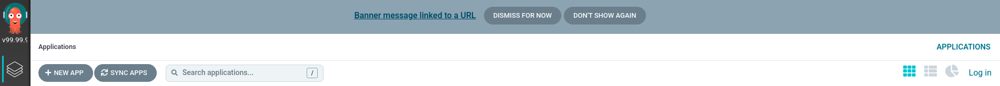

# Custom Styles

Argo CD imports the majority of its UI stylesheets from the [argo-ui](https://github.com/argoproj/argo-ui) project.
Sometimes, it may be desired to customize certain components of the UI for branding purposes or to
help distinguish between multiple instances of Argo CD running in different environments.

Such custom styling can be applied either by supplying a URL to a remotely hosted CSS file, or by 
loading a CSS file directly onto the argocd-server container.  Both mechanisms are driven by modifying
the argocd-cm configMap.

## Adding Styles Via Remote URL

The first method simply requires the addition of the remote URL to the argocd-cm configMap:

### argocd-cm
```yaml
---
apiVersion: v1
kind: ConfigMap
metadata:
  ...
  name: argocd-cm
data:
  ui.cssurl: "https://www.example.com/my-styles.css"
```

## Adding Styles Via Volume Mounts

The second method requires mounting the CSS file directly onto the argocd-server container and then
providing the argocd-cm with the properly configured path to that file.  In the following example,
the CSS file is actually defined inside of a separate configMap (the same effect could be achieved
by generating or downloading a CSS file in an initContainer):

### argocd-cm
```yaml
---
apiVersion: v1
kind: ConfigMap
metadata:
  ...
  name: argocd-cm
data:
  ui.cssurl: "./custom/my-styles.css"
```

Note that the `cssurl` should be specified relative to the "/shared/app" directory; 
not as an absolute path.

### argocd-styles-cm
```yaml
---
apiVersion: v1
kind: ConfigMap
metadata:
  ...
  name: argocd-styles-cm
data:
  my-styles.css: |
    .sidebar {
      background: linear-gradient(to bottom, #999, #777, #333, #222, #111);
    }
```

### argocd-server
```yaml
---
apiVersion: apps/v1
kind: Deployment
metadata:
  name: argocd-server
  ...
spec:
  template:
    ...
    spec:
      containers:
      - command:
        ...
        volumeMounts:
        ...
        - mountPath: /shared/app/custom
          name: styles
      ...
      volumes:
      ...
      - configMap:
          name: argocd-styles-cm
        name: styles
```

Note that the CSS file should be mounted within a subdirectory of the "/shared/app" directory
(e.g. "/shared/app/custom").  Otherwise, the file will likely fail to be imported by the browser with an
"incorrect MIME type" error. The subdirectory can be changed using `server.staticassets` key of the
[argocd-cmd-params-cm.yaml](./argocd-cmd-params-cm.yaml) ConfigMap.

## Developing Style Overlays
The styles specified in the injected CSS file should be specific to components and classes defined in [argo-ui](https://github.com/argoproj/argo-ui).
It is recommended to test out the styles you wish to apply first by making use of your browser's built-in developer tools.  For a more full-featured
experience, you may wish to build a separate project using the [Argo CD UI dev server](https://webpack.js.org/configuration/dev-server/).

## Banners

Argo CD can optionally display a banner that can be used to notify your users of upcoming maintenance and operational changes. This feature can be enabled by specifying the banner message using the `ui.bannercontent` field in the `argocd-cm` ConfigMap and Argo CD will display this message at the top of every UI page. You can optionally add a link to this message by setting `ui.bannerurl`. You can also make the banner sticky (permanent) by setting `ui.bannerpermanent` to true and change its position to "both" or "bottom" by using `ui.bannerposition: "both"`, allowing the banner to display on both the top and bottom, or `ui.bannerposition: "bottom"` to display it exclusively at the bottom.

### argocd-cm
```yaml
---
apiVersion: v1
kind: ConfigMap
metadata:
  ...
  name: argocd-cm
data:
    ui.bannercontent: "Banner message linked to a URL"
    ui.bannerurl: "www.bannerlink.com"
    ui.bannerpermanent: "true"
    ui.bannerposition: "bottom"
```


