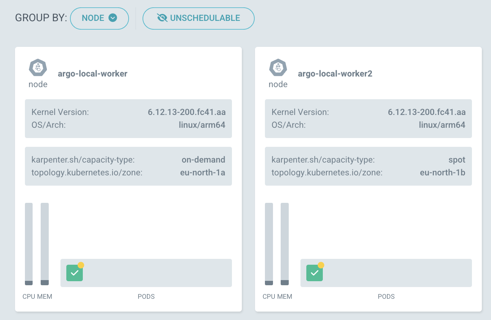

# UI Customization

## Default Application Details View

By default, the Application Details will show the `Tree` view.

This can be configured on an Application basis, by setting the `pref.argocd.argoproj.io/default-view` annotation, accepting one of: `tree`, `pods`, `network`, `list` as values.

For the Pods view, the default grouping mechanism can be configured using the `pref.argocd.argoproj.io/default-pod-sort` annotation, accepting one of: `node`, `parentResource`, `topLevelResource` as values.

## Node Labels in Pod View

It's possible to propagate node labels to node information in the pod view by configuring `application.allowedNodeLabels` in the [argocd-cm](argocd-cm-yaml.md) ConfigMap.

The following configuration:
```yaml
application.allowedNodeLabels: topology.kubernetes.io/zone,karpenter.sh/capacity-type
```
Would result in:

