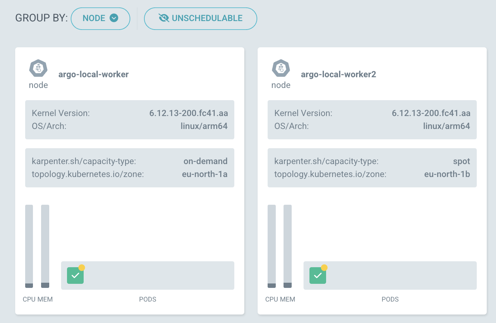

# UI Customization

## Default Application Details View

By default, the Application Details will show the `Tree` view.

This can be configured on an Application basis, by setting the `pref.argocd.argoproj.io/default-view` annotation, accepting one of: `tree`, `pods`, `network`, `list` as values.

For the Pods view, the default grouping mechanism can be configured using the `pref.argocd.argoproj.io/default-pod-sort` annotation, accepting one of: `node`, `parentResource`, `topLevelResource` as values.

## Node Labels in Pod View

It's possible to propagate node labels to node information in the pod view by configuring `application.allowedNodeLabels` in the [argocd-cm](argocd-cm-yaml.md) ConfigMap.

The following configuration:
```yaml
application.allowedNodeLabels: topology.kubernetes.io/zone,karpenter.sh/capacity-type
```
Would result in:


## CLI Download Links

By default, the **Help** page (linked from the bottom of the sidebar) links to the GitHub releases page for the running Argo CD version, where the CLI is available for all supported operating systems and architectures.

To offer direct download buttons instead (for example an internal mirror, or air-gapped environments where GitHub is not reachable), set `help.download.<os>-<arch>` keys in the [argocd-cm](argocd-cm-yaml.md) ConfigMap. When any of these keys are configured, the Help page renders a button per key pointing at the URL you provide and the default GitHub releases link is no longer shown. The Argo CD server also serves its own embedded Linux CLI binary at `download/argocd-linux-<arch>`, which can be used as a target for these keys:

```yaml
apiVersion: v1
kind: ConfigMap
metadata:
  name: argocd-cm
  namespace: argocd
data:
  help.download.linux-amd64: "https://example.com/argocd-linux-amd64"
  help.download.linux-arm64: "https://example.com/argocd-linux-arm64"
  help.download.darwin-amd64: "https://example.com/argocd-darwin-amd64"
  help.download.darwin-arm64: "https://example.com/argocd-darwin-arm64"
  help.download.windows-amd64: "https://example.com/argocd-windows-amd64.exe"
```

The following `<os>-<arch>` keys are recognized; any other key is ignored:

- `linux-amd64`
- `linux-arm64`
- `linux-ppc64le`
- `linux-s390x`
- `darwin-amd64`
- `darwin-arm64`
- `windows-amd64`
