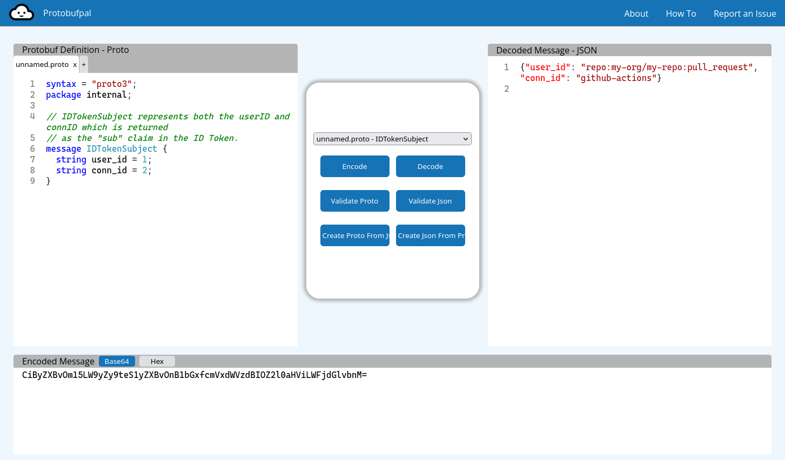

# GitHub Actions

GitHub is an OAuth identity provider which can be used in GitHub Actions
to generate tokens that identifies the repository and where it runs.

See: <https://docs.github.com/en/actions/security-for-github-actions/security-hardening-your-deployments/about-security-hardening-with-openid-connect>

You need to use OAuth 2.0 Token Exchange. Some identity providers supports this
out of the box, for example [Okta](https://developer.okta.com/docs/guides/set-up-token-exchange/main/).

However if you can't use that then you can use Dex.

## Using Dex

Edit the `argocd-cm` and configure the `dex.config` section:

```yaml
dex.config: |
  connectors:
    # Example connector
    - type: oidc
      id: google
      name: Google
      config:
        issuer: https://accounts.google.com
        clientID: XXXXXXXXXXXXX.apps.googleusercontent.com
        clientSecret: XXXXXXXXXXXXX

    # GitHub Actions connector
    - type: oidc
      id: github-actions
      name: GitHub Actions
      config:
        issuer: https://token.actions.githubusercontent.com/
        # If using GitHub Enterprise Server, then use this issuer:
        #issuer: https://github.example.com/_services/token
        scopes: [openid]
        userNameKey: sub
        insecureSkipEmailVerified: true

        # If using ArgoCD v2, then you also need to set this to get
        # commands like "argocd account get-user-info" to display correctly
        claimMapping:
          email: sub

  # Argo automatically adds the "argo-cd-cli" client
  #staticClients:
  #  - name: Argo CD CLI
  #    id: argo-cd-cli
```

This is very similar to Dex's official documentation (<https://dexidp.io/docs/guides/token-exchange/>),
however you don't need to set `staticClients`.
ArgoCD will automatically generate a static client named `argo-cd-cli` for you
that you should use.

Then you want a GitHub Action workflow something like this:

```yaml
name: argocd-test

on:
  pull_request:

permissions:
  id-token: write # This is required for requesting the JWT

jobs:
  argocd-test:
    runs-on:
      group: ephemeral_runners
    steps:
      # Actions have access to two special environment variables ACTIONS_CACHE_URL and ACTIONS_RUNTIME_TOKEN.
      # Inline step scripts in workflows do not see these variables.
      - uses: actions/github-script@v6
        id: script
        timeout-minutes: 10
        with:
          debug: true
          script: |
            const token = process.env['ACTIONS_RUNTIME_TOKEN']
            const runtimeUrl = process.env['ACTIONS_ID_TOKEN_REQUEST_URL']
            core.setOutput('TOKEN', token.trim())
            core.setOutput('IDTOKENURL', runtimeUrl.trim())            

      - name: Obtain access token
        id: idtoken
        run: |
          # get an token from github
          echo "getting token from GitHub"
          GH_TOKEN_RESPONSE=$(curl -sSf \
            "${{steps.script.outputs.IDTOKENURL}}" \
            -H "Authorization: bearer  ${{steps.script.outputs.TOKEN}}" \
            -H "Accept: application/json; api-version=2.0" \
            -H "Content-Type: application/json" \
            -d "{}" \
          )
          GH_TOKEN=$(jq -r .value <<< $GH_TOKEN_RESPONSE)
          echo "::add-mask::$GH_TOKEN"

          # exchange it for a dex token
          DEX_URL="https://argocd.example.com/api/dex/token"
          echo "getting access token from Dex: $DEX_URL"
          DEX_TOKEN_RESPONSE=$(curl -sSf \
              "$DEX_URL" \
              --user argo-cd-cli: \
              --data-urlencode "connector_id=github-actions" \
              --data-urlencode "grant_type=urn:ietf:params:oauth:grant-type:token-exchange" \
              --data-urlencode "scope=openid email profile federated:id" \
              --data-urlencode "requested_token_type=urn:ietf:params:oauth:token-type:access_token" \
              --data-urlencode "subject_token=$GH_TOKEN" \
              --data-urlencode "subject_token_type=urn:ietf:params:oauth:token-type:id_token")
          DEX_TOKEN=$(jq -r .access_token <<< $DEX_TOKEN_RESPONSE)

          if [[ -z "$DEX_TOKEN" ]]; then
            echo "::error::No token found in dex response"
            exit 1
          fi

          echo "::add-mask::$(echo "$DEX_TOKEN" | base64 -w0)"
          echo "::add-mask::$DEX_TOKEN"
          echo "dex-token=$DEX_TOKEN" >> "$GITHUB_OUTPUT"
          # use $DEX_TOKEN          

      - name: Setup ArgoCD CLI
        run: |
          curl -sSL -o argocd-linux-amd64 https://github.com/argoproj/argo-cd/releases/latest/download/argocd-linux-amd64
          mkdir -p "$RUNNER_TEMP/argocd"
          install -m 555 argocd-linux-amd64 "$RUNNER_TEMP/argocd/argocd"
          rm argocd-linux-amd64
          echo "$RUNNER_TEMP/argocd" >> "$GITHUB_PATH"

      - name: Use CLI in some commands
        env:
          ARGOCD_AUTH_TOKEN: ${{ steps.idtoken.outputs.dex-token }}
          ARGOCD_SERVER: argocd.example.com
          ARGOCD_OPTS: --grpc-web
        run: |
          set -x

          argocd version

          argocd account get-user-info

          argocd proj list

          argocd app list
```

One notable difference from Dex's official documentation (<https://dexidp.io/docs/guides/token-exchange/>),
is setting `subject_token_type` to `id_token` instead of `access_token`
to avoid the following error:

```logfmt
dex-79d7d98fff-8qrl2 dex time=2025-03-06T13:58:35.821Z level=ERROR msg="failed to verify subject token" err="oidc: getUserInfo is required for access token exchange" request_id=e2ef51fa-84c7-4734-8ea4-ade43a95d1af
```

## RBAC (ArgoCD v3)

When using ArgoCD v3.0.0 or later, then you define your `policy.csv` like so:

```yaml
configs:
  rbac:
    policy.csv: |
      p, repo:my-org/my-repo:pull_request, projects, get, my-project, allow
      p, repo:my-org/my-repo:pull_request, applications, get, my-project/*, allow
      p, repo:my-org/my-repo:pull_request, applicationsets, get, my-project/*, allow
```

More info: [RBAC Configuration](../rbac.md)

## RBAC (ArgoCD v2)

When using ArgoCD v2.x.x, then ArgoCD used the JWT `sub` field instead of
`federated_claims.user_id`. This was changed in PR [#20683](https://github.com/argoproj/argo-cd/pull/20683)
but that fix is only available since ArgoCD v3.0.0.

Therefore, when using ArgoCD v2.x.x you need to specify the base64-encoded
value used by Dex:

```yaml
configs:
  rbac:
    policy.csv: |
      p, CiByZXBvOm15LW9yZy9teS1yZXBvOnB1bGxfcmVxdWVzdBIOZ2l0aHViLWFjdGlvbnM, projects, get, my-project, allow
      p, CiByZXBvOm15LW9yZy9teS1yZXBvOnB1bGxfcmVxdWVzdBIOZ2l0aHViLWFjdGlvbnM, applications, get, my-project/*, allow
      p, CiByZXBvOm15LW9yZy9teS1yZXBvOnB1bGxfcmVxdWVzdBIOZ2l0aHViLWFjdGlvbnM, applicationsets, get, my-project/*, allow
```

This string can be found in the `argocd-server` logs when trying to access
ArgoCD. It is not a randomly generated string.

The value is a base64-encoded string (with trimmed `=` signs) of the following
protobuf message:

```protobuf
syntax = "proto3";
package internal;

// IDTokenSubject represents both the userID and connID which is returned
// as the "sub" claim in the ID Token.
message IDTokenSubject {
  string user_id = 1;
  string conn_id = 2;
}
```

(Source: <https://github.com/dexidp/dex/blob/v2.42.1/server/internal/types.proto#L14-L19>)

Which means you can generate the string yourself using sites like
<https://www.protobufpal.com/> by pasting the protobuf definition and
a JSON-encoded version of the message. Example:

```json
{"user_id": "repo:my-org/my-repo:pull_request", "conn_id": "github-actions"}
```


