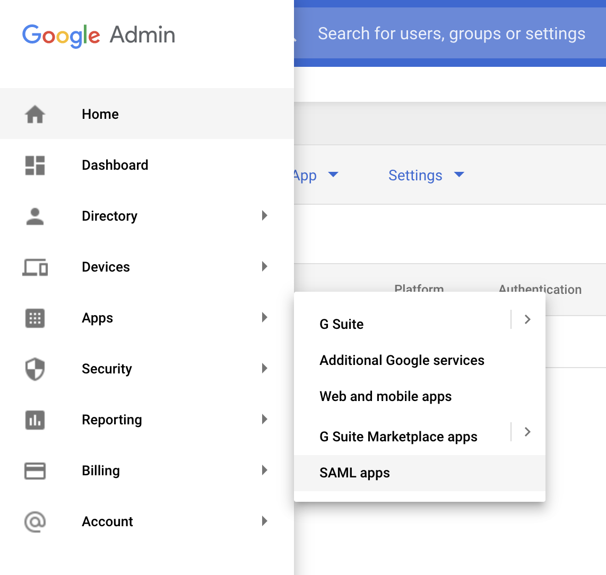
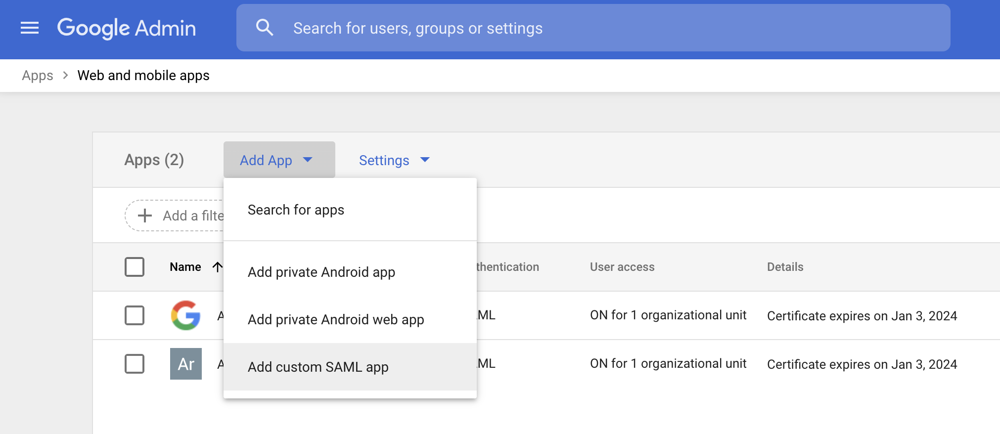
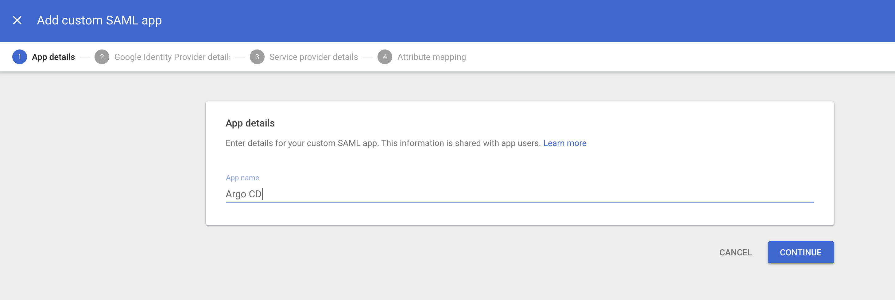
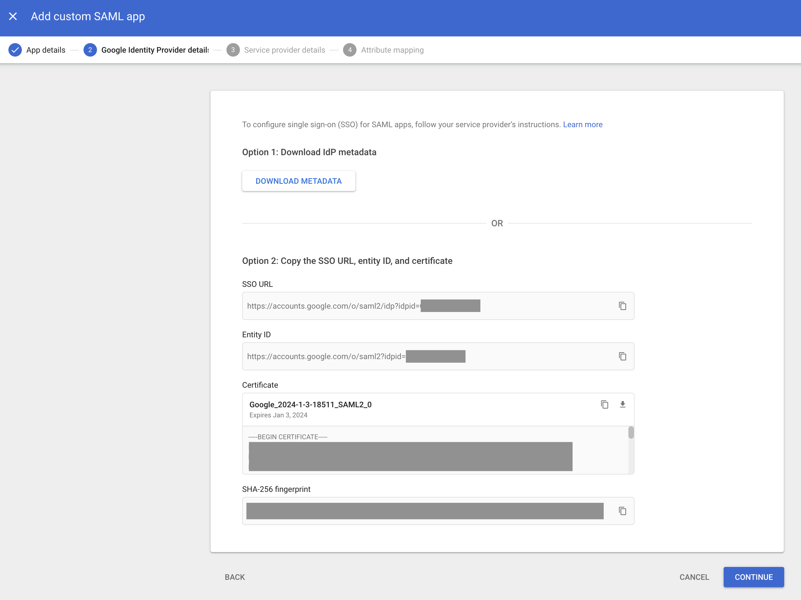
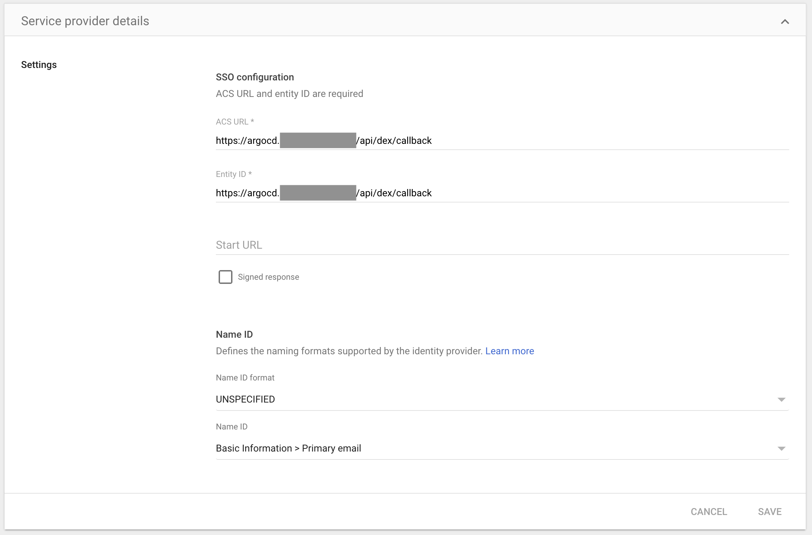

# Google

* [G Suite SAML App Auth using Dex](#g-suite-saml-app-auth-using-dex)

Once you've set up one of the above integrations, be sure to edit `argo-rbac-cm` to configure permissions (as in the example below). See [RBAC Configurations](../rbac.md) for more detailed scenarios.

```yaml
apiVersion: v1
kind: ConfigMap
metadata:
  name: argocd-rbac-cm
  namespace: argocd
data:
  policy.default: role:readonly
```

## G Suite SAML App Auth using Dex

### Configure a new SAML App

1. In the [Google admin console](https://admin.google.com), open the left-side menu and select `Apps` > `SAML Apps`

    

2. Under `Add App` select `Add custom SAML app`

    

3. Enter a `Name` for the application (eg. `Argo CD`), then choose `Continue`

    

4. Download the metadata or copy the `SSO URL`, `Certificate`, and optionally `Entity ID` from the identity provider details for use in the next section. Choose `continue`.
    - Base64 encode the contents of the certificate file, for example:
    - `$ cat ArgoCD.cer | base64`
    - *Keep a copy of the encoded output to be used in the next section.*

    

5. For both the `ACS URL` and `Entity ID`, use your Argo Dex Callback URL, for example: `https://argocd.example.com/api/dex/callback`

    

6. Finish creating the application.

### Configure Argo to use the new Google SAML App

Edit `argo-cm` and add the following `dex.config` to the data section, replacing the `caData`, `argocd.example.com`, `sso-url`, and optionally `google-entity-id` with your values from the Google SAML App:

```yaml
data:
  url: https://argocd.example.com
  dex.config: |
    connectors:
    - type: saml
      id: saml
      name: saml
      config:
        ssoURL: https://sso-url (eg. https://accounts.google.com/o/saml2/idp?idpid=Abcde0)
        entityIssuer: https://argocd.example.com/api/dex/callback
        caData: |
          BASE64-ENCODED-CERTIFICATE-DATA
        redirectURI: https://argocd.example.com/api/dex/callback
        usernameAttr: name
        emailAttr: email
        # optional
        ssoIssuer: https://google-entity-id (e.g. https://accounts.google.com/o/saml2?idpid=Abcde0)
```

### References

- [Dex SAML connector docs](https://dexidp.io/docs/connectors/saml/)
- [Google's SAML error messages](https://support.google.com/a/answer/6301076?hl=en)
