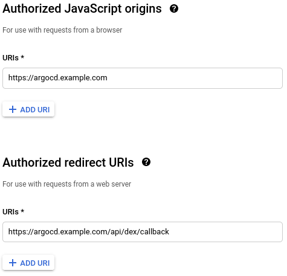
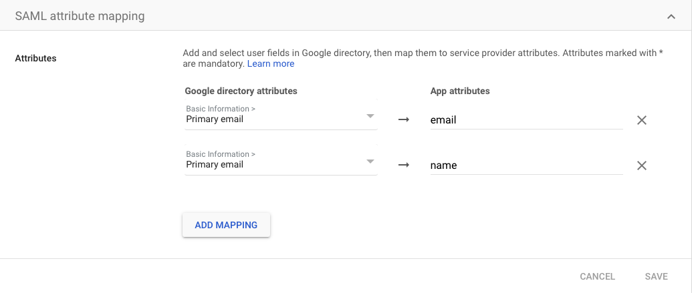
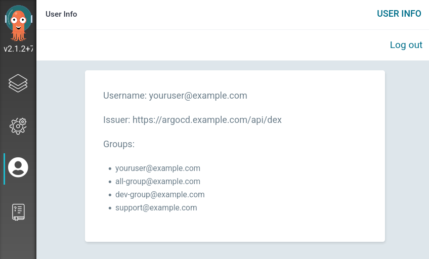

# Google

There are three different ways to integrate Argo CD login with your Google Workspace users. Generally the OpenID Connect (_oidc_) method would be the recommended way of doing this integration (and easier, as well...), but depending on your needs, you may choose a different option.

* [OpenID Connect using Dex](#openid-connect-using-dex)  
  This is the recommended login method if you don't need information about the groups the user's belongs to. Google doesn't expose the `groups` claim via _oidc_, so you won't be able to use Google Groups membership information for RBAC. 
* [SAML App Auth using Dex](#saml-app-auth-using-dex)  
  Dex [recommends avoiding this method](https://dexidp.io/docs/connectors/saml/#warning). Also, you won't get Google Groups membership information through this method.
* [OpenID Connect plus Google Groups using Dex](#openid-connect-plus-google-groups-using-dex)  
  This is the recommended method if you need to use Google Groups membership in your RBAC configuration.

Once you've set up one of the above integrations, be sure to edit `argo-rbac-cm` to configure permissions (as in the example below). See [RBAC Configurations](../rbac.md) for more detailed scenarios.

```yaml
apiVersion: v1
kind: ConfigMap
metadata:
  name: argocd-rbac-cm
  namespace: argocd
data:
  policy.default: role:readonly
```

## OpenID Connect using Dex

### Configure your OAuth consent screen

If you've never configured this, you'll be redirected straight to this if you try to create an OAuth Client ID

1. Go to your [OAuth Consent](https://console.cloud.google.com/apis/credentials/consent) configuration. If you still haven't created one, select `Internal` or `External` and click `Create` 
2. Go and [edit your OAuth consent screen](https://console.cloud.google.com/apis/credentials/consent/edit) Verify you're in the correct project!
3. Configure a name for your login app and a user support email address
4. The app logo and filling the information links is not mandatory, but it's a nice touch for the login page
5. In "Authorized domains" add the domains who are allowed to log in to ArgoCD (e.g. if you add `example.com`, all Google Workspace users with an `@example.com` address will be able to log in)
6. Save to continue to the "Scopes" section
7. Click on "Add or remove scopes" and add the `.../auth/userinfo.profile` and the `openid` scopes
8. Save, review the summary of your changes and finish

### Configure a new OAuth Client ID

1. Go to your [Google API Credentials](https://console.cloud.google.com/apis/credentials) console, and make sure you're in the correct project.
2. Click on "+Create Credentials"/"OAuth Client ID"
3. Select "Web Application" in the Application Type drop down menu, and enter an identifying name for your app (e.g. `Argo CD`)
4. Fill "Authorized JavaScript origins" with your Argo CD URL, e.g. `https://argocd.example.com`
5. Fill "Authorized redirect URIs" with your Argo CD URL plus `/api/dex/callback`, e.g. `https://argocd.example.com/api/dex/callback`

    

6. Click "Create" and save your "Client ID" and your "Client Secret" for later

### Configure Argo to use OpenID Connect

Edit `argocd-cm` and add the following `dex.config` to the data section, replacing `clientID` and `clientSecret` with the values you saved before:

```yaml
data:
  url: https://argocd.example.com
  dex.config: |
    connectors:
    - config:
        issuer: https://accounts.google.com
        clientID: XXXXXXXXXXXXX.apps.googleusercontent.com
        clientSecret: XXXXXXXXXXXXX
      type: oidc
      id: google
      name: Google
```

### References

- [Dex oidc connector docs](https://dexidp.io/docs/connectors/oidc/)

## SAML App Auth using Dex

### Configure a new SAML App

---
!!! warning "Deprecation Warning"

    Note that, according to [Dex documentation](https://dexidp.io/docs/connectors/saml/#warning), SAML is considered unsafe and they are planning to deprecate that module.

---

1. In the [Google admin console](https://admin.google.com), open the left-side menu and select `Apps` > `SAML Apps`

    

2. Under `Add App` select `Add custom SAML app`

    

3. Enter a `Name` for the application (e.g. `Argo CD`), then choose `Continue`

    

4. Download the metadata or copy the `SSO URL`, `Certificate`, and optionally `Entity ID` from the identity provider details for use in the next section. Choose `continue`.
    - Base64 encode the contents of the certificate file, for example:
    - `$ cat ArgoCD.cer | base64`
    - *Keep a copy of the encoded output to be used in the next section.*
    - *Ensure that the certificate is in PEM format before base64 encoding*

    

5. For both the `ACS URL` and `Entity ID`, use your Argo Dex Callback URL, for example: `https://argocd.example.com/api/dex/callback`

    

6. Add SAML Attribute Mapping, Map `Primary email` to `name` and `Primary Email` to `email`. and click `ADD MAPPING` button.

    

7. Finish creating the application.

### Configure Argo to use the new Google SAML App

Edit `argocd-cm` and add the following `dex.config` to the data section, replacing the `caData`, `argocd.example.com`, `sso-url`, and optionally `google-entity-id` with your values from the Google SAML App:

```yaml
data:
  url: https://argocd.example.com
  dex.config: |
    connectors:
    - type: saml
      id: saml
      name: saml
      config:
        ssoURL: https://sso-url (e.g. https://accounts.google.com/o/saml2/idp?idpid=Abcde0)
        entityIssuer: https://argocd.example.com/api/dex/callback
        caData: |
          BASE64-ENCODED-CERTIFICATE-DATA
        redirectURI: https://argocd.example.com/api/dex/callback
        usernameAttr: name
        emailAttr: email
        # optional
        ssoIssuer: https://google-entity-id (e.g. https://accounts.google.com/o/saml2?idpid=Abcde0)
```

### References

- [Dex SAML connector docs](https://dexidp.io/docs/connectors/saml/)
- [Google's SAML error messages](https://support.google.com/a/answer/6301076?hl=en)

## OpenID Connect plus Google Groups using Dex

We're going to use Dex's `google` connector to get additional Google Groups information from your users, allowing you to use group membership on your RBAC, i.e., giving `admin` role to the whole `sysadmins@yourcompany.com` group.

This connector uses two different credentials:

- An oidc client ID and secret  
  Same as when you're configuring an [OpenID connection](#openid-connect-using-dex), this authenticates your users
- A Google service account  
  This is used to connect to the Google Directory API and pull information about your user's group membership

Also, you'll need the email address for an admin user on this domain. Dex will impersonate that user identity to fetch user information from the API.

### Configure OpenID Connect

Go through the same steps as in [OpenID Connect using Dex](#openid-connect-using-dex), except for configuring `argocd-cm`. We'll do that later.

### Set up Directory API access 

1. Follow [Google instructions to create a service account with Domain-Wide Delegation](https://developers.google.com/admin-sdk/directory/v1/guides/delegation)
    - When assigning API scopes to the service account assign **only** the `https://www.googleapis.com/auth/admin.directory.group.readonly` scope and nothing else. If you assign any other scopes, you won't be able to fetch information from the API
    - Create the credentials in JSON format and store them in a safe place, we'll need them later  
2. Enable the [Admin SDK](https://console.developers.google.com/apis/library/admin.googleapis.com/)

### Configure Dex

1. Create a secret with the contents of the previous json file encoded in base64, like this:

        apiVersion: v1
        kind: Secret
        metadata:
          name: argocd-google-groups-json
          namespace: argocd
        data:
          googleAuth.json: JSON_FILE_BASE64_ENCODED

2. Edit your `argocd-dex-server` deployment to mount that secret as a file  
    - Add a volume mount in `/spec/template/spec/containers/0/volumeMounts/` like this. Be aware of editing the running container and not the init container!

            volumeMounts:
            - mountPath: /shared
              name: static-files
            - mountPath: /tmp
              name: dexconfig
            - mountPath: /tmp/oidc
              name: google-json
              readOnly: true

    - Add a volume in `/spec/template/spec/volumes/` like this:

            volumes:
            - emptyDir: {}
              name: static-files
            - emptyDir: {}
              name: dexconfig
            - name: google-json
              secret:
                defaultMode: 420
                secretName: argocd-google-groups-json

3. Edit `argocd-cm` and add the following `dex.config` to the data section, replacing `clientID` and `clientSecret` with the values you saved before, `adminEmail` with the address for the admin user you're going to impersonate, and editing `redirectURI` with your Argo CD domain (note that the `type` is now `google` instead of `oidc`):

        dex.config: |
          connectors:
          - config:
              redirectURI: https://argocd.example.com/api/dex/callback
              clientID: XXXXXXXXXXXXX.apps.googleusercontent.com
              clientSecret: XXXXXXXXXXXXX
              serviceAccountFilePath: /tmp/oidc/googleAuth.json
              adminEmail: admin-email@example.com
            type: google
            id: google
            name: Google

4. Restart your `argocd-dex-server` deployment to be sure it's using the latest configuration
5. Login to Argo CD and go to the "User info" section, were you should see the groups you're member  
  
6. Now you can use groups email addresses to give RBAC permissions
7. Dex (> v2.31.0) can also be configure to fetch transitive group membership as follows:

        dex.config: |
          connectors:
          - config:
              redirectURI: https://argocd.example.com/api/dex/callback
              clientID: XXXXXXXXXXXXX.apps.googleusercontent.com
              clientSecret: XXXXXXXXXXXXX
              serviceAccountFilePath: /tmp/oidc/googleAuth.json
              adminEmail: admin-email@example.com
              fetchTransitiveGroupMembership: True
            type: google
            id: google
            name: Google

### References

- [Dex Google connector docs](https://dexidp.io/docs/connectors/google/)
