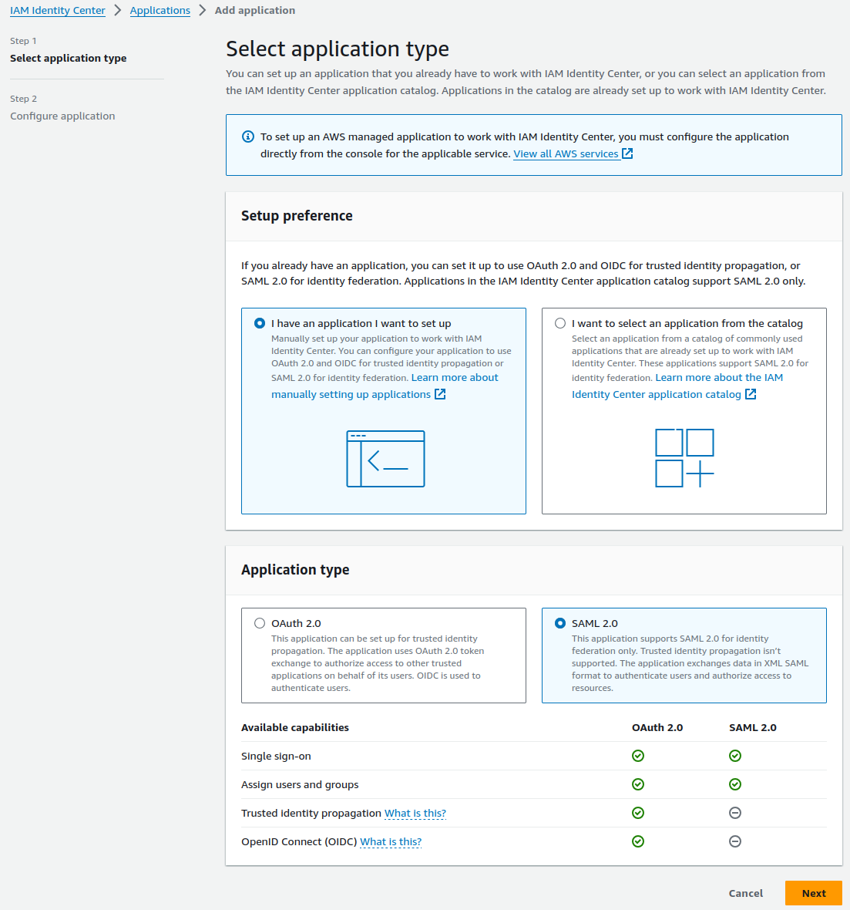
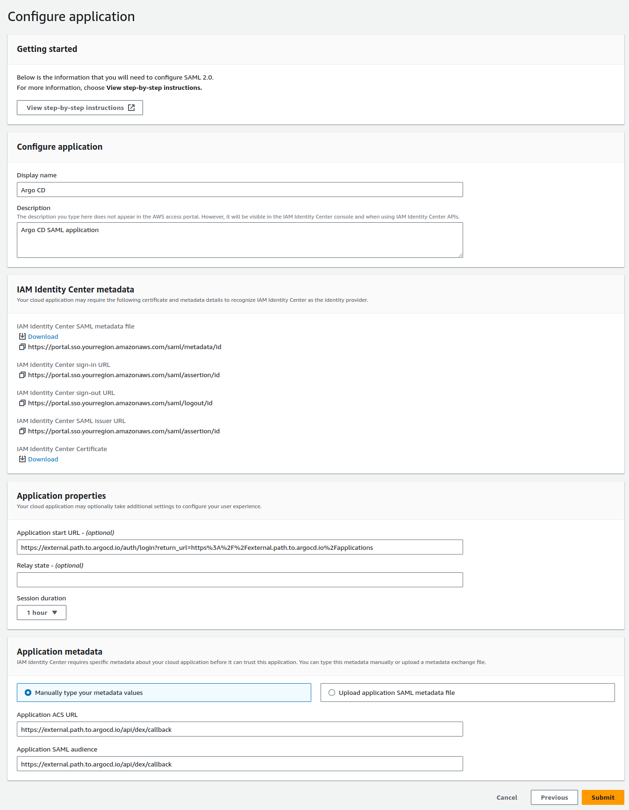
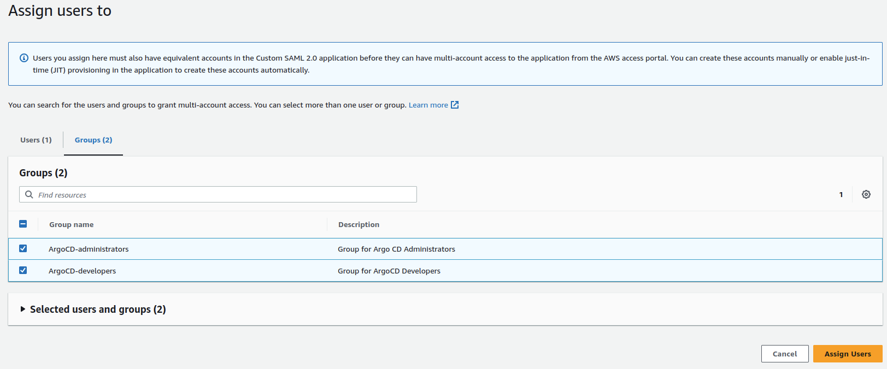
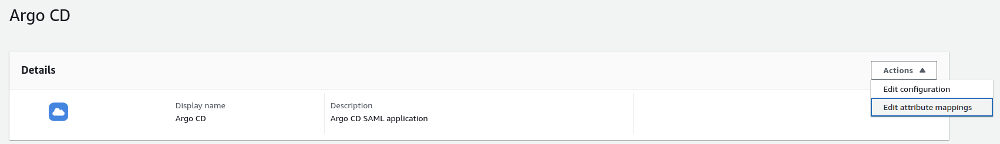
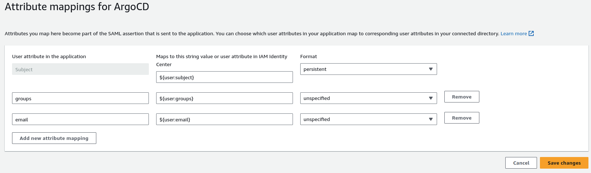
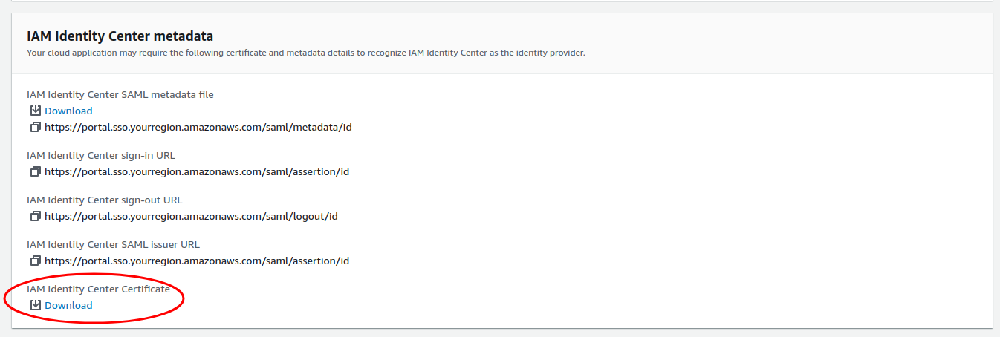

# Identity Center (AWS SSO)

!!! note "Are you using this? Please contribute!"
    If you're using this IdP please consider [contributing](../../developer-guide/docs-site.md) to this document.

A working Single Sign-On configuration using Identity Center (AWS SSO) has been achieved using the following method:

* [SAML (with Dex)](#saml-with-dex)

## SAML (with Dex)

1. Create a new SAML application in Identity Center and download the certificate.
    * 
    * 
2. Click `Assign Users` after creating the application in Identity Center, and select the users or user groups you wish to grant access to this application.
    * 
3. Copy the Argo CD URL into the `data.url` field in the `argocd-cm` ConfigMap.

        data:
          url: https://argocd.example.com

4. Configure Attribute mappings.

    !!! note "Group attribute mapping is not officially!"
        Group attribute mapping is not officially supported in the AWS docs, however the workaround is currently working.

    * 
    * 

<!-- markdownlint-enable MD046 -->

5. Download the CA certificate to use in the `argocd-cm` configuration.
    * If using the `caData` field, you'll need to base64-encode the entire certificate, including the `-----BEGIN CERTIFICATE-----` and `-----END CERTIFICATE-----` stanzas (e.g., `base64 my_cert.pem`).
    * If using the `ca` field and storing the CA certificate separately as a secret, you will need to mount the secret onto the `dex` container in the `argocd-dex-server` Deployment.
    * 
6. Edit the `argocd-cm` and configure the `data.dex.config` section:

<!-- markdownlint-disable MD046 -->
```yaml
dex.config: |
  logger:
    level: debug
    format: json
  connectors:
  - type: saml
    id: aws
    name: "AWS IAM Identity Center"
    config:
      # You need value of Identity Center APP SAML (IAM Identity Center sign-in URL)
      ssoURL: https://portal.sso.yourregion.amazonaws.com/saml/assertion/id
      # You need `caData` _OR_ `ca`, but not both.
      caData: <CA cert (IAM Identity Center Certificate of Identity Center APP SAML) passed through base64 encoding>
      # Path to mount the secret to the dex container
      entityIssuer: https://external.path.to.argocd.io/api/dex/callback
      redirectURI: https://external.path.to.argocd.io/api/dex/callback
      usernameAttr: email
      emailAttr: email
      groupsAttr: groups
```
<!-- markdownlint-enable MD046 -->

### Connect Identity Center Groups to Argo CD Roles
Argo CD recognizes user memberships in Identity Center groups that match the **Group Attribute Statements** regex. 

 In the example above, the regex `argocd-*` is used, making Argo CD aware of a group named `argocd-admins`.

Modify the `argocd-rbac-cm` ConfigMap to connect the `ArgoCD-administrators` Identity Center group to the builtin Argo CD `admin` role.
<!-- markdownlint-disable MD046 -->
```yaml
apiVersion: v1
kind: ConfigMap
metadata:
  name: argocd-rbac-cm
data:
  policy.csv: |
    g, <Identity Center Group ID>, role:admin
  scopes: '[groups, email]'
```
<!-- markdownlint-enable MD046 -->
