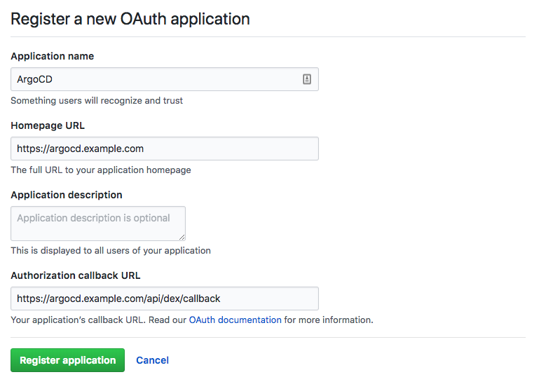
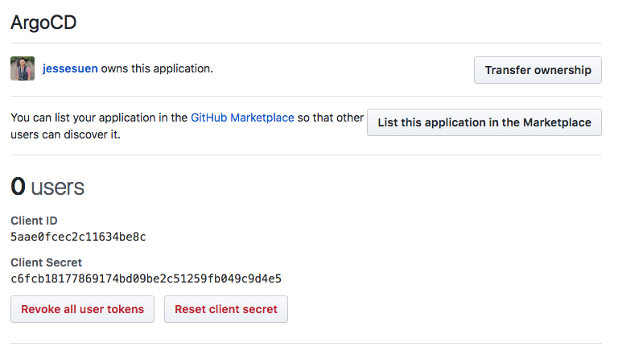

# Overview

Once installed Argo CD has one built-in `admin` user that has full access to the system. It is recommended to use `admin` user only
for initial configuration and then switch to local users or configure SSO integration.

## Local users/accounts (v1.5)

The local users/accounts feature serves two main use-cases:

* Auth tokens for Argo CD management automation. It is possible to configure an API account with limited permissions and generate an authentication token.
Such token can be used to automatically create applications, projects etc.
* Additional users for a very small team when SSO integration is overkill. The local users don't provide advanced features such as groups,
login history etc. So if you need such features it is strongly recommended to use SSO.

!!! note
    When you create local users, each of those users will need additional [RBAC rules](../rbac.md) set up, otherwise they will fall back to the default policy specified by `policy.default` field of the `argocd-rbac-cm` ConfigMap.

The maximum length of a local account's username is 32.

### Create new user

New users should be defined in `argocd-cm` ConfigMap:

```yaml
apiVersion: v1
kind: ConfigMap
metadata:
  name: argocd-cm
  namespace: argocd
  labels:
    app.kubernetes.io/name: argocd-cm
    app.kubernetes.io/part-of: argocd
data:
  # add an additional local user with apiKey and login capabilities
  #   apiKey - allows generating API keys
  #   login - allows to login using UI
  accounts.alice: apiKey, login
  # disables user. User is enabled by default
  accounts.alice.enabled: "false"
```

Each user might have two capabilities:

* apiKey - allows generating authentication tokens for API access
* login - allows to login using UI

### Disable admin user

As soon as additional users are created it is recommended to disable `admin` user:

```yaml
apiVersion: v1
kind: ConfigMap
metadata:
  name: argocd-cm
  namespace: argocd
  labels:
    app.kubernetes.io/name: argocd-cm
    app.kubernetes.io/part-of: argocd
data:
  admin.enabled: "false"
```

### Manage users

The Argo CD CLI provides set of commands to set user password and generate tokens.

* Get full users list
```bash
argocd account list
```

* Get specific user details
```bash
argocd account get <username>
```

* Set user password
```bash
argocd account update-password \
  --account <name> \
  --current-password <current-admin> \
  --new-password <new-user-password>
```

* Generate auth token
```bash
# if flag --account is omitted then Argo CD generates token for current user
argocd account generate-token --account <username>
```

### Failed logins rate limiting

Argo CD rejects login attempts after too many failed in order to prevent password brute-forcing.
The following environments variables are available to control throttling settings:

* `ARGOCD_SESSION_MAX_FAIL_COUNT`: Maximum number of failed logins before Argo CD starts
rejecting login attempts. Default: 5.

* `ARGOCD_SESSION_FAILURE_WINDOW_SECONDS`: Number of seconds for the failure window.
Default: 300 (5 minutes). If this is set to 0, the failure window is
disabled and the login attempts gets rejected after 10 consecutive logon failures,
regardless of the time frame they happened.

* `ARGOCD_SESSION_MAX_CACHE_SIZE`: Maximum number of entries allowed in the
cache. Default: 1000

* `ARGOCD_MAX_CONCURRENT_LOGIN_REQUESTS_COUNT`: Limits max number of concurrent login requests.
If set to 0 then limit is disabled. Default: 50.

## SSO

There are two ways that SSO can be configured:

* [Bundled Dex OIDC provider](#dex) - use this option if your current provider does not support OIDC (e.g. SAML,
  LDAP) or if you wish to leverage any of Dex's connector features (e.g. the ability to map GitHub
  organizations and teams to OIDC groups claims).

* [Existing OIDC provider](#existing-oidc-provider) - use this if you already have an OIDC provider which you are using (e.g.
  [Okta](okta.md), [OneLogin](onelogin.md), [Auth0](auth0.md), [Microsoft](microsoft.md), [Keycloak](keycloak.md),
  [Google (G Suite)](google.md)), where you manage your users, groups, and memberships.

## Dex

Argo CD embeds and bundles [Dex](https://github.com/coreos/dex) as part of its installation, for the
purpose of delegating authentication to an external identity provider. Multiple types of identity
providers are supported (OIDC, SAML, LDAP, GitHub, etc...). SSO configuration of Argo CD requires
editing the `argocd-cm` ConfigMap with
[Dex connector](https://dexidp.io/docs/connectors/) settings.

This document describes how to configure Argo CD SSO using GitHub (OAuth2) as an example, but the
steps should be similar for other identity providers.

### 1. Register the application in the identity provider

In GitHub, register a new application. The callback address should be the `/api/dex/callback`
endpoint of your Argo CD URL (e.g. `https://argocd.example.com/api/dex/callback`).



After registering the app, you will receive an OAuth2 client ID and secret. These values will be
inputted into the Argo CD configmap.



### 2. Configure Argo CD for SSO

Edit the argocd-cm configmap:

```bash
kubectl edit configmap argocd-cm -n argocd
```

* In the `url` key, input the base URL of Argo CD. In this example, it is `https://argocd.example.com`
* In the `dex.config` key, add the `github` connector to the `connectors` sub field. See Dex's
  [GitHub connector](https://github.com/coreos/dex/blob/master/Documentation/connectors/github.md)
  documentation for explanation of the fields. A minimal config should populate the clientID,
  clientSecret generated in Step 1.
* You will very likely want to restrict logins to one or more GitHub organization. In the
  `connectors.config.orgs` list, add one or more GitHub organizations. Any member of the org will
  then be able to login to Argo CD to perform management tasks.

```yaml
data:
  url: https://argocd.example.com

  dex.config: |
    connectors:
      # GitHub example
      - type: github
        id: github
        name: GitHub
        config:
          clientID: aabbccddeeff00112233
          clientSecret: $dex.github.clientSecret
          orgs:
          - name: your-github-org

      # GitHub enterprise example
      - type: github
        id: acme-github
        name: Acme GitHub
        config:
          hostName: github.acme.com
          clientID: abcdefghijklmnopqrst
          clientSecret: $dex.acme.clientSecret
          orgs:
          - name: your-github-org
```

After saving, the changes should take affect automatically.

NOTES:

* Any values which start with '$' will look to a key in argocd-secret of the same name (minus the $),
  to obtain the actual value. This allows you to store the `clientSecret` as a kubernetes secret.
  Kubernetes secrets must be base64 encoded. To base64 encode your secret, you can run
  `printf RAW_STRING | base64`.
* There is no need to set `redirectURI` in the `connectors.config` as shown in the dex documentation.
  Argo CD will automatically use the correct `redirectURI` for any OAuth2 connectors, to match the
  correct external callback URL (e.g. `https://argocd.example.com/api/dex/callback`)

## Existing OIDC Provider

To configure Argo CD to delegate authenticate to your existing OIDC provider, add the OAuth2
configuration to the `argocd-cm` ConfigMap under the `oidc.config` key:

```yaml
data:
  url: https://argocd.example.com

  oidc.config: |
    name: Okta
    issuer: https://dev-123456.oktapreview.com
    clientID: aaaabbbbccccddddeee
    clientSecret: $oidc.okta.clientSecret

    # Optional set of OIDC scopes to request. If omitted, defaults to: ["openid", "profile", "email", "groups"]
    requestedScopes: ["openid", "profile", "email", "groups"]

    # Optional set of OIDC claims to request on the ID token.
    requestedIDTokenClaims: {"groups": {"essential": true}}

    # Some OIDC providers require a separate clientID for different callback URLs.
    # For example, if configuring Argo CD with self-hosted Dex, you will need a separate client ID
    # for the 'localhost' (CLI) client to Dex. This field is optional. If omitted, the CLI will
    # use the same clientID as the Argo CD server
    cliClientID: vvvvwwwwxxxxyyyyzzzz
```

!!! note
    The callback address should be the /auth/callback endpoint of your Argo CD URL
    (e.g. https://argocd.example.com/auth/callback).

### Requesting additional ID token claims

Not all OIDC providers support a special `groups` scope. E.g. Okta, OneLogin and Microsoft do support a special
`groups` scope and will return group membership with the default `requestedScopes`.

Other OIDC providers might be able to return a claim with group membership if explicitly requested to do so.
Individual claims can be requested with `requestedIDTokenClaims`, see
[OpenID Connect Claims Parameter](https://connect2id.com/products/server/docs/guides/requesting-openid-claims#claims-parameter)
for details. The Argo CD configuration for claims is as follows:

```yaml
  oidc.config: |
    requestedIDTokenClaims:
      email:
        essential: true
      groups:
        essential: true
        value: org:myorg
      acr:
        essential: true
        values:
        - urn:mace:incommon:iap:silver
        - urn:mace:incommon:iap:bronze
```

For a simple case this can be:

```yaml
  oidc.config: |
    requestedIDTokenClaims: {"groups": {"essential": true}}
```
### Configuring a custom logout URL for your OIDC provider

Optionally, if your OIDC provider exposes a logout API and you wish to configure a custom logout URL for the purposes of invalidating 
any active session post logout, you can do so by specifying it as follows:

```yaml
  oidc.config: |
    name: example-OIDC-provider
    issuer: https://example-OIDC-provider.com
    clientID: xxxxxxxxx
    clientSecret: xxxxxxxxx
    requestedScopes: ["openid", "profile", "email", "groups"]
    requestedIDTokenClaims: {"groups": {"essential": true}}
    logoutURL: https://example-OIDC-provider.com/logout?id_token_hint={{token}}
```
By default, this would take the user to their OIDC provider's login page after logout. If you also wish to redirect the user back to Argo CD after logout, you can specify the logout URL as follows:

```yaml
...
    logoutURL: https://example-OIDC-provider.com/logout?id_token_hint={{token}}&post_logout_redirect_uri={{logoutRedirectURL}}
```

You are not required to specify a logoutRedirectURL as this is automatically generated by ArgoCD as your base ArgoCD url + Rootpath

!!! note
   The post logout redirect URI may need to be whitelisted against your OIDC provider's client settings for ArgoCD.