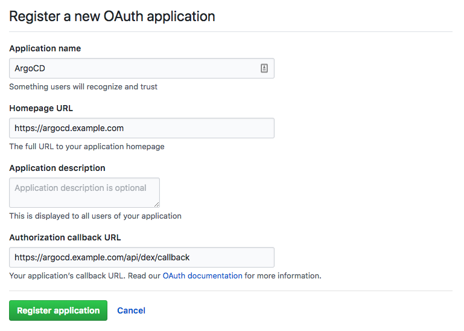
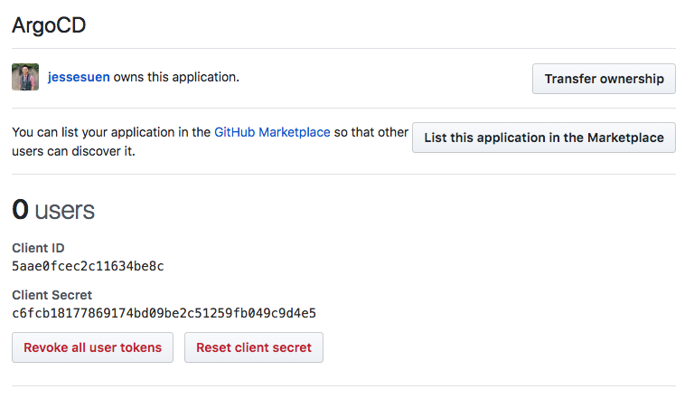

# Overview

Once installed Argo CD has one built-in `admin` user that has full access to the system. It is recommended to use `admin` user only
for initial configuration and then switch to local users or configure SSO integration.

## Local users/accounts

The local users/accounts feature serves two main use-cases:

* Auth tokens for Argo CD management automation. It is possible to configure an API account with limited permissions and generate an authentication token.
Such token can be used to automatically create applications, projects etc.
* Additional users for a very small team where use of SSO integration might be considered an overkill. The local users don't provide advanced features such as groups,
login history etc. So if you need such features it is strongly recommended to use SSO.

> [!NOTE]
> When you create local users, each of those users will need additional [RBAC rules](../rbac.md) set up, otherwise they will fall back to the default policy specified by `policy.default` field of the `argocd-rbac-cm` ConfigMap.

The maximum length of a local account's username is 32.

### Create new user

New users should be defined in `argocd-cm` ConfigMap:

```yaml
apiVersion: v1
kind: ConfigMap
metadata:
  name: argocd-cm
  namespace: argocd
  labels:
    app.kubernetes.io/name: argocd-cm
    app.kubernetes.io/part-of: argocd
data:
  # add an additional local user with apiKey and login capabilities
  #   apiKey - allows generating API keys
  #   login - allows to login using UI
  accounts.alice: apiKey, login
  # disables user. User is enabled by default
  accounts.alice.enabled: "false"
```

Each user might have two capabilities:

* apiKey - allows generating authentication tokens for API access
* login - allows to login using UI

### Delete user

In order to delete a user, you must remove the corresponding entry defined in the `argocd-cm` ConfigMap:

Example:

```bash
kubectl patch -n argocd cm argocd-cm --type='json' -p='[{"op": "remove", "path": "/data/accounts.alice"}]'
```

It is recommended to also remove the password entry in the `argocd-secret` Secret:

Example:

```bash
kubectl patch -n argocd secrets argocd-secret --type='json' -p='[{"op": "remove", "path": "/data/accounts.alice.password"}]'
```

### Disable admin user

As soon as additional users are created it is recommended to disable `admin` user:

```yaml
apiVersion: v1
kind: ConfigMap
metadata:
  name: argocd-cm
  namespace: argocd
  labels:
    app.kubernetes.io/name: argocd-cm
    app.kubernetes.io/part-of: argocd
data:
  admin.enabled: "false"
```

### Manage users

The Argo CD CLI provides set of commands to set user password and generate tokens.

* Get full users list
```bash
argocd account list
```

* Get specific user details
```bash
argocd account get --account <username>
```

* Set user password
```bash
# if you are managing users as the admin user, <current-user-password> should be the current admin password.
argocd account update-password \
  --account <name> \
  --current-password <current-user-password> \
  --new-password <new-user-password>
```

* Generate auth token
```bash
# if flag --account is omitted then Argo CD generates token for current user
argocd account generate-token --account <username>
```

### Failed logins rate limiting

Argo CD rejects login attempts after too many failed in order to prevent password brute-forcing.
The following environments variables are available to control throttling settings:

* `ARGOCD_SESSION_FAILURE_MAX_FAIL_COUNT`: Maximum number of failed logins before Argo CD starts
rejecting login attempts. Default: 5.

* `ARGOCD_SESSION_FAILURE_WINDOW_SECONDS`: Number of seconds for the failure window.
Default: 300 (5 minutes). If this is set to 0, the failure window is
disabled and the login attempts gets rejected after 10 consecutive logon failures,
regardless of the time frame they happened.

* `ARGOCD_SESSION_MAX_CACHE_SIZE`: Maximum number of entries allowed in the
cache. Default: 1000

* `ARGOCD_MAX_CONCURRENT_LOGIN_REQUESTS_COUNT`: Limits max number of concurrent login requests.
If set to 0 then limit is disabled. Default: 50.

## SSO

There are two ways that SSO can be configured:

* [Bundled Dex OIDC provider](#dex) - use this option if your current provider does not support OIDC (e.g. SAML,
  LDAP) or if you wish to leverage any of Dex's connector features (e.g. the ability to map GitHub
  organizations and teams to OIDC groups claims). Dex also supports OIDC directly and can fetch user
  information from the identity provider when the groups cannot be included in the IDToken.

* [Existing OIDC provider](#existing-oidc-provider) - use this if you already have an OIDC provider which you are using (e.g.
  [Okta](okta.md), [OneLogin](onelogin.md), [Auth0](auth0.md), [Microsoft](microsoft.md), [Keycloak](keycloak.md),
  [Google (G Suite)](google.md)), where you manage your users, groups, and memberships.

## Dex

Argo CD embeds and bundles [Dex](https://github.com/dexidp/dex) as part of its installation, for the
purpose of delegating authentication to an external identity provider. Multiple types of identity
providers are supported (OIDC, SAML, LDAP, GitHub, etc...). SSO configuration of Argo CD requires
editing the `argocd-cm` ConfigMap with
[Dex connector](https://dexidp.io/docs/connectors/) settings.

This document describes how to configure Argo CD SSO using GitHub (OAuth2) as an example, but the
steps should be similar for other identity providers.

### 1. Register the application in the identity provider

In GitHub, register a new application. The callback address should be the `/api/dex/callback`
endpoint of your Argo CD URL (e.g. `https://argocd.example.com/api/dex/callback`).



After registering the app, you will receive an OAuth2 client ID and secret. These values will be
inputted into the Argo CD configmap.



### 2. Configure Argo CD for SSO

Edit the argocd-cm configmap:

```bash
kubectl edit configmap argocd-cm -n argocd
```

* In the `url` key, input the base URL of Argo CD. In this example, it is `https://argocd.example.com`
* (Optional): If Argo CD should be accessible via multiple base URLs you may
  specify any additional base URLs via the `additionalUrls` key.
* In the `dex.config` key, add the `github` connector to the `connectors` sub field. See Dex's
  [GitHub connector](https://github.com/dexidp/website/blob/main/content/docs/connectors/github.md)
  documentation for explanation of the fields. A minimal config should populate the clientID,
  clientSecret generated in Step 1.
* You will very likely want to restrict logins to one or more GitHub organization. In the
  `connectors.config.orgs` list, add one or more GitHub organizations. Any member of the org will
  then be able to login to Argo CD to perform management tasks.

```yaml
data:
  url: https://argocd.example.com

  dex.config: |
    connectors:
      # GitHub example
      - type: github
        id: github
        name: GitHub
        config:
          clientID: aabbccddeeff00112233
          clientSecret: $dex.github.clientSecret # Alternatively $<some_K8S_secret>:dex.github.clientSecret
          orgs:
          - name: your-github-org

      # GitHub enterprise example
      - type: github
        id: acme-github
        name: Acme GitHub
        config:
          hostName: github.acme.example.com
          clientID: abcdefghijklmnopqrst
          clientSecret: $dex.acme.clientSecret  # Alternatively $<some_K8S_secret>:dex.acme.clientSecret
          orgs:
          - name: your-github-org
```

After saving, the changes should take effect automatically.

NOTES:

* There is no need to set `redirectURI` in the `connectors.config` as shown in the dex documentation.
  Argo CD will automatically use the correct `redirectURI` for any OAuth2 connectors, to match the
  correct external callback URL (e.g. `https://argocd.example.com/api/dex/callback`)
* By default, `Secret` keys such as `dex.acme.clientSecret` will be looked up in `argocd-secret`. If you want to use another secret, (`some_K8S_secret` in the example above), it *must* have the label `app.kubernetes.io/part-of: argocd`.

## OIDC Configuration with DEX

Dex can be used for OIDC authentication instead of ArgoCD directly. This provides a separate set of
features such as fetching information from the `UserInfo` endpoint and
[federated tokens](https://dexidp.io/docs/custom-scopes-claims-clients/#cross-client-trust-and-authorized-party)

### Configuration:
* In the `argocd-cm` ConfigMap add the `OIDC` connector to the `connectors` sub field inside `dex.config`.
See Dex's [OIDC connect documentation](https://dexidp.io/docs/connectors/oidc/) to see what other
configuration options might be useful. We're going to be using a minimal configuration here.
* The issuer URL should be where Dex talks to the OIDC provider. There would normally be a
`.well-known/openid-configuration` under this URL which has information about what the provider supports.
e.g. https://accounts.google.com/.well-known/openid-configuration


```yaml
data:
  url: "https://argocd.example.com"
  dex.config: |
    connectors:
      # OIDC
      - type: oidc
        id: oidc
        name: OIDC
        config:
          issuer: https://example-OIDC-provider.example.com
          clientID: aaaabbbbccccddddeee
          clientSecret: $dex.oidc.clientSecret
```

> [!NOTE]
> Argo CD's OIDC token refresh (see `refreshTokenThreshold` in [Existing OIDC Provider](#existing-oidc-provider))
> does not apply to Dex's embedded web login flow. Once a Dex-issued ID token expires, the user
> must log in again, regardless of `refreshTokenThreshold` being set.

### Requesting additional ID token claims

By default Dex only retrieves the profile and email scopes. In order to retrieve more claims you
can add them under the `scopes` entry in the Dex configuration. To enable group claims through Dex,
`insecureEnableGroups` also needs to be enabled. Group information is currently only refreshed at authentication
time and support to refresh group information more dynamically can be tracked here: [dexidp/dex#1065](https://github.com/dexidp/dex/issues/1065).

```yaml
data:
  url: "https://argocd.example.com"
  dex.config: |
    connectors:
      # OIDC
      - type: oidc
        id: oidc
        name: OIDC
        config:
          issuer: https://example-OIDC-provider.example.com
          clientID: aaaabbbbccccddddeee
          clientSecret: $dex.oidc.clientSecret
          insecureEnableGroups: true
          scopes:
          - profile
          - email
          - groups
```

> [!WARNING]
> Because group information is only refreshed at authentication time just adding or removing an account from a group will not change a user's membership until they reauthenticate. Depending on your organization's needs this could be a security risk and could be mitigated by changing the authentication token's lifetime.

### Retrieving claims that are not in the token

When an Idp does not or cannot support certain claims in an IDToken they can be retrieved separately using
the UserInfo endpoint. Dex supports this functionality using the `getUserInfo` endpoint. One of the most
common claims that is not supported in the IDToken is the `groups` claim and both `getUserInfo` and `insecureEnableGroups`
must be set to true.

```yaml
data:
  url: "https://argocd.example.com"
  dex.config: |
    connectors:
      # OIDC
      - type: oidc
        id: oidc
        name: OIDC
        config:
          issuer: https://example-OIDC-provider.example.com
          clientID: aaaabbbbccccddddeee
          clientSecret: $dex.oidc.clientSecret
          insecureEnableGroups: true
          scopes:
          - profile
          - email
          - groups
          getUserInfo: true
```

## Existing OIDC Provider

To configure Argo CD to delegate authentication to your existing OIDC provider, add the OAuth2
configuration to the `argocd-cm` ConfigMap under the `oidc.config` key:

```yaml
data:
  url: https://argocd.example.com

  oidc.config: |
    name: Okta
    issuer: https://dev-123456.oktapreview.com
    clientID: aaaabbbbccccddddeee
    clientSecret: $oidc.okta.clientSecret
    
    # Optional list of allowed aud claims. If omitted or empty, defaults to the clientID value above (and the 
    # cliClientID, if that is also specified). If you specify a list and want the clientID to be allowed, you must 
    # explicitly include it in the list.
    # Token verification will pass if any of the token's audiences matches any of the audiences in this list.
    allowedAudiences:
    - aaaabbbbccccddddeee
    - qqqqwwwweeeerrrrttt

    # Optional. If false, tokens without an audience will always fail validation. If true, tokens without an audience 
    # will always pass validation.
    # Defaults to true for Argo CD < 2.6.0. Defaults to false for Argo CD >= 2.6.0.
    skipAudienceCheckWhenTokenHasNoAudience: true

    # Optional set of OIDC scopes to request. If omitted, defaults to: ["openid", "profile", "email", "groups"]
    requestedScopes: ["openid", "profile", "email", "groups"]

    # Optional set of OIDC claims to request on the ID token.
    requestedIDTokenClaims: {"groups": {"essential": true}}

    # Some OIDC providers require a separate clientID for different callback URLs.
    # For example, if configuring Argo CD with self-hosted Dex, you will need a separate client ID
    # for the 'localhost' (CLI) client to Dex. This field is optional. If omitted, the CLI will
    # use the same clientID as the Argo CD server
    cliClientID: vvvvwwwwxxxxyyyyzzzz

    # PKCE is an OIDC extension to prevent authorization code interception attacks.
    # Make sure the identity provider supports it and that it is activated for Argo CD OIDC client.
    # Default is false.
    enablePKCEAuthentication: true

    # Optional. Argo CD uses this threshold to refresh an OIDC ID token before it expires, using the
    # cached refresh token, so the session isn't interrupted. Must be shorter than the ID
    # token's lifetime, or a new token will be requested on every request.
    # Default is 0s.
    refreshTokenThreshold: 30s
```

> [!NOTE]
> The callback address should be the /auth/callback endpoint of your Argo CD URL
> (e.g. https://argocd.example.com/auth/callback).

### Requesting additional ID token claims

Not all OIDC providers support a special `groups` scope. E.g. Okta, OneLogin and Microsoft do support a special
`groups` scope and will return group membership with the default `requestedScopes`.

Other OIDC providers might be able to return a claim with group membership if explicitly requested to do so.
Individual claims can be requested with `requestedIDTokenClaims`, see
[OpenID Connect Claims Parameter](https://connect2id.com/products/server/docs/guides/requesting-openid-claims#claims-parameter)
for details. The Argo CD configuration for claims is as follows:

```yaml
  oidc.config: |
    requestedIDTokenClaims:
      email:
        essential: true
      groups:
        essential: true
        value: org:myorg
      acr:
        essential: true
        values:
        - urn:mace:incommon:iap:silver
        - urn:mace:incommon:iap:bronze
```

For a simple case this can be:

```yaml
  oidc.config: |
    requestedIDTokenClaims: {"groups": {"essential": true}}
```

### Retrieving group claims when not in the token

Some OIDC providers don't return the group information for a user in the ID token, even if explicitly requested using the `requestedIDTokenClaims` setting (Okta for example). They instead provide the groups on the user info endpoint. With the following config, Argo CD queries the user info endpoint during login for groups information of a user:

```yaml
oidc.config: |
    enableUserInfoGroups: true
    userInfoPath: /userinfo
    userInfoURL: "https://users.example.com"
    userInfoCacheExpiration: "5m"
```

**Note: If you omit the `userInfoCacheExpiration` setting or if it's greater than the expiration of the ID token, the argocd-server will cache group information as long as the ID token is valid!**

### Configuring a custom logout URL for your OIDC provider

Optionally, if your OIDC provider exposes a logout API and you wish to configure a custom logout URL for the purposes of invalidating 
any active session post logout, you can do so by specifying it as follows:

```yaml
  oidc.config: |
    name: example-OIDC-provider
    issuer: https://example-OIDC-provider.example.com
    clientID: xxxxxxxxx
    clientSecret: xxxxxxxxx
    requestedScopes: ["openid", "profile", "email", "groups"]
    requestedIDTokenClaims: {"groups": {"essential": true}}
    logoutURL: https://example-OIDC-provider.example.com/logout?id_token_hint={{token}}
```
By default, this would take the user to their OIDC provider's login page after logout. If you also wish to redirect the user back to Argo CD after logout, you can specify the logout URL as follows:

```yaml
...
    logoutURL: https://example-OIDC-provider.example.com/logout?id_token_hint={{token}}&post_logout_redirect_uri={{logoutRedirectURL}}
```

You are not required to specify a logoutRedirectURL as this is automatically generated by ArgoCD as your base ArgoCD url + Rootpath

> [!NOTE]
> The post logout redirect URI may need to be whitelisted against your OIDC provider's client settings for ArgoCD.

### Token Revocation and Session Management

Argo CD implements server-side token revocation to enhance security when users log out. This is particularly important for SSO configurations using Dex or other OIDC providers.

#### How Token Revocation Works

When a user logs out (either via the UI or CLI using `argocd logout`), Argo CD:

1. **Invalidates the token on the server**: The token is added to a revocation list stored in Redis
2. **Removes the token locally**: The token is removed from the local configuration
3. **Redirects to OIDC provider** (if configured): The user is redirected to the OIDC provider's logout URL to terminate the SSO session

Revoked tokens cannot be used for API calls, even if they haven't expired yet. This prevents:
- Unauthorized access after logout
- Token reuse if a token is compromised
- Security gaps with Dex SSO where tokens are not automatically invalidated

#### Graceful Degradation

The `argocd logout` command will gracefully handle scenarios where the server is unreachable:

```bash
$ argocd logout my-argocd-server
WARN[0000] Failed to invalidate token on server: connection refused. Proceeding with local logout.
Logged out from 'my-argocd-server'
```

This allows users to logout locally even if the server is down, though the token will not be revoked server-side until it expires naturally.

#### Security Best Practices

1.**Use short-lived tokens**: Configure reasonable token expiration times in the OIDC provider to limit the window of exposure
2.**Enable logout URLs**: Configure `logoutURL` in `oidc.config` for your OIDC provider to ensure SSO sessions are also terminated
3.**Monitor token usage**: Use Argo CD's audit logging to track token creation and revocation events

### Configuring a custom root CA certificate for communicating with the OIDC provider

If your OIDC provider is setup with a certificate which is not signed by one of the well known certificate authorities
you can provide a custom certificate which will be used in verifying the OIDC provider's TLS certificate when
communicating with it.  
Add a `rootCA` to your `oidc.config` which contains the PEM encoded root certificate:

```yaml
  oidc.config: |
    ...
    rootCA: |
      -----BEGIN CERTIFICATE-----
      ... encoded certificate data here ...
      -----END CERTIFICATE-----
```


## CI/CD Pipeline Authentication

CI/CD pipelines run without a browser, so the usual `argocd login --sso` flow doesn't apply. The following patterns all work headlessly.

### Project role tokens

AppProjects can issue JWTs scoped to a role's policies. This is useful when you want CI access limited to a specific project without creating a cluster-level account.

Add a role to your AppProject:

```yaml
spec:
  roles:
    - name: ci-deploy
      description: CI pipeline deployment access
      policies:
        - p, proj:my-project:ci-deploy, applications, sync, my-project/*, allow
        - p, proj:my-project:ci-deploy, applications, get, my-project/*, allow
```

Then generate a token for it:

```bash
argocd proj role create-token my-project ci-deploy --expires-in 24h
```

Store the token as `ARGOCD_AUTH_TOKEN` in your CI secrets. Use `argocd proj role delete-token` to revoke it.

> [!WARNING]
> Avoid `--expires-in 0s` (no expiry) unless your pipeline explicitly rotates tokens. A
> non-expiring token that leaks — via a CI log, a cached artifact, or an accidentally
> committed secret — remains valid indefinitely with no automatic recovery.
>
> Short-lived tokens require rotation. Rotating a project role token requires an existing
> valid Argo CD credential to call `argocd proj role create-token`. If your pipeline runs
> infrequently, consider using Dex Token Exchange instead — the CI platform's own identity
> token is always fresh and needs no rotation.

> [!NOTE]
> Project role tokens are scoped to the project's own policies. They cannot be granted
> cluster-level or cross-project permissions.

### Local user API token

Add a local account with the `apiKey` capability in `argocd-cm`:

```yaml
data:
  accounts.ci-bot: apiKey
```

Generate a token:

```bash
argocd account generate-token --account ci-bot --expires-in 24h
```

Set the output as `ARGOCD_AUTH_TOKEN` and configure the account's RBAC in `argocd-rbac-cm`. Use `argocd account delete-token` to revoke individual tokens.

> [!WARNING]
> Without `--expires-in`, the generated token never expires. Prefer short-lived tokens and
> rotate them from your CI system rather than relying on manual revocation.

### Dex Token Exchange

If your CI platform issues OIDC tokens (GitHub Actions, GitLab CI, Kubernetes ServiceAccounts), Dex can exchange them for Argo CD tokens without any browser interaction. This uses the OAuth 2.0 Token Exchange grant (RFC 8693).

**Configure Dex**

Enable the token exchange grant type and add a connector for your CI provider in `dex.config` inside `argocd-cm`:

```yaml
dex.config: |
  oauth2:
    grantTypes:
      - authorization_code
      - refresh_token
      - urn:ietf:params:oauth:grant-type:token-exchange
  connectors:
    - type: oidc
      id: <your-ci-connector-id>
      name: <Your CI Provider>
      config:
        issuer: <issuer-url-of-ci-identity-provider>
        scopes: [openid]
        userNameKey: sub
        insecureSkipEmailVerified: true
```

> [!WARNING]
> `insecureSkipEmailVerified: true` skips email verification for every identity on that
> connector, not just pipeline jobs. Always use a dedicated connector for CI providers —
> never share a connector between CI pipelines and human users.

**Exchange the token**

In your pipeline, exchange your CI platform's identity token for an Argo CD token:

```bash
DEX_TOKEN=$(curl -sSf "https://${ARGOCD_SERVER}/api/dex/token" \
  --user "argo-cd-cli:" \
  --data-urlencode "connector_id=<your-ci-connector-id>" \
  --data-urlencode "grant_type=urn:ietf:params:oauth:grant-type:token-exchange" \
  --data-urlencode "scope=openid email profile federated:id" \
  --data-urlencode "requested_token_type=urn:ietf:params:oauth:token-type:access_token" \
  --data-urlencode "subject_token=${CI_IDENTITY_TOKEN}" \
  --data-urlencode "subject_token_type=urn:ietf:params:oauth:token-type:id_token" \
  | jq -r .access_token)

# mask the token in CI logs before use
export ARGOCD_AUTH_TOKEN="$DEX_TOKEN"
```

Replace `CI_IDENTITY_TOKEN` with the identity token your CI platform issues and `connector_id` with the `id` from your Dex connector config. Mask the token before it reaches your CI logs — for example, `echo "::add-mask::$DEX_TOKEN"` in GitHub Actions or the equivalent for your platform.

**Configure RBAC**

In Argo CD v3.0 and later, the RBAC subject is derived from `federated_claims.user_id` in
the exchanged token, not the `sub` claim. For an OIDC connector configured with
`userNameKey: sub` (as shown above), this equals the raw `sub` value from your CI
platform's own identity token — the connector ID is not appended.

To find the exact value for your setup, run `argocd account get-user-info` after a
successful exchange and copy the `Username` field. Then add it to `argocd-rbac-cm`:

```yaml
apiVersion: v1
kind: ConfigMap
metadata:
  name: argocd-rbac-cm
  namespace: argocd
data:
  policy.csv: |
    p, repo:myorg/myrepo:ref:refs/heads/main, applications, sync, my-project/*, allow
    p, repo:myorg/myrepo:ref:refs/heads/main, applications, get, my-project/*, allow
```

If you manage Argo CD with Helm, set the same policies under `configs.rbac.policy.csv` in
your values file instead.

For full worked examples see [GitHub Actions](github-actions.md) and [GitLab CI](gitlab-ci.md).

> [!WARNING]
> The RBAC subject must be the full, exact `federated_claims.user_id` value — not a partial
> string or the connector name. The Dex token endpoint is publicly reachable and uses a
> public client, so security depends entirely on your RBAC policies being specific. An overly
> broad subject could grant access to any identity from that issuer, including pipelines in
> other organizations' repositories.

> [!WARNING]
> When requesting `CI_IDENTITY_TOKEN`, set its audience (`aud`) to your Argo CD URL (e.g.
> `https://argocd.example.com`). If the token carries a broad or shared audience, Dex will
> accept any token carrying that audience, regardless of which service it was issued for —
> the same confused deputy risk as with external OIDC. Most CI platforms let you specify
> the audience when requesting an identity token; always scope it to Argo CD specifically.

> [!NOTE]
> Token exchange requires Dex. It does not work when Argo CD is configured with an external
> OIDC provider directly via `oidc.config` without Dex.

### External OIDC ID token

If Argo CD uses an external OIDC provider via `oidc.config` (no Dex), and your CI platform can get an ID token from that same provider, you can pass it directly as `ARGOCD_AUTH_TOKEN`. Argo CD verifies it against the provider's public keys.

This covers several common setups:

- **Azure** — CI running with Azure Workload Identity or a managed identity, where the same Azure AD tenant is Argo CD's OIDC provider.
- **Kubernetes pods** — a pod's projected ServiceAccount token, when the cluster's SA token issuer matches Argo CD's configured OIDC issuer.
- **Okta / Keycloak** — a machine client using the client credentials grant to get an ID token directly from the IdP.

> [!WARNING]
> Set `allowedAudiences` explicitly in `oidc.config` to a value unique to your Argo CD
> instance. If it is too broad — or shared with other services — a token issued for a
> different service can be used to authenticate to Argo CD. This is a confused deputy
> attack: the attacker needs only to compromise any other service that shares the audience.

> [!WARNING]
> Avoid the Resource Owner Password Credentials (ROPC) grant. It sends a username and
> password directly from your pipeline to the IdP, bypasses MFA, and is deprecated in
> OAuth 2.1. Use the client credentials grant or Dex Token Exchange instead.

### Kubernetes-direct (`--core` mode)

`argocd login --core` skips Argo CD's own authentication entirely. It starts a local in-process server and enforces access through Kubernetes RBAC on your kubeconfig or in-cluster service account. No `ARGOCD_AUTH_TOKEN` required.

```bash
# in-cluster
argocd login --core

# with a specific kubeconfig context
argocd login --core --kube-context my-cluster
```

```bash
argocd app sync guestbook --core
argocd app wait guestbook --core
```

The kubeconfig user or service account needs read/write access to Argo CD CRDs (`applications.argoproj.io`, `appprojects.argoproj.io`) in the Argo CD namespace.

> [!WARNING]
> `--core` mode bypasses Argo CD's RBAC model, not just its authentication. AppProject
> restrictions — which clusters, namespaces, and source repos an application may target —
> are enforced by the Argo CD server and do not apply here. A service account with CRD
> write access in `--core` mode can create or modify applications targeting any cluster
> Argo CD manages, regardless of project boundaries. Grant this access only to highly
> trusted identities and prefer project role tokens or API tokens for normal CI use.
> Additionally, actions taken in `--core` mode are not attributed to a named Argo CD user
> in the audit log, which may be a compliance concern in regulated environments.

> [!NOTE]
> Some server-side operations — such as generating project tokens or managing accounts — are
> not available in `--core` mode.

## SSO Further Reading

### Sensitive Data and SSO Client Secrets

`argocd-secret` can be used to store sensitive data which can be referenced by ArgoCD. Values starting with `$` in configmaps are interpreted as follows:

- If value has the form: `$<secret>:a.key.in.k8s.secret`, look for a k8s secret with the name `<secret>` (minus the `$`), and read its value. 
- Otherwise, look for a key in the k8s secret named `argocd-secret`. 

#### Example

SSO `clientSecret` can thus be stored as a Kubernetes secret with the following manifests

`argocd-secret`:
```yaml
apiVersion: v1
kind: Secret
metadata:
  name: argocd-secret
  namespace: argocd
  labels:
    app.kubernetes.io/name: argocd-secret
    app.kubernetes.io/part-of: argocd
type: Opaque
data:
  ...
  # The secret value must be base64 encoded **once** 
  # this value corresponds to: `printf "hello-world" | base64`
  oidc.auth0.clientSecret: "aGVsbG8td29ybGQ="
  ...
```

`argocd-cm`:
```yaml
apiVersion: v1
kind: ConfigMap
metadata:
  name: argocd-cm
  namespace: argocd
  labels:
    app.kubernetes.io/name: argocd-cm
    app.kubernetes.io/part-of: argocd
data:
  ...
  oidc.config: |
    name: Auth0
    clientID: aabbccddeeff00112233

    # Reference key in argocd-secret
    clientSecret: $oidc.auth0.clientSecret
  ...
```

#### Alternative

If you want to store sensitive data in **another** Kubernetes `Secret`, instead of `argocd-secret`. ArgoCD knows to check the keys under `data` in your Kubernetes `Secret` for a corresponding key whenever a value in a configmap or secret starts with `$`, then your Kubernetes `Secret` name and `:` (colon).

Syntax: `$<k8s_secret_name>:<a_key_in_that_k8s_secret>`

> [!NOTE]
> Secret must have label `app.kubernetes.io/part-of: argocd`

##### Example

`another-secret`:
```yaml
apiVersion: v1
kind: Secret
metadata:
  name: another-secret
  namespace: argocd
  labels:
    app.kubernetes.io/part-of: argocd
type: Opaque
data:
  ...
  # Store client secret like below.
  # Ensure the secret is base64 encoded
  oidc.auth0.clientSecret: <client-secret-base64-encoded>
  ...
```

`argocd-cm`:
```yaml
apiVersion: v1
kind: ConfigMap
metadata:
  name: argocd-cm
  namespace: argocd
  labels:
    app.kubernetes.io/name: argocd-cm
    app.kubernetes.io/part-of: argocd
data:
  ...
  oidc.config: |
    name: Auth0
    clientID: aabbccddeeff00112233
    # Reference key in another-secret (and not argocd-secret)
    clientSecret: $another-secret:oidc.auth0.clientSecret  # Mind the ':'
  ...
```

### Skipping certificate verification on OIDC provider connections

By default, all connections made by the API server to OIDC providers (either external providers or the bundled Dex
instance) must pass certificate validation. These connections occur when getting the OIDC provider's well-known
configuration, when getting the OIDC provider's keys, and  when exchanging an authorization code or verifying an ID 
token as part of an OIDC login flow.

Disabling certificate verification might make sense if:
* You are using the bundled Dex instance **and** your Argo CD instance has TLS configured with a self-signed certificate
  **and** you understand and accept the risks of skipping OIDC provider cert verification.
* You are using an external OIDC provider **and** that provider uses an invalid certificate **and** you cannot solve
  the problem by setting `oidcConfig.rootCA` **and** you understand and accept the risks of skipping OIDC provider cert 
  verification.

If either of those two applies, then you can disable OIDC provider certificate verification by setting
`oidc.tls.insecure.skip.verify` to `"true"` in the `argocd-cm` ConfigMap.
