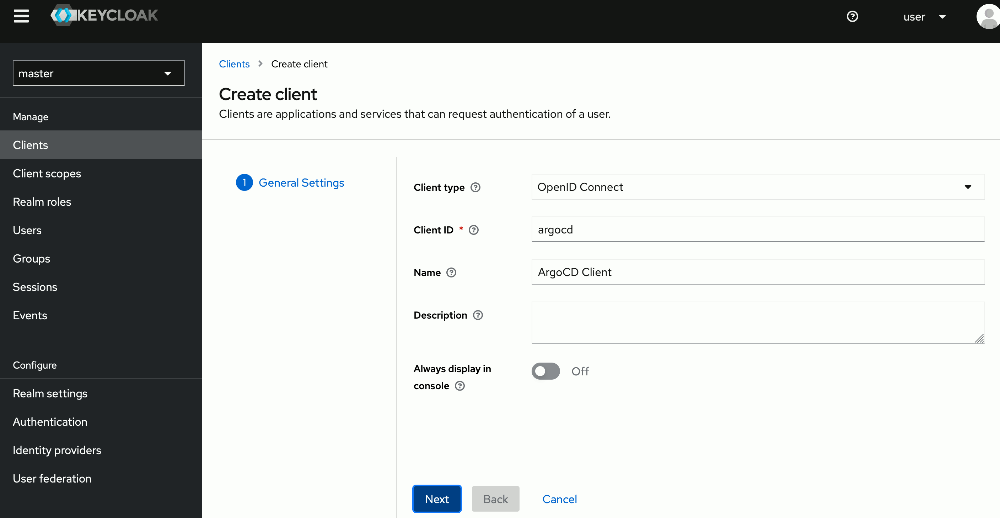
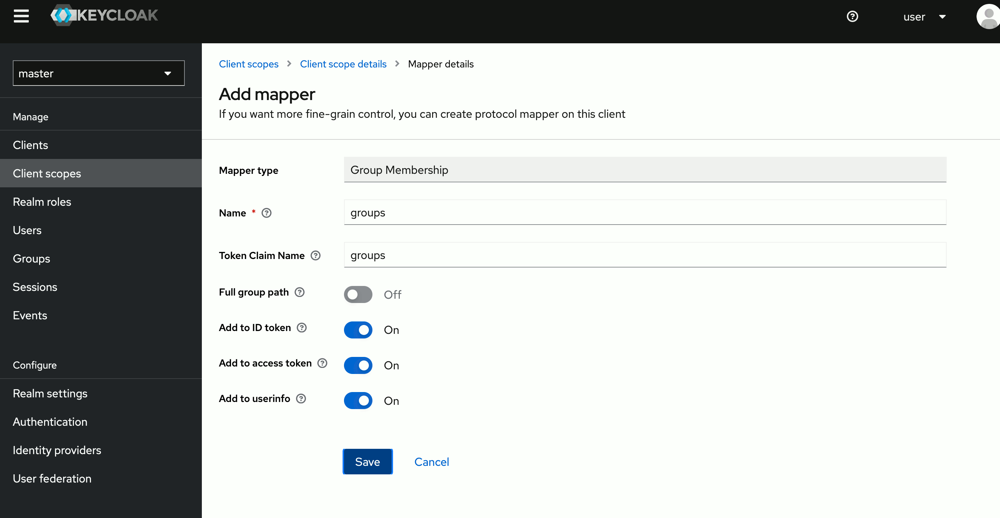
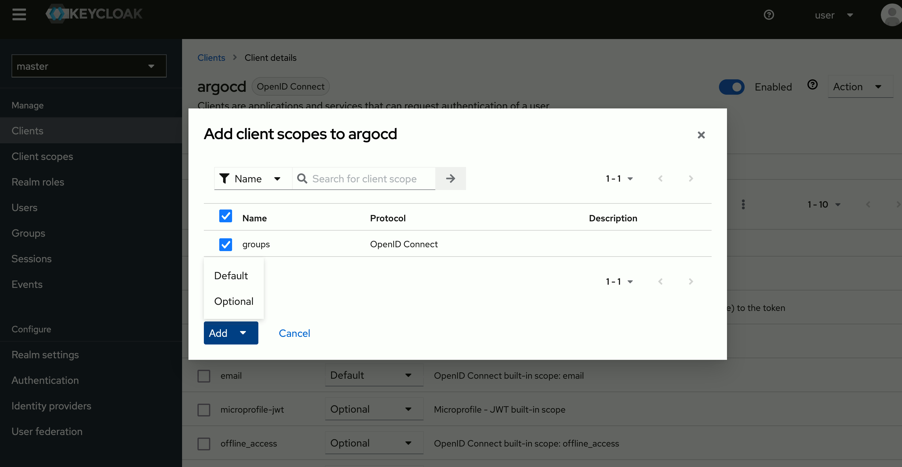
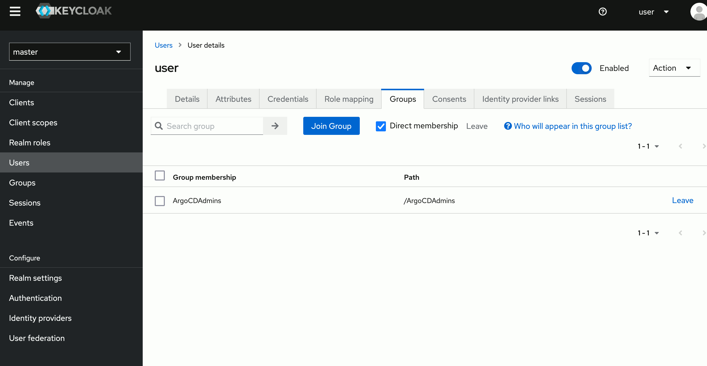

# Keycloak

# Integrating Keycloak and ArgoCD

These instructions will take you through the entire process of getting your ArgoCD application authenticating with Keycloak. 
You will create a client within Keycloak and configure ArgoCD to use Keycloak for authentication, using groups set in Keycloak
to determine privileges in Argo.

## Creating a new client in Keycloak

First we need to setup a new client. Start by logging into your keycloak server, select the realm you want to use (`master` by default)
and then go to __Clients__ and click the __create__ button top right.



Configure the client by setting the __Access Type__ to _confidential_ and set the Valid Redirect URIs to the callback url for your ArgoCD
hostname. It should be https://{hostname}/auth/callback (you can also leave the default less secure https://{hostname}/* ). You can also set the
__Base URL__ to _/applications_.


Make sure to click __Save__. You should now have a new tab called __Credentials__. You can copy the Secret that we'll use in our ArgoCD 
configuration.


## Configuring the groups claim

In order for ArgoCD to provide the groups the user is in we need to configure a groups claim that can be included in the authentication token.
To do this we'll start by creating a new __Client Scope__ called _groups_.


Once you've created the client scope you can now add a Token Mapper which will add the groups claim to the token when the client requests
the groups scope. Make sure to set the __Name__ as well as the __Token Claim Name__ to _groups_.



We can now configure the client to provide the _groups_ scope. You can now assign the _groups_ scope either to the __Assigned Default Client Scopes__ 
or to the __Assigned Optional Client Scopes__. If you put it in the Optional category you will need to make sure that ArgoCD requests the scope in
it's OIDC configuration. 



Since we will always want group information, I recommend using the Default category. Make sure you click __Add selected__
and that the _groups_ claim is in the correct list on the __right__.


Create a group called _ArgoCDAdmins_ and have your current user join the group.



## Configuring ArgoCD OIDC

Let's start by storing the client secret you generated earlier in the argocd secret _argocd-secret_.

1. First you'll need to encode the client secret in base64: `$ echo -n '83083958-8ec6-47b0-a411-a8c55381fbd2' | base64`
2. Then you can edit the secret and add the base64 value to a new key called _oidc.keycloak.clientSecret_ using `$ kubectl edit secret argocd-secret`.
   Your Secret should look something like this:
    ```yaml
    apiVersion: v1
    kind: Secret
    metadata:
      name: argocd-secret
    data:
      ...
      oidc.keycloak.clientSecret: ODMwODM5NTgtOGVjNi00N2IwLWE0MTEtYThjNTUzODFmYmQy   
      ...
    ```

Now we can configure the config map and add the oidc configuration to enable our keycloak authentication.
You can use `$ kubectl edit configmap argocd-cm`.

Your ConfigMap should look like this:

```yaml
apiVersion: v1
kind: ConfigMap
metadata:
  name: argocd-cm
data:
  url: https://argocd.example.com
  oidc.config: |
    name: Keycloak
    issuer: https://keycloak.example.com/auth/realms/master
    clientID: argocd
    clientSecret: $oidc.keycloak.clientSecret
    requestedScopes: ["openid", "profile", "email", "groups"]
```

Make sure that:
- __issuer__ ends with the correct realm (in this example _master_)
- __clientID__ is set to the Client ID you configured in Keycloak
- __clientSecret__ points to the right key you created in the _argocd-secret_ Secret
- __requestedScopes__ contains the _groups_ claim if you didn't add it to the Default scopes

## Configuring ArgoCD Policy

Now that we have an authentication that provides groups we want to apply a policy to these groups.
We can modify the _argocd-rbac-cm_ ConfigMap using `$ kubectl edit configmap argocd-rbac-cm`.

```yaml
apiVersion: v1
kind: ConfigMap
metadata:
  name: argocd-rbac-cm
data:
  policy.csv: |
    g, ArgoCDAdmins, role:admin
```

In this example we give the role _role:admin_ to all users in the group _ArgoCDAdmins_.

## Login

You can now login using our new Keycloak OIDC authentication:


