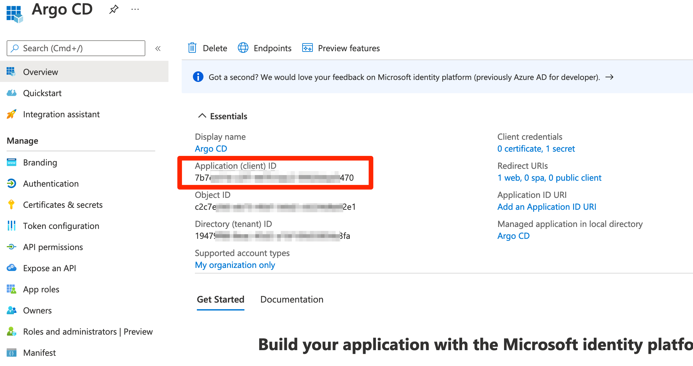
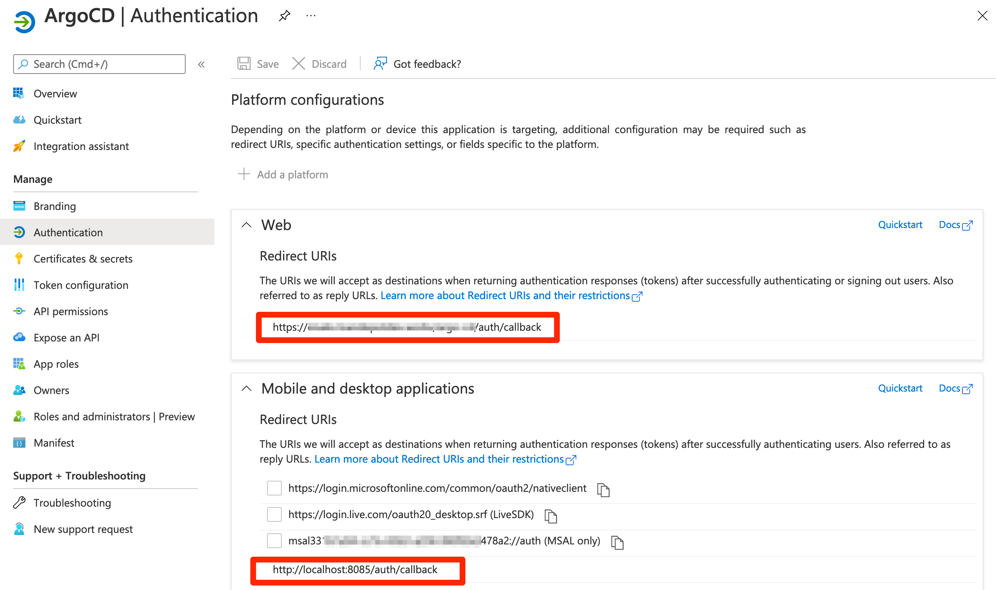
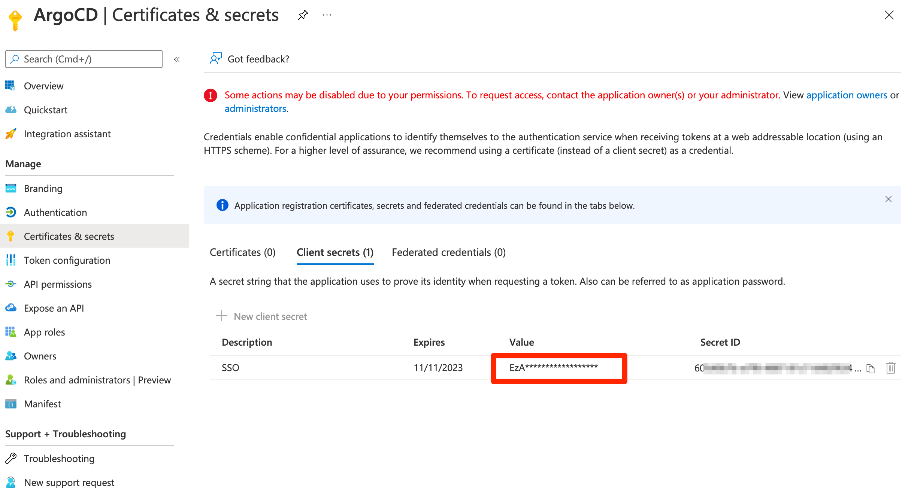
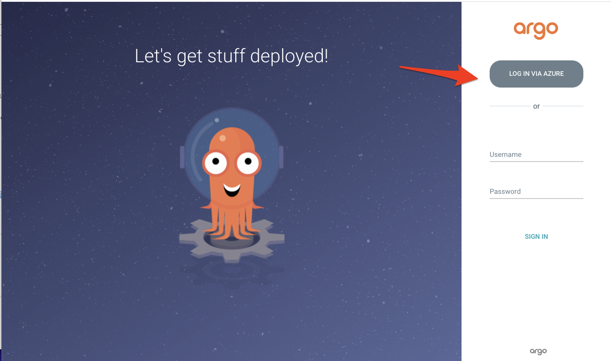
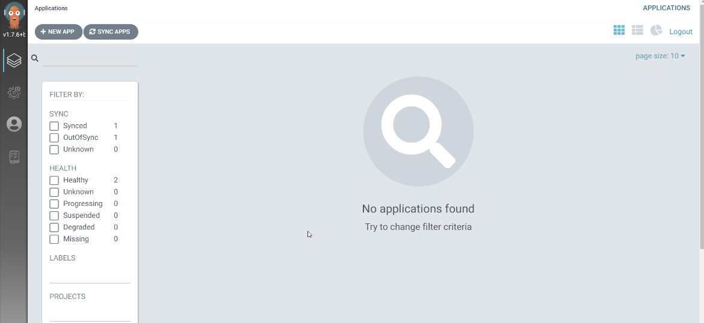
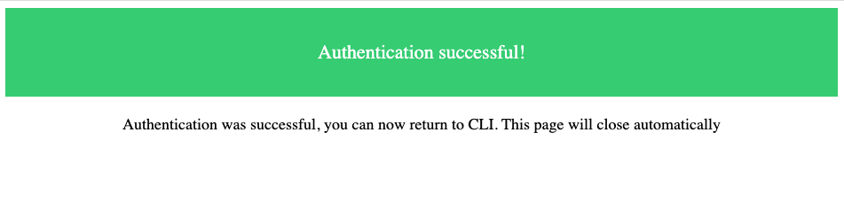

# Microsoft

!!! note ""
    Entra ID was formerly known as Azure AD.

* [Entra ID SAML Enterprise App Auth using Dex](#entra-id-saml-enterprise-app-auth-using-dex)
* [Entra ID App Registration Auth using OIDC](#entra-id-app-registration-auth-using-oidc)
* [Entra ID App Registration Auth using Dex](#entra-id-app-registration-auth-using-dex)

## Entra ID SAML Enterprise App Auth using Dex
### Configure a new Entra ID Enterprise App

1. From the `Microsoft Entra ID` > `Enterprise applications` menu, choose `+ New application`
2. Select `Non-gallery application`
3. Enter a `Name` for the application (e.g. `Argo CD`), then choose `Add`
4. Once the application is created, open it from the `Enterprise applications` menu.
5. From the `Users and groups` menu of the app, add any users or groups requiring access to the service.
   
6. From the `Single sign-on` menu, edit the `Basic SAML Configuration` section as follows (replacing `my-argo-cd-url` with your Argo URL):
      - **Identifier (Entity ID):** https://`<my-argo-cd-url>`/api/dex/callback
      - **Reply URL (Assertion Consumer Service URL):** https://`<my-argo-cd-url>`/api/dex/callback
      - **Sign on URL:** https://`<my-argo-cd-url>`/auth/login
      - **Relay State:** `<empty>`
      - **Logout Url:** `<empty>`
      
7. From the `Single sign-on` menu, edit the `User Attributes & Claims` section to create the following claims:
      - `+ Add new claim` | **Name:** email | **Source:** Attribute | **Source attribute:** user.mail
      - `+ Add group claim` | **Which groups:** All groups | **Source attribute:** Group ID | **Customize:** True | **Name:** Group | **Namespace:** `<empty>` | **Emit groups as role claims:** False
      - *Note: The `Unique User Identifier` required claim can be left as the default `user.userprincipalname`*
      
8. From the `Single sign-on` menu, download the SAML Signing Certificate (Base64)
      - Base64 encode the contents of the downloaded certificate file, for example:
      - `$ cat ArgoCD.cer | base64`
      - *Keep a copy of the encoded output to be used in the next section.*
9. From the `Single sign-on` menu, copy the `Login URL` parameter, to be used in the next section.

### Configure Argo to use the new Entra ID Enterprise App

1. Edit `argocd-cm` and add the following `dex.config` to the data section, replacing the `caData`, `my-argo-cd-url` and `my-login-url` your values from the Entra ID App:

            data:
              url: https://my-argo-cd-url
              dex.config: |
                logger:
                  level: debug
                  format: json
                connectors:
                - type: saml
                  id: saml
                  name: saml
                  config:
                    entityIssuer: https://my-argo-cd-url/api/dex/callback
                    ssoURL: https://my-login-url (e.g. https://login.microsoftonline.com/xxxxx/a/saml2)
                    caData: |
                       MY-BASE64-ENCODED-CERTIFICATE-DATA
                    redirectURI: https://my-argo-cd-url/api/dex/callback
                    usernameAttr: email
                    emailAttr: email
                    groupsAttr: Group

2. Edit `argocd-rbac-cm` to configure permissions, similar to example below.
      - Use Entra ID `Group IDs` for assigning roles.
      - See [RBAC Configurations](../rbac.md) for more detailed scenarios.

            # example policy
            policy.default: role:readonly
            policy.csv: |
               p, role:org-admin, applications, *, */*, allow
               p, role:org-admin, clusters, get, *, allow
               p, role:org-admin, repositories, get, *, allow
               p, role:org-admin, repositories, create, *, allow
               p, role:org-admin, repositories, update, *, allow
               p, role:org-admin, repositories, delete, *, allow
               g, "84ce98d1-e359-4f3b-85af-985b458de3c6", role:org-admin # (azure group assigned to role)

## Entra ID App Registration Auth using OIDC
### Configure a new Entra ID App registration
#### Add a new Entra ID App registration

1. From the `Microsoft Entra ID` > `App registrations` menu, choose `+ New registration`
2. Enter a `Name` for the application (e.g. `Argo CD`).
3. Specify who can use the application (e.g. `Accounts in this organizational directory only`).
4. Enter Redirect URI (optional) as follows (replacing `my-argo-cd-url` with your Argo URL), then choose `Add`.
      - **Platform:** `Web`
      - **Redirect URI:** https://`<my-argo-cd-url>`/auth/callback
5. When registration finishes, the Azure portal displays the app registration's Overview pane. You see the Application (client) ID.
      

#### Configure additional platform settings for ArgoCD CLI

1. In the Azure portal, in App registrations, select your application.
2. Under Manage, select Authentication.
3. Under Platform configurations, select Add a platform.
4. Under Configure platforms, select the "Mobile and desktop applications" tile. Use the below value. You shouldn't change it.
      - **Redirect URI:** `http://localhost:8085/auth/callback`
      

#### Add credentials a new Entra ID App registration

1. From the `Certificates & secrets` menu, choose `+ New client secret`
2. Enter a `Name` for the secret (e.g. `ArgoCD-SSO`).
      - Make sure to copy and save generated value. This is a value for the `client_secret`.
      

#### Setup permissions for Entra ID Application

1. From the `API permissions` menu, choose `+ Add a permission`
2. Find `User.Read` permission (under `Microsoft Graph`) and grant it to the created application:
   
3. From the `Token Configuration` menu, choose `+ Add groups claim`
   

### Associate an Entra ID group to your Entra ID App registration

1. From the `Microsoft Entra ID` > `Enterprise applications` menu, search the App that you created (e.g. `Argo CD`).
      - An Enterprise application with the same name of the Entra ID App registration is created when you add a new Entra ID App registration.
2. From the `Users and groups` menu of the app, add any users or groups requiring access to the service.
   

### Configure Argo to use the new Entra ID App registration

1. Edit `argocd-cm` and configure the `data.oidc.config` and `data.url` section:

            ConfigMap -> argocd-cm

            data:
               url: https://argocd.example.com/ # Replace with the external base URL of your Argo CD
               oidc.config: |
                     name: Azure
                     issuer: https://login.microsoftonline.com/{directory_tenant_id}/v2.0
                     clientID: {azure_ad_application_client_id}
                     clientSecret: $oidc.azure.clientSecret
                     requestedIDTokenClaims:
                        groups:
                           essential: true
                     requestedScopes:
                        - openid
                        - profile
                        - email

2. Edit `argocd-secret` and configure the `data.oidc.azure.clientSecret` section:

            Secret -> argocd-secret

            data:
               oidc.azure.clientSecret: {client_secret | base64_encoded}

3. Edit `argocd-rbac-cm` to configure permissions. Use group ID from Azure for assigning roles
      [RBAC Configurations](../rbac.md)

            ConfigMap -> argocd-rbac-cm

            policy.default: role:readonly
            policy.csv: |
               p, role:org-admin, applications, *, */*, allow
               p, role:org-admin, clusters, get, *, allow
               p, role:org-admin, repositories, get, *, allow
               p, role:org-admin, repositories, create, *, allow
               p, role:org-admin, repositories, update, *, allow
               p, role:org-admin, repositories, delete, *, allow
               g, "84ce98d1-e359-4f3b-85af-985b458de3c6", role:org-admin

4. Mapping role from jwt token to argo
   If you want to map the roles from the jwt token to match the default roles (readonly and admin) then you must change the scope variable in the rbac-configmap.

            policy.default: role:readonly
            policy.csv: |
               p, role:org-admin, applications, *, */*, allow
               p, role:org-admin, clusters, get, *, allow
               p, role:org-admin, repositories, get, *, allow
               p, role:org-admin, repositories, create, *, allow
               p, role:org-admin, repositories, update, *, allow
               p, role:org-admin, repositories, delete, *, allow
               g, "84ce98d1-e359-4f3b-85af-985b458de3c6", role:org-admin
            scopes: '[groups, email]'

   Refer to [operator-manual/argocd-rbac-cm.yaml](https://github.com/argoproj/argo-cd/blob/master/docs/operator-manual/argocd-rbac-cm.yaml) for all of the available variables.

## Entra ID App Registration Auth using Dex

Configure a new AD App Registration, as above.
Then, add the `dex.config` to `argocd-cm`:
```yaml
ConfigMap -> argocd-cm

data:
    dex.config: |
      connectors:
      - type: microsoft
        id: microsoft
        name: Your Company GmbH
        config:
          clientID: $MICROSOFT_APPLICATION_ID
          clientSecret: $MICROSOFT_CLIENT_SECRET
          redirectURI: http://localhost:8080/api/dex/callback
          tenant: ffffffff-ffff-ffff-ffff-ffffffffffff
          groups:
            - DevOps
```

## Validation
### Log in to ArgoCD UI using SSO

1. Open a new browser tab and enter your ArgoCD URI: https://`<my-argo-cd-url>`
   
3. Click `LOGIN VIA AZURE` button to log in with your Microsoft Entra ID account. You’ll see the ArgoCD applications screen.
   
4. Navigate to User Info and verify Group ID. Groups will have your group’s Object ID that you added in the `Setup permissions for Entra ID Application` step.
   

### Log in to ArgoCD using CLI

1. Open terminal, execute the below command.

            argocd login <my-argo-cd-url> --grpc-web-root-path / --sso

2. You will see the below message after entering your credentials from the browser.
   
3. Your terminal output will be similar as below.
   
            WARNING: server certificate had error: x509: certificate is valid for ingress.local, not my-argo-cd-url. Proceed insecurely (y/n)? y
            Opening browser for authentication
            INFO[0003] RequestedClaims: map[groups:essential:true ]
            Performing authorization_code flow login: https://login.microsoftonline.com/XXXXXXXXXXXXX/oauth2/v2.0/authorize?access_type=offline&claims=%7B%22id_token%22%3A%7B%22groups%22%3A%7B%22essential%22%3Atrue%7D%7D%7D&client_id=XXXXXXXXXXXXX&code_challenge=XXXXXXXXXXXXX&code_challenge_method=S256&redirect_uri=http%3A%2F%2Flocalhost%3A8085%2Fauth%2Fcallback&response_type=code&scope=openid+profile+email+offline_access&state=XXXXXXXX
            Authentication successful
            'yourid@example.com' logged in successfully
            Context 'my-argo-cd-url' updated

   You may get an warning if you are not using a correctly signed certs. Refer to [Why Am I Getting x509: certificate signed by unknown authority When Using The CLI?](https://argo-cd.readthedocs.io/en/stable/faq/#why-am-i-getting-x509-certificate-signed-by-unknown-authority-when-using-the-cli).
