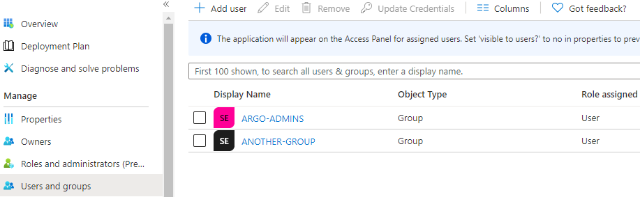
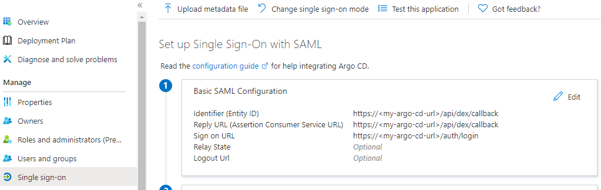
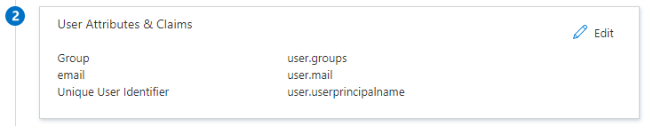
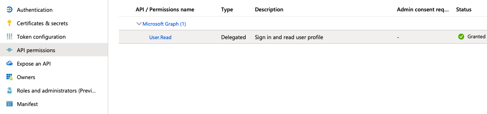
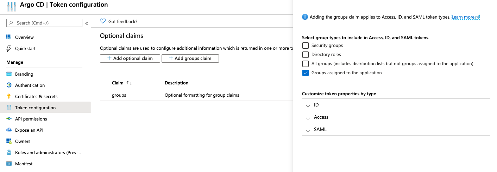

# Microsoft

* [Azure AD SAML Enterprise App Auth using Dex](#azure-ad-saml-enterprise-app-auth-using-dex)
* [Azure AD App Registration Auth using OIDC](#azure-ad-app-registration-auth-using-oidc)
* [Azure AD App Registration Auth using Dex](#azure-ad-app-registration-auth-using-dex)

## Azure AD SAML Enterprise App Auth using Dex

### Configure a new Azure AD Enterprise App

1. From the `Azure Active Directory` > `Enterprise applications` menu, choose `+ New application`
2. Select `Non-gallery application`
3. Enter a `Name` for the application (eg. `Argo CD`), then choose `Add`
4. Once the application is created, open it from the `Enterprise applications` menu.
5. From the `Users and groups` menu of the app, add any users or groups requiring access to the service.

   

6. From the `Single sign-on` menu, edit the `Basic SAML Configuration` section as follows (replacing `my-argo-cd-url` with your Argo URL):
   - **Identifier (Entity ID):** https://`<my-argo-cd-url>`/api/dex/callback
   - **Reply URL (Assertion Consumer Service URL):** https://`<my-argo-cd-url>`/api/dex/callback
   - **Sign on URL:** https://`<my-argo-cd-url>`/auth/login
   - **Relay State:** `<empty>`
   - **Logout Url:** `<empty>`

   

7. From the `Single sign-on` menu, edit the `User Attributes & Claims` section to create the following claims:
   - `+ Add new claim` | **Name:** email | **Source:** Attribute | **Source attribute:** user.mail
   - `+ Add group claim` | **Which groups:** All groups | **Source attribute:** Group ID | **Customize:** True | **Name:** Group | **Namespace:** `<empty>` | **Emit groups as role claims:** False
   - *Note: The `Unique User Identifier` required claim can be left as the default `user.userprincipalname`*

   

8. From the `Single sign-on` menu, download the SAML Signing Certificate (Base64)
   - Base64 encode the contents of the downloaded certificate file, for example:
   - `$ cat ArgoCD.cer | base64`
   - *Keep a copy of the encoded output to be used in the next section.*
9. From the `Single sign-on` menu, copy the `Login URL` parameter, to be used in the next section.

### Configure Argo to use the new Azure AD Enterprise App

1. Edit `argo-cm` and add the following `dex.config` to the data section, replacing the `caData`, `my-argo-cd-url` and `my-login-url` your values from the Azure AD App:

```
data:
  url: https://my-argo-cd-url
  dex.config: |
    logger:
      level: debug
      format: json
    connectors:
    - type: saml
      id: saml
      name: saml
      config:
        entityIssuer: https://my-argo-cd-url/api/dex/callback
        ssoURL: https://my-login-url (eg. https://login.microsoftonline.com/xxxxx/a/saml2)
        caData: |
          MY-BASE64-ENCODED-CERTIFICATE-DATA
        redirectURI: https://my-argo-cd-url/api/dex/callback
        usernameAttr: email
        emailAttr: email
        groupsAttr: Group
```

2. Edit `argo-rbac-cm` to configure permissions, similar to example below.

   - Use Azure AD `Group IDs` for assigning roles.
   - See [RBAC Configurations](../rbac.md) for more detailed scenarios.

```
# example policy
policy.default: role:readonly
  policy.csv: |
    p, role:org-admin, applications, *, */*, allow
    p, role:org-admin, clusters, get, *, allow
    p, role:org-admin, repositories, get, *, allow
    p, role:org-admin, repositories, create, *, allow
    p, role:org-admin, repositories, update, *, allow
    p, role:org-admin, repositories, delete, *, allow
    g, "84ce98d1-e359-4f3b-85af-985b458de3c6", role:org-admin # (azure group assigned to role)
```

## Azure AD App Registration Auth using OIDC

1. Register a new Azure AD Application

    [Quickstart: Register an application](https://docs.microsoft.com/en-us/azure/active-directory/develop/quickstart-register-app)

        App Registrations Inputs
            Redirect URI: https://argocd.example.com/auth/callback
        Outputs
            Application (client) ID: aaaaaaaa-1111-bbbb-2222-cccccccccccc
            Directory (tenant) ID: 33333333-dddd-4444-eeee-555555555555
            Secret: some_secret

2. Setup permissions for Azure AD Application

    On "API permissions" page find `User.Read` permission (under `Microsoft Graph`) and grant it to the created application:

    

    Also, on "Token Configuration" page add groups claim for the groups assigned to the application:

    

3. Edit `argocd-cm` and configure the `data.oidc.config` section:

        ConfigMap -> argocd-cm

        data:
            url: https://argocd.example.com/
            oidc.config: |
                name: Azure
                issuer: https://login.microsoftonline.com/{directory_tenant_id}/v2.0
                clientID: {azure_ad_application_client_id}
                clientSecret: $oidc.azure.clientSecret
                requestedIDTokenClaims:
                    groups:
                        essential: true
                requestedScopes:
                    - openid
                    - profile
                    - email

4. Edit `argocd-secret` and configure the `data.oidc.azure.clientSecret` section:

        Secret -> argocd-secret

        data:
            oidc.azure.clientSecret: {client_secret | base64_encoded}

5. Edit `argocd-rbac-cm` to configure permissions. Use group ID from Azure for assigning roles

    [RBAC Configurations](../rbac.md)

        ConfigMap -> argocd-rbac-cm

        policy.default: role:readonly
        policy.csv: |
            p, role:org-admin, applications, *, */*, allow
            p, role:org-admin, clusters, get, *, allow
            p, role:org-admin, repositories, get, *, allow
            p, role:org-admin, repositories, create, *, allow
            p, role:org-admin, repositories, update, *, allow
            p, role:org-admin, repositories, delete, *, allow
            g, "84ce98d1-e359-4f3b-85af-985b458de3c6", role:org-admin

6. Mapping role from jwt token to argo

    If you want to map the roles from the jwt token to match the default roles (readonly and admin) then you must change the scope variable in the rbac-configmap.

        scopes: '[roles, email]'

## Azure AD App Registration Auth using Dex

Configure a new AD App Registration, as above.

Then, add the `dex.config` to `argocd-cm`:

```yaml
ConfigMap -> argocd-cm

data:
    dex.config: |
      connectors:
      - type: microsoft
        id: microsoft
        name: Your Company GmbH
        config:
          clientID: $MICROSOFT_APPLICATION_ID
          clientSecret: $MICROSOFT_CLIENT_SECRET
          redirectURI: http://localhost:8080/api/dex/callback
          tenant: ffffffff-ffff-ffff-ffff-ffffffffffff
          groups:
            - DevOps
```
