# Okta

!!! note "Are you using this? Please contribute!"
    If you're using this IdP please consider [contributing](../../developer-guide/site.md) to this document.

A working Single Sign-On configuration using Okta via at least two methods was achieved using:

* [SAML (with Dex)](#saml-with-dex)
* [OIDC (without Dex)](#oidc-without-dex)

## SAML (with Dex)

!!! note "Okta app group assignment"
    The Okta app's **Group Attribute Statements** regex will be used later to map Okta groups to Argo CD RBAC roles.

1. Create a new SAML application in Okta UI.
    * 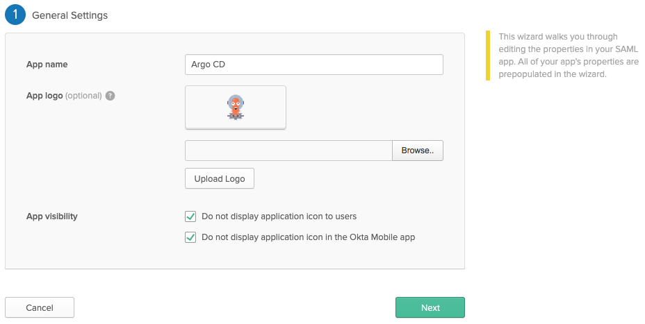
        I've disabled `App Visibility` because Dex doesn't support Provider-initiated login flows.
    * 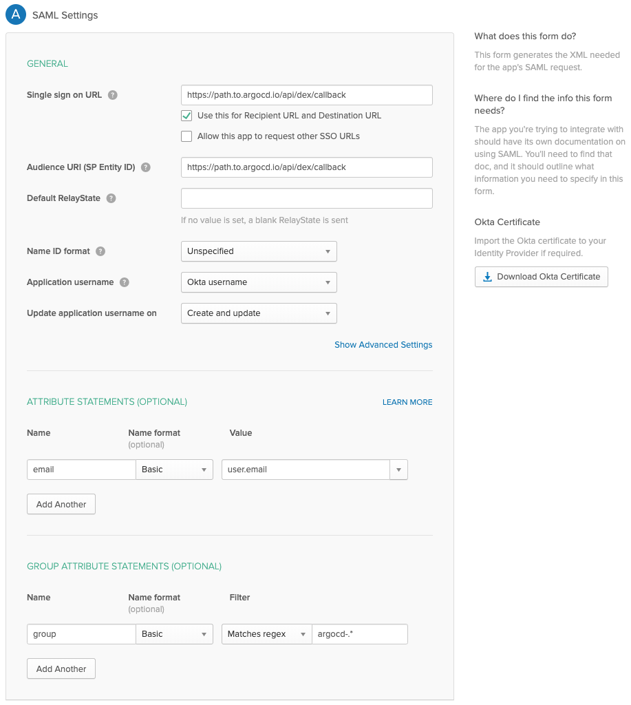
1. Click `View setup instructions` after creating the application in Okta.
    * 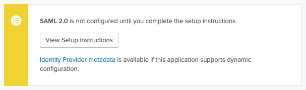
1. Copy the Argo CD URL to the `argocd-cm` in the data.url

<!-- markdownlint-disable MD046 -->
```yaml
data:
  url: https://argocd.example.com
```
<!-- markdownlint-disable MD046 -->

1. Download the CA certificate to use in the `argocd-cm` configuration.
    * If you are using this in the caData field, you will need to pass the entire certificate (including `-----BEGIN CERTIFICATE-----` and `-----END CERTIFICATE-----` stanzas) through base64 encoding, for example, `base64 my_cert.pem`.
    * If you are using the ca field and storing the CA certificate separately as a secret, you will need to mount the secret to the `dex` container in the `argocd-dex-server` Deployment.
    * 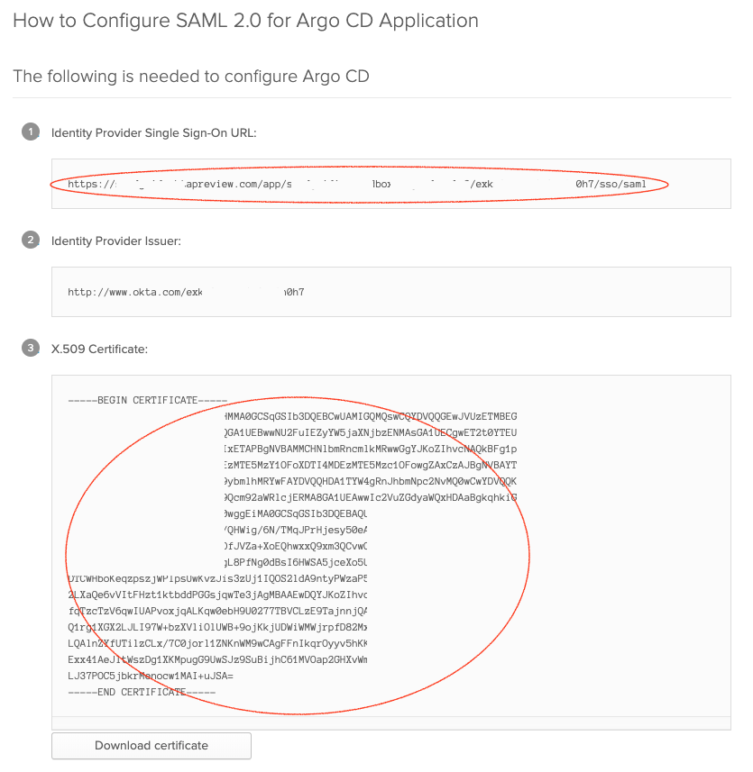
1. Edit the `argocd-cm` and configure the `data.dex.config` section:

<!-- markdownlint-disable MD046 -->
```yaml
dex.config: |
  logger:
    level: debug
    format: json
  connectors:
  - type: saml
    id: okta
    name: Okta
    config:
      ssoURL: https://yourorganization.oktapreview.com/app/yourorganizationsandbox_appnamesaml_2/rghdr9s6hg98s9dse/sso/saml
      # You need `caData` _OR_ `ca`, but not both.
      caData: |
        <CA cert passed through base64 encoding>
      # You need `caData` _OR_ `ca`, but not both.
      # Path to mount the secret to the dex container
      ca: /path/to/ca.pem
      redirectURI: https://ui.argocd.yourorganization.net/api/dex/callback
      usernameAttr: email
      emailAttr: email
      groupsAttr: group
```
<!-- markdownlint-enable MD046 -->

----

### Private deployment
It is possible to setup Okta SSO with a private Argo CD installation, where the Okta callback URL is the only publicly exposed endpoint.
The settings are largely the same with a few changes in the Okta app configuration and the `data.dex.config` section of the `argocd-cm` ConfigMap.

Using this deployment model, the user connects to the private Argo CD UI and the Okta authentication flow seamlessly redirects back to the private UI URL.

Often this public endpoint is exposed through an [Ingress object](../../ingress/#private-argo-cd-ui-with-multiple-ingress-objects-and-byo-certificate).


1. Update the URLs in the Okta app's General settings
    * 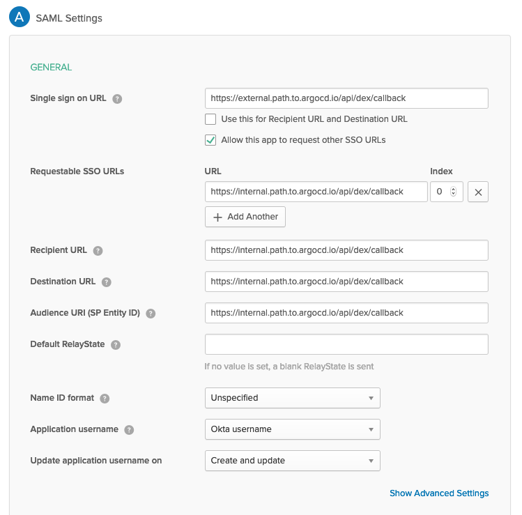
        The `Single sign on URL` field points to the public exposed endpoint, and all other URL fields point to the internal endpoint.
1. Update the `data.dex.config` section of the `argocd-cm` ConfigMap with the external endpoint reference.

<!-- markdownlint-disable MD046 -->
```yaml
dex.config: |
  logger:
    level: debug
  connectors:
  - type: saml
    id: okta
    name: Okta
    config:
      ssoURL: https://yourorganization.oktapreview.com/app/yourorganizationsandbox_appnamesaml_2/rghdr9s6hg98s9dse/sso/saml
      # You need `caData` _OR_ `ca`, but not both.
      caData: |
        <CA cert passed through base64 encoding>
      # You need `caData` _OR_ `ca`, but not both.
      # Path to mount the secret to the dex container
      ca: /path/to/ca.pem
      redirectURI: https://external.path.to.argocd.io/api/dex/callback
      usernameAttr: email
      emailAttr: email
      groupsAttr: group
```
<!-- markdownlint-enable MD046 -->

### Connect Okta Groups to Argo CD Roles
Argo CD is aware of user memberships of Okta groups that match the *Group Attribute Statements* regex.
The example above uses the `argocd-*` regex, so Argo CD would be aware of a group named `argocd-admins`.

Modify the `argocd-rbac-cm` ConfigMap to connect the `argocd-admins` Okta group to the builtin Argo CD `admin` role.
<!-- markdownlint-disable MD046 -->
```yaml
apiVersion: v1
kind: ConfigMap
metadata:
  name: argocd-rbac-cm
data:
  policy.csv: |
    g, argocd-admins, role:admin
  scopes: '[email,groups]'
```

## OIDC (without Dex)

!!! warning "Okta groups for RBAC"
    If you want `groups` scope returned from Okta, you will need to enable [API Access Management with Okta](https://developer.okta.com/docs/concepts/api-access-management/). This addon is free, and automatically enabled, on Okta developer edition. However, it's an optional add-on for production environments, with an additional associated cost.

    You may alternately add a "groups" scope and claim to the default authorization server, and then filter the claim in the Okta application configuration. It's not clear if this requires the Authorization Server add-on.

    If this is not an option for you, use the [SAML (with Dex)](#saml-with-dex) option above instead.

!!! note
    These instructions and screenshots are of Okta version 2023.05.2 E. You can find the current version in the Okta website footer.

First, create the OIDC integration:

1. On the `Okta Admin` page, navigate to the Okta Applications at `Applications > Applications.`
1. Choose `Create App Integration`, and choose `OIDC`, and then `Web Application` in the resulting dialogues.
    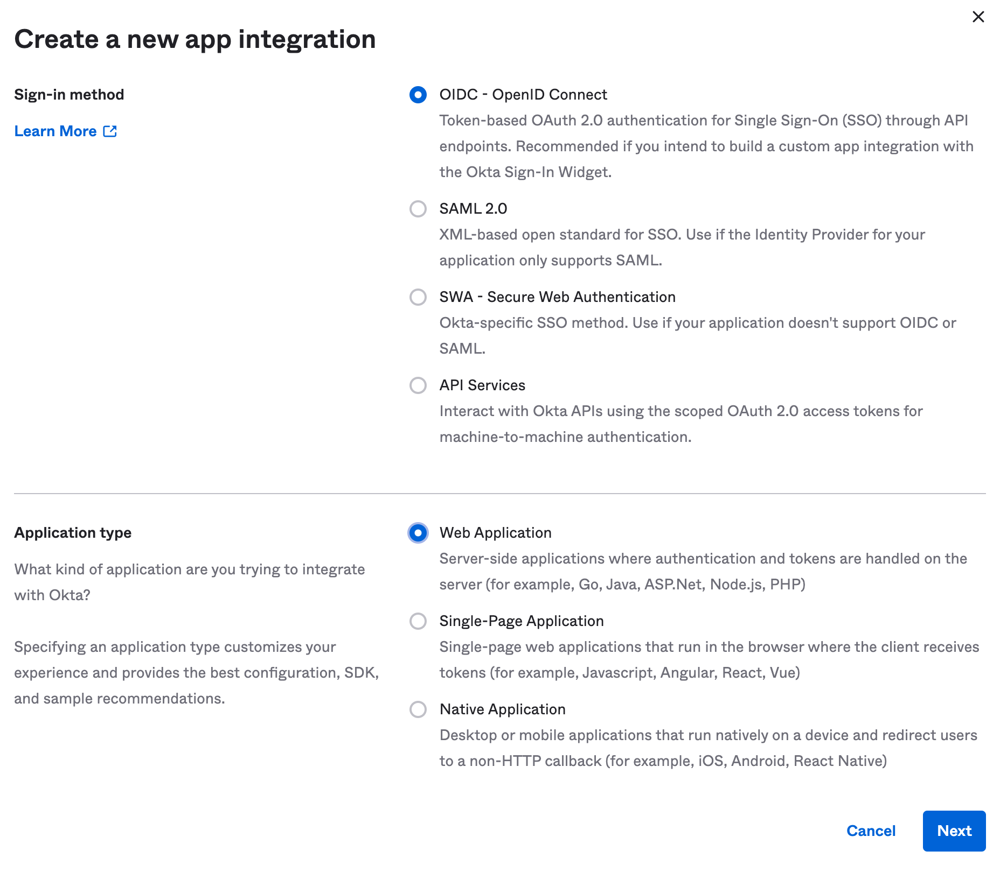
1. Update the following:
    1. `App Integration name` and `Logo` - set these to suit your needs; they'll be displayed in the Okta catalogue.
    1. `Sign-in redirect URLs`: Add `https://argocd.example.com/auth/callback`; replacing `argocd.example.com` with your ArgoCD web interface URL. Also add `http://localhost:8085/auth/callback` if you would like to be able to login with the CLI.
    1. `Sign-out redirect URIs`: Add `https://argocd.example.com`; substituting the correct domain name as above. 
    1. Either assign groups, or choose to skip this step for now.
    1. Leave the rest of the options as-is, and save the integration.
    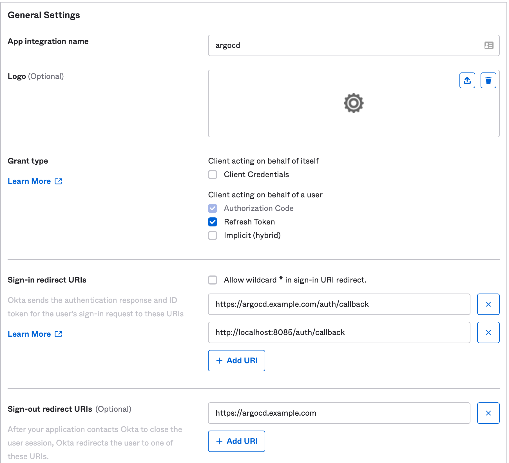
1. Copy the `Client ID` and the `Client Secret` from the newly created app; you will need these later.

Next, create a custom Authorization server:

1. On the `Okta Admin` page, navigate to the Okta API Management at `Security > API`.
1. Click `Add Authorization Server`, and assign it a name and a description. The `Audience` should match your ArgoCD URL - `https://argocd.example.com`
1. Click `Scopes > Add Scope`:
    1. Add a scope called `groups`. Leave the rest of the options as default.
    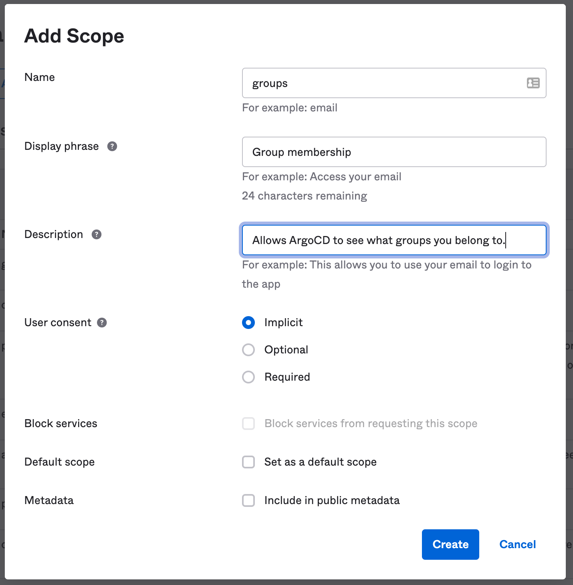
1. Click `Claims > Add Claim`:
    1. Add a claim called `groups`.
    1. Adjust the `Include in token type` to `ID Token`, `Always`.
    1. Adjust the `Value type` to `Groups`.
    1. Add a filter that will match the Okta groups you want passed on to ArgoCD; for example `Regex: argocd-.*`.
    1. Set `Include in` to `groups` (the scope you created above).
    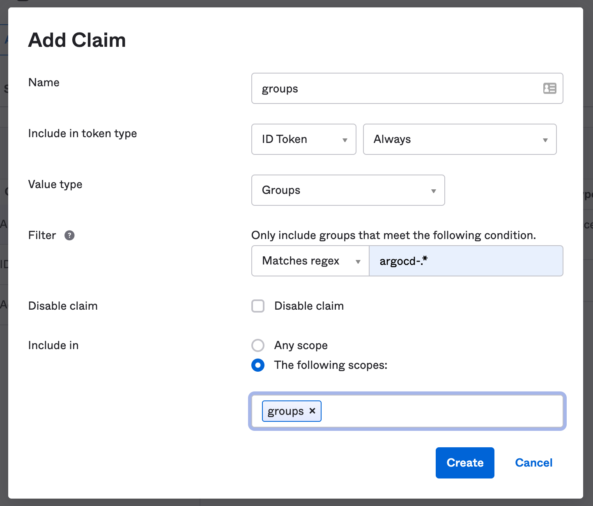
1. Click on `Access Policies` > `Add Policy.` This policy will restrict how this authorization server is used.
    1. Add a name and description.
    1. Assign the policy to the client (application integration) you created above. The field should auto-complete as you type.
    1. Create the policy.
    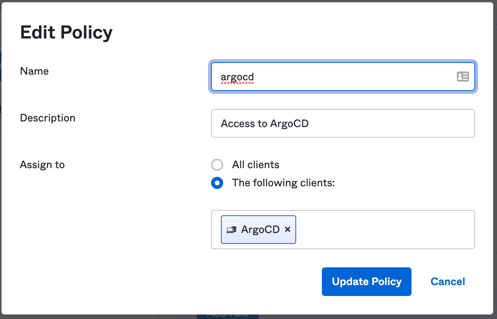
1. Add a rule to the policy:
    1. Add a name; `default` is a reasonable name for this rule.
    1. Fine-tune the settings to suit your organization's security posture. Some ideas:
        1. uncheck all the grant types except the Authorization Code.
        1. Adjust the token lifetime to govern how long a session can last.
        1. Restrict refresh token lifetime, or completely disable it.
    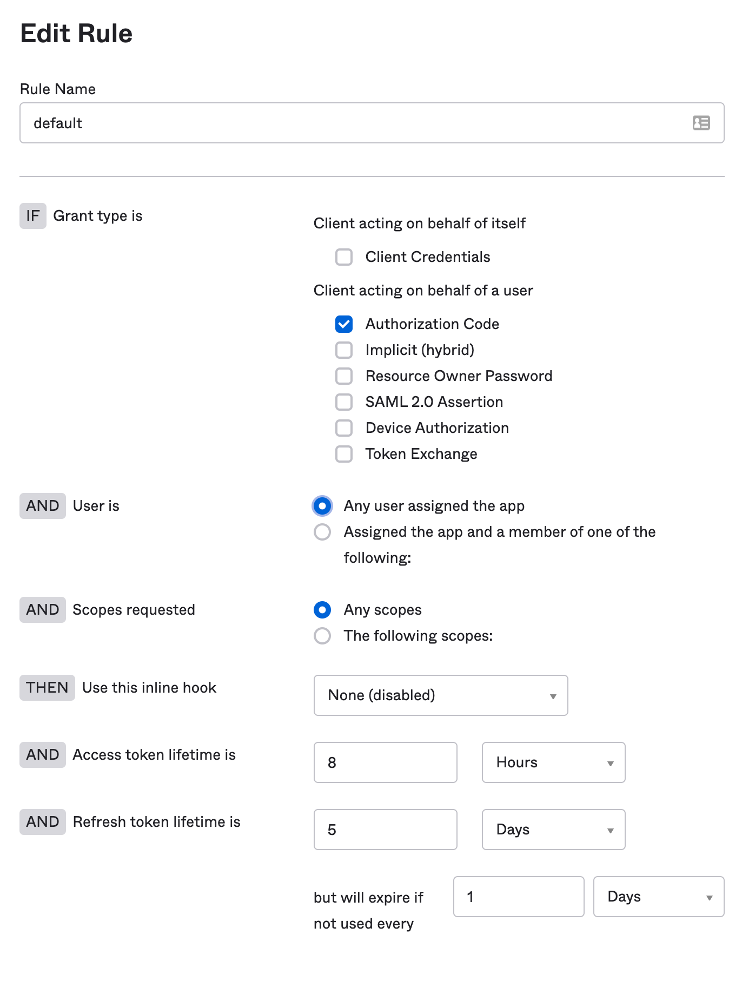
1. Finally, click `Back to Authorization Servers`, and copy the `Issuer URI`. You will need this later.

If you haven't yet created Okta groups, and assigned them to the application integration, you should do that now:

1. Go to `Directory > Groups`
1. For each group you wish to add:
    1. Click `Add Group`, and choose a meaningful name. It should match the regex or pattern you added to your custom `group` claim.
    1. Click on the group (refresh the page if the new group didn't show up in the list).
    1. Assign Okta users to the group.
    1. Click on `Applications` and assign the OIDC application integration you created to this group.
    1. Repeat as needed.

Finally, configure ArgoCD itself. Edit the `argocd-cm` configmap:

<!-- markdownlint-disable MD046 -->
```yaml
url: https://argocd.example.com
oidc.config: |
  name: Okta
  # this is the authorization server URI
  issuer: https://example.okta.com/oauth2/aus9abcdefgABCDEFGd7
  clientID: 0oa9abcdefgh123AB5d7
  clientSecret: ABCDEFG1234567890abcdefg
  requestedScopes: ["openid", "profile", "email", "groups"]
  requestedIDTokenClaims: {"groups": {"essential": true}}
```

You may want to store the `clientSecret` in a Kubernetes secret; see [how to deal with SSO secrets](./index.md/#sensitive-data-and-sso-client-secrets ) for more details.
