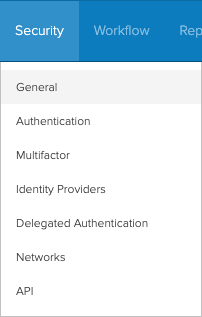
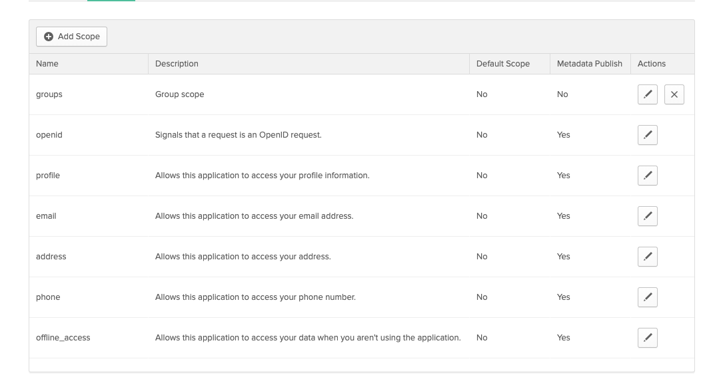
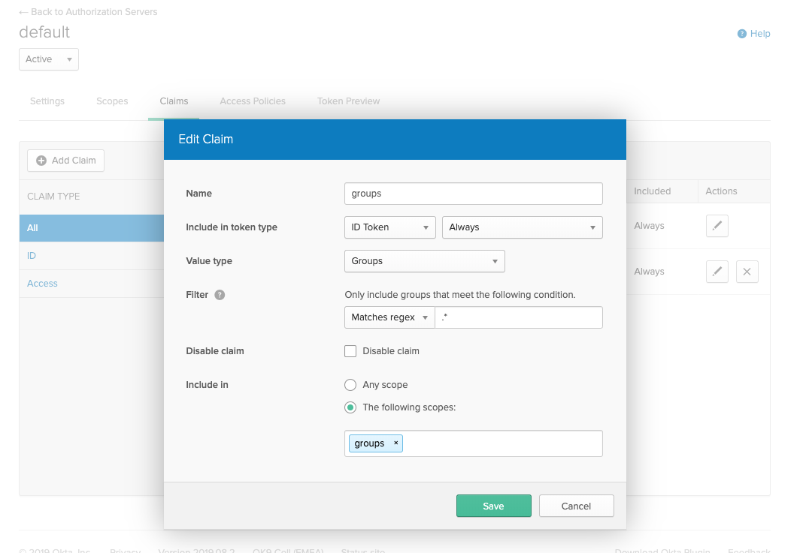

# Okta

!!! note "Are you using this? Please contribute!"
    If you're using this IdP please consider [contributing](../../developer-guide/site.md) to this document.

A working Single Sign-On configuration using Okta via at least two methods was achieved using:

* [SAML (with Dex)](#saml-with-dex)
* [OIDC (without Dex)](#oidc-without-dex)

## SAML (with Dex)

!!! note "Okta app group assignment"
    The Okta app's **Group Attribute Statements** regex will be used later to map Okta groups to Argo CD RBAC roles.

1. Create a new SAML application in Okta UI.
    * 
        I've disabled `App Visibility` because Dex doesn't support Provider-initiated login flows.
    * 
1. Click `View setup instructions` after creating the application in Okta.
    * 
1. Copy the SSO URL to the `argocd-cm` in the data.oicd
1. Download the CA certificate to use in the `argocd-cm` configuration.
    * If you are using this in the caData field, you will need to pass the entire certificate (including `-----BEGIN CERTIFICATE-----` and `-----END CERTIFICATE-----` stanzas) through base64 encoding, for example, `base64 my_cert.pem`.
    * If you are using the ca field and storing the CA certificate separately as a secret, you will need to mount the secret to the `dex` container in the `argocd-dex-server` Deployment.
    * 
1. Edit the `argocd-cm` and configure the `data.dex.config` section:

<!-- markdownlint-disable MD046 -->
```yaml
dex.config: |
  logger:
    level: debug
    format: json
  connectors:
  - type: saml
    id: okta
    name: Okta
    config:
      ssoURL: https://yourorganization.oktapreview.com/app/yourorganizationsandbox_appnamesaml_2/rghdr9s6hg98s9dse/sso/saml
      # You need `caData` _OR_ `ca`, but not both.
      caData: |
        <CA cert passed through base64 encoding>
      # You need `caData` _OR_ `ca`, but not both.
      # Path to mount the secret to the dex container
      ca: /path/to/ca.pem
      redirectURI: https://ui.argocd.yourorganization.net/api/dex/callback
      usernameAttr: email
      emailAttr: email
      groupsAttr: group
```
<!-- markdownlint-enable MD046 -->

----

### Private deployment
It is possible to setup Okta SSO with a private Argo CD installation, where the Okta callback URL is the only publicly exposed endpoint.
The settings are largely the same with a few changes in the Okta app configuration and the `data.dex.config` section of the `argocd-cm` ConfigMap.

Using this deployment model, the user connects to the private Argo CD UI and the Okta authentication flow seamlessly redirects back to the private UI URL.

Often this public endpoint is exposed through an [Ingress object](../../ingress/#private-argo-cd-ui-with-multiple-ingress-objects-and-byo-certificate).


1. Update the URLs in the Okta app's General settings
    * 
        The `Single sign on URL` field points to the public exposed endpoint, and all other URL fields point to the internal endpoint.
1. Update the `data.dex.config` section of the `argocd-cm` ConfigMap with the external endpoint reference.

<!-- markdownlint-disable MD046 -->
```yaml
dex.config: |
  logger:
    level: debug
  connectors:
  - type: saml
    id: okta
    name: Okta
    config:
      ssoURL: https://yourorganization.oktapreview.com/app/yourorganizationsandbox_appnamesaml_2/rghdr9s6hg98s9dse/sso/saml
      # You need `caData` _OR_ `ca`, but not both.
      caData: |
        <CA cert passed through base64 encoding>
      # You need `caData` _OR_ `ca`, but not both.
      # Path to mount the secret to the dex container
      ca: /path/to/ca.pem
      redirectURI: https://external.path.to.argocd.io/api/dex/callback
      usernameAttr: email
      emailAttr: email
      groupsAttr: group
```
<!-- markdownlint-enable MD046 -->

### Connect Okta Groups to Argo CD Roles
Argo CD is aware of user memberships of Okta groups that match the *Group Attribute Statements* regex.
The example above uses the `argocd-*` regex, so Argo CD would be aware of a group named `argocd-admins`.

Modify the `argocd-rbac-cm` ConfigMap to connect the `argocd-admins` Okta group to the builtin Argo CD `admin` role.
<!-- markdownlint-disable MD046 -->
```yaml
apiVersion: v1
kind: ConfigMap
metadata:
  name: argocd-rbac-cm
data:
  policy.csv |
    g, argocd-admins, role:admin
  scopes: '[email,groups]'
```

## OIDC (without Dex)

!!! warning "Do you want groups for RBAC later?"
    If you want `groups` scope returned from Okta you need to unfortunately contact support to enable [API Access Management with Okta](https://developer.okta.com/docs/concepts/api-access-management/) or [_just use SAML above!_](#saml-with-dex)

    Next you may need the API Access Management feature, which the support team can enable for your OktaPreview domain for testing, to enable "custom scopes" and a separate endpoint to use instead of the "public" `/oauth2/v1/authorize` API Access Management endpoint. This might be a paid feature if you want OIDC unfortunately. The free alternative I found was SAML.

1. On the `Okta Admin` page, navigate to the Okta API Management at `Security > API`.
    
1. Choose your `default` authorization server.
1. Click `Scopes > Add Scope`
    1. Add a scope called `groups`.
    
1. Click `Claims > Add Claim.`
    1. Add a claim called `groups`
    1. Choose the matching options you need, one example is:
        * e.g. to match groups starting with `argocd-` you'd return an `ID Token` using your scope name from step 3 (e.g. `groups`) where the groups name `matches` the `regex` `argocd-.*`
    
1. Edit the `argocd-cm` and configure the `data.oidc.config` section:

<!-- markdownlint-disable MD046 -->
```yaml
oidc.config: |
  name: Okta
  issuer: https://yourorganization.oktapreview.com
  clientID: 0oaltaqg3oAIf2NOa0h3
  clientSecret: ZXF_CfUc-rtwNfzFecGquzdeJ_MxM4sGc8pDT2Tg6t
  requestedScopes: ["openid", "profile", "email", "groups"]
  requestedIDTokenClaims: {"groups": {"essential": true}}
```
<!-- markdownlint-enable MD046 -->


