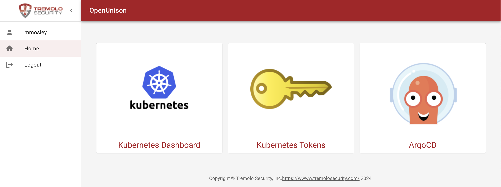

# OpenUnison

## Integrating OpenUnison and ArgoCD

These instructions will take your through the steps of integrating OpenUnison and ArgoCD to support single sign-on and add a "badge" to your OpenUnison portal to create a single access point for both Kubernetes and ArgoCD.  These instructions assume you'll be using both ArgoCD's web interface and command line interface.  These instructions assume you are running [OpenUnison 1.0.20+](https://www.tremolosecurity.com/products/orchestra-for-kubernetes).



## Create an OpenUnison Trust

Update the below `Trust` object and add it to the `openunison` namespace.  The only change you need to make is to replace `argocd.apps.domain.com` with the host name of your ArgoCD URL.  The localhost URL is needed for the cli to work.  There is no client secret used for ArgoCD since the cli will not work with it.

```
apiVersion: openunison.tremolo.io/v1
kind: Trust
metadata:
  name: argocd
  namespace: openunison
spec:
  accessTokenSkewMillis: 120000
  accessTokenTimeToLive: 1200000
  authChainName: LoginService
  clientId: argocd
  codeLastMileKeyName: lastmile-oidc
  codeTokenSkewMilis: 60000
  publicEndpoint: true
  redirectURI:
  - https://argocd.apps.domain.com/auth/callback
  - http://localhost:8085/auth/callback
  signedUserInfo: true
  verifyRedirect: true
```

## Create a "Badge" in OpenUnison

Download [the yaml for a `PortalUrl` object](../../assets/openunison-argocd-url.yaml) and update the `url` to point to your ArgoCD instance.  Add the updated `PortalUrl` to the `openunison` namespace of your cluster.

## Configure SSO in ArgoCD

Next, update the `argocd-cm` ConfigMap in the `argocd` namespace.  Add the `url` and `oidc.config` sections as seen below.  Update `issuer` with the host for OpenUnison.

```
apiVersion: v1
kind: ConfigMap
metadata:
  name: argocd-cm
data:
  url: https://argocd.apps.domain.com
  oidc.config: |-
    name: OpenUnison
    issuer: https://k8sou.apps.192-168-2-144.nip.io/auth/idp/k8sIdp
    clientID: argocd
    requestedScopes: ["openid", "profile", "email", "groups"]
```

If everything went correctly, login to your OpenUnison instance and there should be a badge for ArgoCD.  Clicking on that badge opens ArgoCD in a new window, already logged in!  Additionally, launching the argocd cli tool will launch a browser to login to OpenUnison.

## Configure ArgoCD Policy

OpenUnison places groups in the `groups` claim.  These claims will show up when you click on the user-info section of the ArgoCD portal.  If you're using LDAP, Active Directory, or Active Directory Federation Services the groups will provided to  ArgoCD as full Distinguished Names (DN).  Since a DN containers commas (`,`) you'll need to quote the group name in your policy.  For instance to assign `CN=k8s_login_cluster_admins,CN=Users,DC=ent2k12,DC=domain,DC=com` as an administrator would look like:

```
apiVersion: v1
kind: ConfigMap
metadata:
  name: argocd-rbac-cm
  namespace: argocd
data:
  policy.csv: |
    g, "CN=k8s_login_cluster_admins,CN=Users,DC=ent2k12,DC=domain,DC=com", role:admin
```
