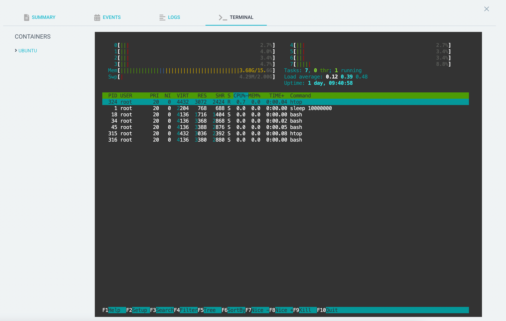

# Web-based Terminal

Since v2.4, Argo CD has a web-based terminal that allows you to get a shell inside a running pod just like you would with
`kubectl exec`. It's basically SSH from your browser, full ANSI color support and all! However, for security this feature
is disabled by default.

This is a powerful privilege. It allows the user to run arbitrary code on any Pod managed by an Application for which
they have the `exec/create` privilege. If the Pod mounts a ServiceAccount token (which is the default behavior of 
Kubernetes), then the user effectively has the same privileges as that ServiceAccount.

## Enabling the terminal
<!-- Use indented code blocks for the numbered list to prevent breaking the numbering. See #11590 -->

1. Set the `exec.enabled` key to `"true"` on the `argocd-cm` ConfigMap.

2. Patch the `argocd-server` Role (if using namespaced Argo) or ClusterRole (if using clustered Argo) to allow `argocd-server`
to exec into pods

        - apiGroups:
          - ""
          resources:
          - pods/exec
          verbs:
          - create

3. Add RBAC rules to allow your users to `create` the `exec` resource, i.e. 

        p, role:myrole, exec, create, */*, allow

See [RBAC Configuration](rbac.md#exec-resource) for more info.

## Changing allowed shells

By default, Argo CD attempts to execute shells in this order:

1. bash
2. sh
3. powershell
4. cmd

If none of the shells are found, the terminal session will fail. To add to or change the allowed shells, change the 
`exec.shells` key in the `argocd-cm` ConfigMap, separating them with commas.
