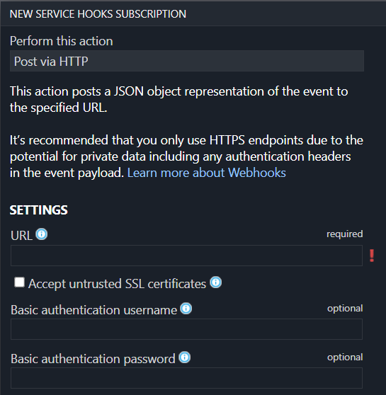

# Git Webhook Configuration

## Overview

Argo CD polls Git repositories every three minutes to detect changes to the manifests. To eliminate
this delay from polling, the API server can be configured to receive webhook events. Argo CD supports
Git webhook notifications from GitHub, GitLab, Bitbucket, Bitbucket Server, Azure DevOps and Gogs. The following explains how to configure
a Git webhook for GitHub, but the same process should be applicable to other providers.

!!! note
    The webhook handler does not differentiate between branch events and tag events where the branch and tag names are
    the same. A hook event for a push to branch `x` will trigger a refresh for an app pointing at the same repo with
    `targetRevision: refs/tags/x`.

## 1. Create The WebHook In The Git Provider

In your Git provider, navigate to the settings page where webhooks can be configured. The payload
URL configured in the Git provider should use the `/api/webhook` endpoint of your Argo CD instance
(e.g. `https://argocd.example.com/api/webhook`). If you wish to use a shared secret, input an
arbitrary value in the secret. This value will be used when configuring the webhook in the next step.

To prevent DDoS attacks with unauthenticated webhook events (the `/api/webhook` endpoint currently lacks rate limiting protection), it is recommended to limit the payload size. You can achieve this by configuring the `argocd-cm` ConfigMap with the `webhook.maxPayloadSizeMB` attribute. The default value is 1GB.

## Github


!!! note
    When creating the webhook in GitHub, the "Content type" needs to be set to "application/json". The default value "application/x-www-form-urlencoded" is not supported by the library used to handle the hooks

## Azure DevOps



Azure DevOps optionally supports securing the webhook using basic authentication. To use it, specify the username and password in the webhook configuration and configure the same username/password in `argocd-secret` Kubernetes secret in
`webhook.azuredevops.username` and `webhook.azuredevops.password` keys.

## 2. Configure Argo CD With The WebHook Secret (Optional)

Configuring a webhook shared secret is optional, since Argo CD will still refresh applications
related to the Git repository, even with unauthenticated webhook events. This is safe to do since
the contents of webhook payloads are considered untrusted, and will only result in a refresh of the
application (a process which already occurs at three-minute intervals). If Argo CD is publicly
accessible, then configuring a webhook secret is recommended to prevent a DDoS attack.

In the `argocd-secret` Kubernetes secret, configure one of the following keys with the Git
provider's webhook secret configured in step 1.

| Provider        | K8s Secret Key                   |
|-----------------|----------------------------------|
| GitHub          | `webhook.github.secret`          |
| GitLab          | `webhook.gitlab.secret`          |
| BitBucket       | `webhook.bitbucket.uuid`         |
| BitBucketServer | `webhook.bitbucketserver.secret` |
| Gogs            | `webhook.gogs.secret`            |
| Azure DevOps    | `webhook.azuredevops.username`   |
|                 | `webhook.azuredevops.password`   |

Edit the Argo CD Kubernetes secret:

```bash
kubectl edit secret argocd-secret -n argocd
```

TIP: for ease of entering secrets, Kubernetes supports inputting secrets in the `stringData` field,
which saves you the trouble of base64 encoding the values and copying it to the `data` field.
Simply copy the shared webhook secret created in step 1, to the corresponding
GitHub/GitLab/BitBucket key under the `stringData` field:

```yaml
apiVersion: v1
kind: Secret
metadata:
  name: argocd-secret
  namespace: argocd
type: Opaque
data:
...

stringData:
  # github webhook secret
  webhook.github.secret: shhhh! it's a GitHub secret

  # gitlab webhook secret
  webhook.gitlab.secret: shhhh! it's a GitLab secret

  # bitbucket webhook secret
  webhook.bitbucket.uuid: your-bitbucket-uuid

  # bitbucket server webhook secret
  webhook.bitbucketserver.secret: shhhh! it's a Bitbucket server secret

  # gogs server webhook secret
  webhook.gogs.secret: shhhh! it's a gogs server secret

  # azuredevops username and password
  webhook.azuredevops.username: admin
  webhook.azuredevops.password: secret-password
```

After saving, the changes should take effect automatically.

### Alternative

If you want to store webhook data in **another** Kubernetes `Secret`, instead of `argocd-secret`. ArgoCD knows to check the keys under `data` in your Kubernetes `Secret` starts with `$`, then your Kubernetes `Secret` name and `:` (colon).

Syntax: `$<k8s_secret_name>:<a_key_in_that_k8s_secret>`

> NOTE: Secret must have label `app.kubernetes.io/part-of: argocd`

For more information refer to the corresponding section in the [User Management Documentation](user-management/index.md#alternative).
