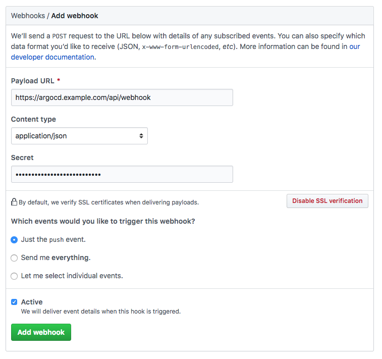
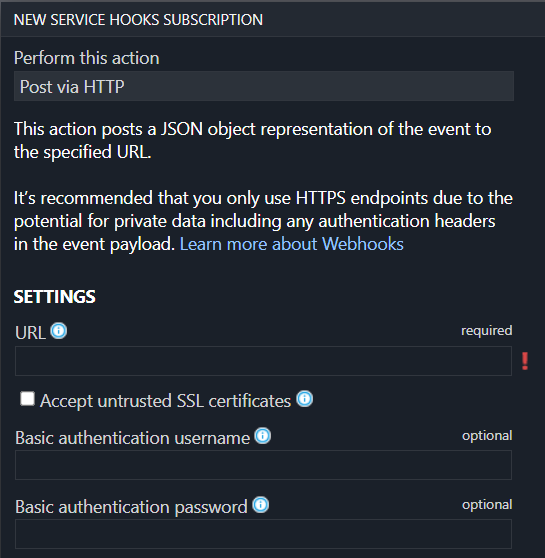

# Webhook Configuration

## Overview

Argo CD polls Git/OCI/Helm repositories every three minutes to detect changes to the manifests. To eliminate
this delay from polling, the API server can be configured to receive webhook events.

### Git Webhooks

Argo CD supports Git webhook notifications from GitHub, GitLab, Bitbucket, Bitbucket Server, Azure DevOps and Gogs. The following explains how to configure a Git webhook for GitHub, but the same process should be applicable to other providers.

### OCI Registry Webhooks

Argo CD also supports webhooks from OCI-compliant container registries to trigger application refreshes when new OCI artifacts are pushed. See [Webhook Configuration for OCI-Compliant Registries](#3-webhook-configuration-for-oci-compliant-registries) for details.

Application Sets use a separate webhook configuration for generating applications. [Webhook support for the Git Generator can be found here](applicationset/Generators-Git.md#webhook-configuration).

> [!NOTE]
> The webhook handler does not differentiate between branch events and tag events where the branch and tag names are
> the same. A hook event for a push to branch `x` will trigger a refresh for an app pointing at the same repo with
> `targetRevision: refs/tags/x`.

## 1. Create The WebHook In The Git Provider

In your Git provider, navigate to the settings page where webhooks can be configured. The payload
URL configured in the Git provider should use the `/api/webhook` endpoint of your Argo CD instance
(e.g. `https://argocd.example.com/api/webhook`). If you wish to use a shared secret, input an
arbitrary value in the secret. This value will be used when configuring the webhook in the next step.

To prevent DDoS attacks with unauthenticated webhook events (the `/api/webhook` endpoint currently lacks rate limiting protection), it is recommended to limit the payload size. You can achieve this by configuring the `argocd-cm` ConfigMap with the `webhook.maxPayloadSizeMB` attribute. The default value is 50MB.

### Github



> [!NOTE]
> When creating the webhook in GitHub, the "Content type" needs to be set to "application/json". The default value "application/x-www-form-urlencoded" is not supported by the library used to handle the hooks

### Azure DevOps



Azure DevOps optionally supports securing the webhook using basic authentication. To use it, specify the username and password in the webhook configuration and configure the same username/password in `argocd-secret` Kubernetes secret in
`webhook.azuredevops.username` and `webhook.azuredevops.password` keys.

## 2. Configure Argo CD With The WebHook Secret (Optional)

Configuring a webhook shared secret is optional, since Argo CD will still refresh applications
related to the Git repository, even with unauthenticated webhook events. This is safe to do since
the contents of webhook payloads are considered untrusted, and will only result in a refresh of the
application (a process which already occurs at three-minute intervals). If Argo CD is publicly
accessible, then configuring a webhook secret is recommended to prevent a DDoS attack.

In the `argocd-secret` Kubernetes secret, configure one of the following keys with the Git
provider's webhook secret configured in step 1.

| Provider        | K8s Secret Key                   |
|-----------------|----------------------------------|
| GitHub          | `webhook.github.secret`          |
| GitLab          | `webhook.gitlab.secret`          |
| BitBucket       | `webhook.bitbucket.uuid`         |
| BitBucketServer | `webhook.bitbucketserver.secret` |
| Gogs            | `webhook.gogs.secret`            |
| Azure DevOps    | `webhook.azuredevops.username`   |
|                 | `webhook.azuredevops.password`   |

Edit the Argo CD Kubernetes secret:

```bash
kubectl edit secret argocd-secret -n argocd
```

TIP: for ease of entering secrets, Kubernetes supports inputting secrets in the `stringData` field,
which saves you the trouble of base64 encoding the values and copying it to the `data` field.
Simply copy the shared webhook secret created in step 1, to the corresponding
GitHub/GitLab/BitBucket key under the `stringData` field:

```yaml
apiVersion: v1
kind: Secret
metadata:
  name: argocd-secret
  namespace: argocd
type: Opaque
data:
...

stringData:
  # github webhook secret
  webhook.github.secret: shhhh! it's a GitHub secret

  # gitlab webhook secret
  webhook.gitlab.secret: shhhh! it's a GitLab secret

  # bitbucket webhook secret
  webhook.bitbucket.uuid: your-bitbucket-uuid

  # bitbucket server webhook secret
  webhook.bitbucketserver.secret: shhhh! it's a Bitbucket server secret

  # gogs server webhook secret
  webhook.gogs.secret: shhhh! it's a gogs server secret

  # azuredevops username and password
  webhook.azuredevops.username: admin
  webhook.azuredevops.password: secret-password
```

After saving, the changes should take effect automatically.

### Alternative

If you want to store webhook data in **another** Kubernetes `Secret`, instead of `argocd-secret`. ArgoCD knows to check the keys under `data` in your Kubernetes `Secret` starts with `$`, then your Kubernetes `Secret` name and `:` (colon).

Syntax: `$<k8s_secret_name>:<a_key_in_that_k8s_secret>`

> [!NOTE]
> Secret must have label `app.kubernetes.io/part-of: argocd`

For more information refer to the corresponding section in the [User Management Documentation](user-management/index.md#alternative).

### Special handling for BitBucket Cloud
BitBucket does not include the list of changed files in the webhook request body.
This prevents the [Manifest Paths Annotation](high_availability.md#manifest-paths-annotation) feature from working with repositories hosted on BitBucket Cloud.
BitBucket provides the `diffstat` API to determine the list of changed files between two commits.
To address the missing changed files list in the webhook, the Argo CD webhook handler makes an API callback to the originating server.
To prevent Server-side request forgery (SSRF) attacks, Argo CD server supports the callback mechanism only for encrypted webhook requests.
The incoming webhook must include `X-Hook-UUID` request header. The corresponding UUID must be provided as `webhook.bitbucket.uuid` in `argocd-secret` for verification.
The callback mechanism supports both public and private repositories on BitBucket Cloud.
For public repositories, the Argo CD webhook handler uses a no-auth client for the API callback.
For private repositories, the Argo CD webhook handler searches for a valid repository OAuth token for the HTTP/HTTPS URL.
The webhook handler uses this OAuth token to make the API request to the originating server.
If the Argo CD webhook handler cannot find a matching repository credential, the list of changed files would remain empty.
If errors occur during the callback, the list of changed files will be empty.

## 3. Webhook Configuration for OCI-Compliant Registries

In addition to Git webhooks, Argo CD supports webhooks from OCI-compliant container registries. This enables instant application refresh when
new artifacts are pushed, eliminating the delay from polling.

### GitHub Container Registry (GHCR)

Webhooks cannot be registered directly on a GHCR image repository. Instead, `package` events are delivered from the associated GitHub repository.

> [!NOTE]
> If your GHCR image repository is not yet linked to a GitHub repository, see [Connecting a repository to a package](https://docs.github.com/en/packages/learn-github-packages/connecting-a-repository-to-a-package).

#### Configure the Webhook

1. Go to your GitHub repository **Settings** → **Webhooks** → **Add webhook**
2. Set **Payload URL** to `https://<argocd-server>/api/webhook`
3. Set **Content type** to `application/json`
4. Set **Secret** to a secure value
5. Under **Events**, select **Let me select individual events** and enable **Packages**

> [!NOTE]
> Only `published` events for `container` package types trigger a refresh. Other package types (npm, maven, etc.) and actions are ignored.

> [!WARNING]
> GitHub does not send `package` webhook events for artifacts with unknown media types. If your OCI artifact uses a custom or non-standard media type, the webhook will not be triggered. See [GitHub documentation on supported package types](https://docs.github.com/en/packages/learn-github-packages/about-permissions-for-github-packages).

#### Configure the Webhook Secret

GHCR webhooks use the same secret as GitHub Git webhooks (`webhook.github.secret`):

```yaml
apiVersion: v1
kind: Secret
metadata:
  name: argocd-secret
  namespace: argocd
type: Opaque
stringData:
  webhook.github.secret: <your-webhook-secret>
```

#### Example Application

When a OCI artifact with a known media type is pushed to GHCR, Argo CD refreshes Applications with a matching `repoURL` and `targetRevision`:

```yaml
apiVersion: argoproj.io/v1alpha1
kind: Application
metadata:
  name: my-app
spec:
  source:
    repoURL: oci://ghcr.io/myorg/myimage
    targetRevision: v1.0.0
    chart: mychart
  destination:
    server: https://kubernetes.default.svc
    namespace: default
```

The `targetRevision` field supports exact tags and [semver constraints](https://github.com/Masterminds/semver#checking-version-constraints):

| Constraint | Webhook triggers on push of |
|------------|----------------------------|
| `1.0.0` | Only `1.0.0` |
| `^1.2.0` | `>=1.2.0` and `<2.0.0` (e.g., `1.2.1`, `1.9.0`) |
| `~1.2.0` | `>=1.2.0` and `<1.3.0` (e.g., `1.2.1`, `1.2.9`) |
| `>=1.0.0` | Any version `>=1.0.0` |

#### URL Matching

Argo CD normalizes OCI repository URLs before comparison to ensure consistent matching:

For example, these `repoURL` values all match a webhook event for `ghcr.io/myorg/myimage`:
- `oci://ghcr.io/myorg/myimage`
- `oci://GHCR.IO/MyOrg/MyImage`
- `oci://ghcr.io/myorg/myimage/`
